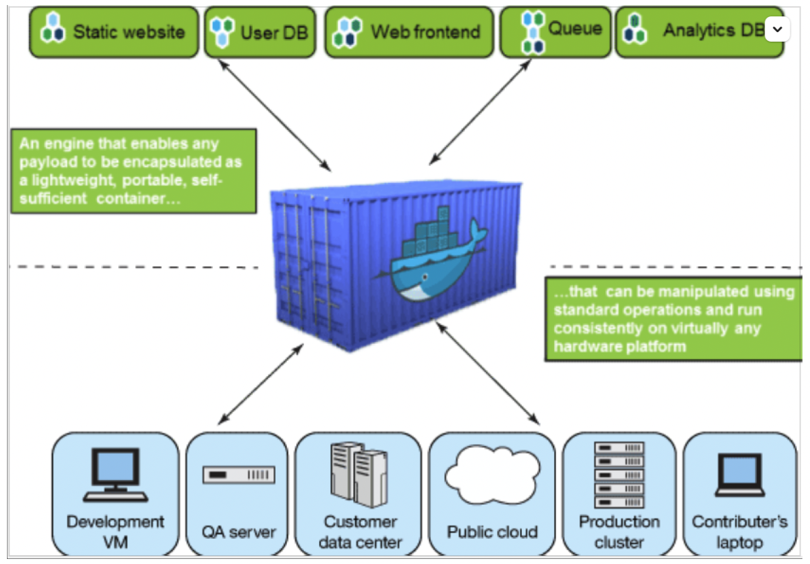
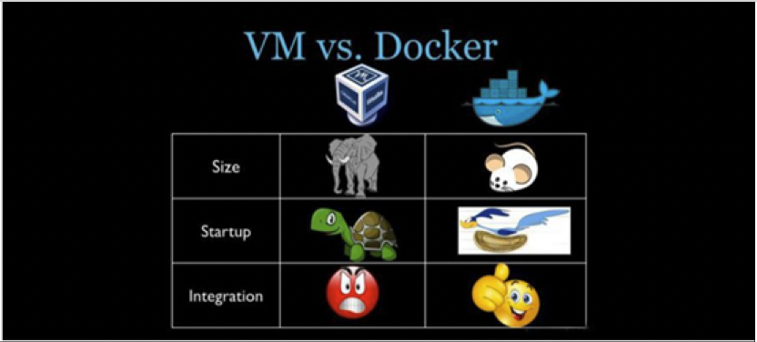
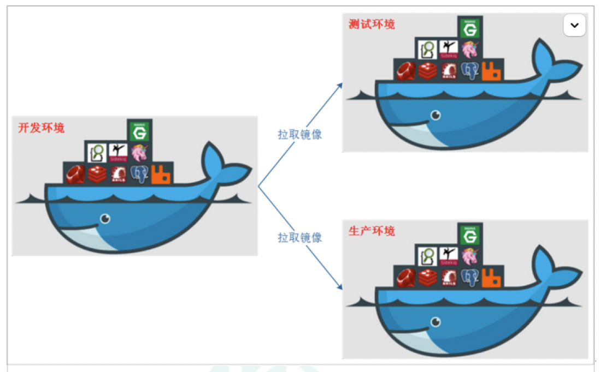
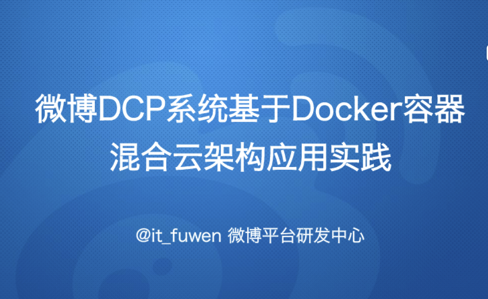
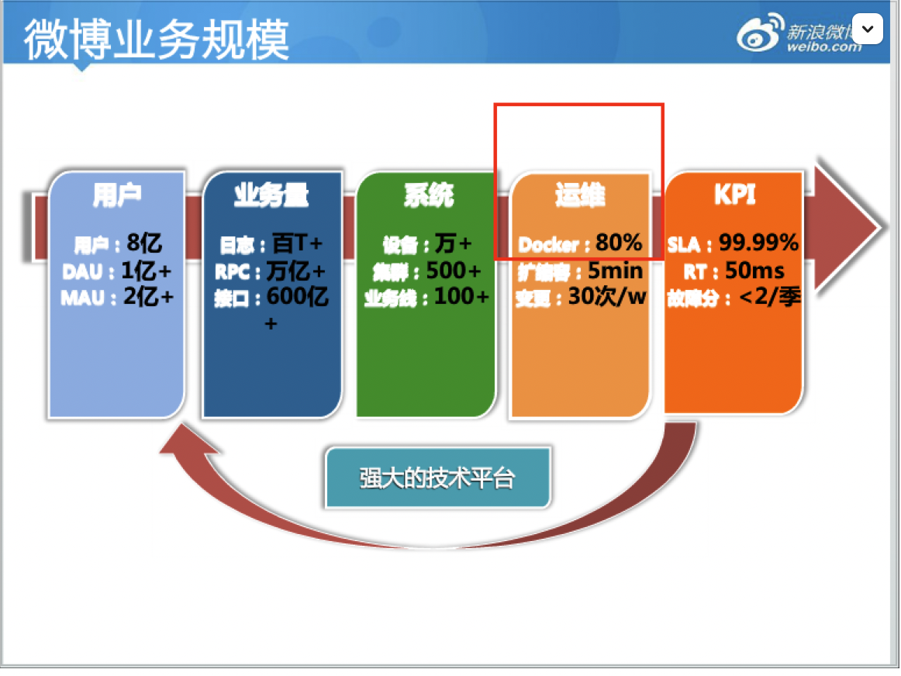
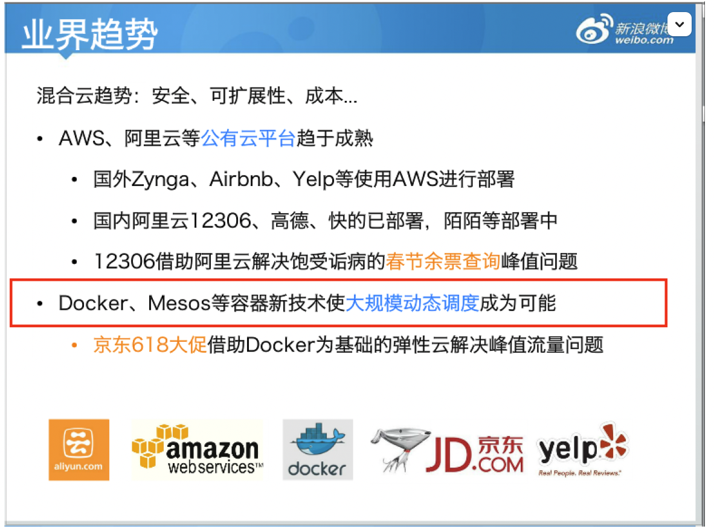
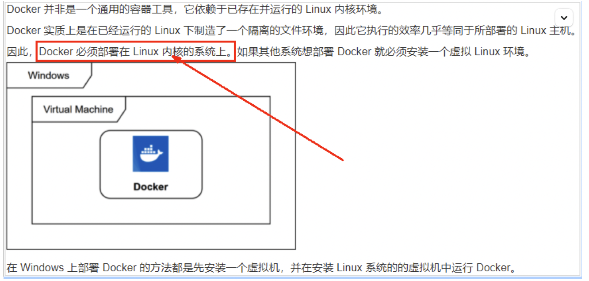
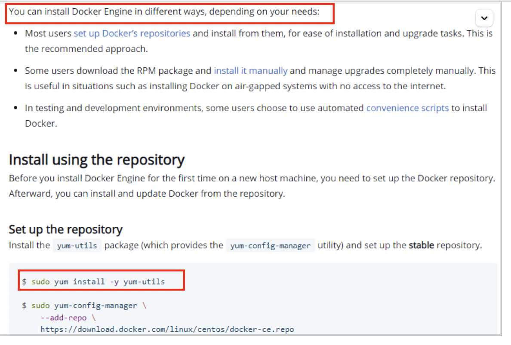

### 								Docker 详细教程

### 一、Docker简介

#### 1.1 docker是什么

【问题】：问什么会有docker出现

​	Docker的出现 使得Docker得以打破过去「程序即应用」的观念。透过镜像(images)将作业系统核心除外，运作应用程式所需要的系统环境，由下而上打包，达到应用程式跨平台间的无缝接轨运作。 

【docker理念】：解决了运行环境和配置问题的软件容器，方便持续继承并有助于整体发布的容器虚拟化技术。

#### 1.2 容器与虚拟机比较

##### 1.2.1 容器发展简史





##### 1.2.2 传统虚拟机技术

虚拟机（virtual machine）就是带环境安装的一种解决方案。 

它可以在一种操作系统里面运行另一种操作系统，比如在Windows10系统里面运行Linux系统CentOS7。应用程序对此毫无感知，因为虚拟机看上去跟真实系统一模一样，而对于底层系统来说，虚拟机就是一个普通文件，不需要了就删掉，对其他部分毫无影响。这类虚拟机完美的运行了另一套系统，能够使应用程序，操作系统和硬件三者之间的逻辑不变。  

| Win10 | VMWare | Centos7 | 各种cpu、内存网络额配置+各种软件 | 虚拟机实例 |
| ----- | ------ | ------- | -------------------------------- | ---------- |
|       |        |         |                                  |            |

虚拟机的缺点： 

1   资源占用多         2   冗余步骤多          3   启动慢 

##### 1.2.3 容器虚拟化技术

由于前面虚拟机存在某些缺点，Linux发展出了另一种虚拟化技术： 

Linux容器(Linux Containers，缩写为 LXC) 

Linux容器是与系统其他部分隔离开的一系列进程，从另一个镜像运行，并由该镜像提供支持进程所需的全部文件。容器提供的镜像包含了应用的所有依赖项，因而在从开发到测试再到生产的整个过程中，它都具有可移植性和一致性。 

Linux 容器不是模拟一个完整的操作系统 而是对进程进行隔离。有了容器，就可以将软件运行所需的所有资源打包到一个隔离的容器中。 容器与虚拟机不同，不需要捆绑一整套操作系统 ，只需要软件工作所需的库资源和设置。系统因此而变得高效轻量并保证部署在任何环境中的软件都能始终如一地运行。 

#####   1.2.4 对比

 

比较了 Docker 和传统虚拟化方式的不同之处： 

传统虚拟机技术是虚拟出一套硬件后，在其上运行一个完整操作系统，在该系统上再运行所需应用进程； 容器内的应用进程直接运行于宿主的内核，容器内没有自己的内核 且也没有进行硬件虚拟 。因此容器要比传统虚拟机更为轻便。 每个容器之间互相隔离，每个容器有自己的文件系统 ，容器之间进程不会相互影响，能区分计算资源。  

#### 1.3 能干什么

##### 1.3.1 技术职级变化

coder -> programmer -> software engineer -> DevOps engineer

##### 1.3.2 开发/运维（Devops)新一代开发工程师

- 一次构建、随处运行
- 更快速的应用交付和部署
- 更便捷的升级和扩缩容
- 更简单的系统运维
- 更高效的计算资源利用

##### 1.3.3 Docker应用场景



Docker 借鉴了标砖集装箱的概念。标准集装箱将货物运往世界各地，Docker将这个模型运用到自己的设计中，唯一不同的是：集装箱运输货物，而Docker运输软件。

#### 1.4 那些企业在使用

- 新浪

  

  

  

  

- 美团


- 蘑菇街


#### 1.5 下载地址

官网：http://www.docker.com

Docker Hub 官网：https://hub.docker.com

### 二、Docker安装

#### 2.1 前提说明

##### 2.1.1 **CentOS Docker** **安装** 



##### 2.1.2 前提条件

目前，CentOS仅发行版本中的内核支持Docker。Docker运行在CentOS 7（64-bit）上，要求系统为64位，Linux系统内核版本为3.8以上，这里选用Centos7.x

##### 2.1.3 查看自己的内核

uname 命令用于打印当前系统相关信息（内核版本号，硬件架构，主机名称和操作系统类型等）。


#### 2.2 Docker的基本组成

##### 2.2.1 镜像（image）

Docker 镜像（Image）就是一个 **只读** 的模板。镜像可以用来创建 Docker 容器， 一个镜像可以创建很多容器 。 

它也相当于是一个root文件系统。比如官方镜像 centos:7 就包含了完整的一套 centos:7 最小系统的 root 文件系统。 

相当于容器的“源代码”， docker镜像文件类似于Java的类模板，而docker容器实例类似于java中new出来的实例对象。

##### 2.2.2 容器（container）

- 从面向对象角度 

Docker 利用容器（Container）独立运行的一个或一组应用，应用程序或服务运行在容器里面，容器就类似于一个虚拟化的运行环境， 容器是用镜像创建的运行实例 。就像是Java中的类和实例对象一样，镜像是静态的定义，容器是镜像运行时的实体。容器为镜像提供了一个标准的和隔离的运行环境 ，它可以被启动、开始、停止、删除。每个容器都是相互隔离的、保证安全的平台 

- 从镜像容器角度 

**可以把容器看做是一个简易版的** ***Linux\*** **环境** （包括root用户权限、进程空间、用户空间和网络空间等）和运行在其中的应用程序。 

##### 2.2.3 仓库（repository）

仓库（Repository）是 集中存放镜像 文件的场所。 

类似于 

Maven仓库，存放各种jar包的地方； 

github仓库，存放各种git项目的地方； 

Docker公司提供的官方registry被称为Docker Hub，存放各种镜像模板的地方。 

仓库分为公开仓库（Public）和私有仓库（Private）两种形式。 

最大的公开仓库是 Docker Hub(https://hub.docker.com/) ， 

存放了数量庞大的镜像供用户下载。国内的公开仓库包括阿里云 、网易云等 

##### 2.2.4 小总结

- 需要正确的理解仓库/镜像/容器这几个概念: 

Docker 本身是一个容器运行载体或称之为管理引擎。我们把应用程序和配置依赖打包好形成一个可交付的运行环境，这个打包好的运行环境就是image镜像文件。只有通过这个镜像文件才能生成Docker容器实例(类似Java中new出来一个对象)。 

image文件可以看作是容器的模板。Docker 根据 image 文件生成容器的实例。同一个 image 文件，可以生成多个同时运行的容器实例。 

- 镜像文件 

image 文件生成的容器实例，本身也是一个文件，称为镜像文件。 

- 容器实例 

一个容器运行一种服务，当我们需要的时候，就可以通过docker客户端创建一个对应的运行实例，也就是我们的容器 。

- 仓库 

就是放一堆镜像的地方，我们可以把镜像发布到仓库中，需要的时候再从仓库中拉下来就可以了。 

#### 2.3 Docker平台架构图解（入门版）


##### 2.3.1 Docker工作原理

Docker是一个Client-Server结构的系统，Docker守护进程运行在主机上， 然后通过Socket连接从客户端访问，守护进程从客户端接受命令并管理运行在主机上的容器 。 容器，是一个运行时环境，就是我们前面说到的集装箱。可以对比mysql演示对比讲解 


##### 2.3.2 整体架构及底层通信原理简述

Docker是一个C/S模式的架构，后端是一个松耦合架构，众多模块各司其职

##### 2.3.3 Docker运行的基本流程为：

1. 用户是使用Docker Client 与Docker Daemon 建立通信，并发送请求给后者。
2. Docker Daemon 作为Docker架构中的主体部分，首先提供Docker Server 的功能时期可以接受 Docker Client的请求。
3. Docker Engine 执行Docker内部的一些列工作，每一项工作都是以一个Job的形式的存在。
4. Job的运行过程中，当需要容器镜像是，则从Docker Register中下载镜像，并通过镜像管理驱动Graph driver 将下载镜像以Graph的形式存储。
5. 当需要为Docker创建网络环境时，通过网络驱动Network driver创建并配置Docker容器网络环境。
6. 当需要限制Docker容器运行资源或执行用户指令等操作时，则通过Exec driver来完成。
7. Libcontainer是一项独立的容器管理包，Network driver以及Exec driver都是通过Libcontainer来实现具体容器进行的操作。


#### 2.4、安装步骤

##### 2.4.1 CentOS7安装Docker

1. 确定你是CentOS7以上版本

```shell
# 查看CentOS版本命令
cat /etc/redhat-release
```

2. 卸载旧版本

   

```shell
# 卸载旧版本docker命令
$ sudo yum remove docker \
									docker-client \
									docker-client-latest \
									docker-common \
									docker-latest \
									docker-latest-logrotate \
									docker-logrotate \
									docker-engine		
```

3. yum安装gcc相关命令

```shell
# yum安装gcc相关命令
yum -y install gcc
yum -y install gcc-c++
```

4. 安装需要的软件包

   

```shell
# 官网要求
yum install -y yum-utils
```

5. 设置stable镜像仓库

   

```shell
# 推荐使用
yum-config-manager --add-repo http://mirrors.aliyun.com/docker-ce/linux/centos/docker-ce.repo
```

6. 更新yum软件包索引

```shell
# 更新yum软件包索引
yum makecache fast
```

7. 安装DOCKER CE

```shell
# 命令
yum -y install docker-ce docker-ce-cli containerd.io
```

8. 启动docker

```shell
# 启动命令
systemctl start docker
```

9. 测试

```shell
# 测试
docker version 

docker run hello-world
```


10. 卸载

```shell
# 卸载命令
systemctl stop docker 
yum remove docker-ce docker-ce-cli containerd.io
rm -rf /var/lib/docker
rm -rf /var/lib/containerd
```

#### 2.5、阿里云镜像加速

#### 2.5.1 是什么

- 地址：https://promotion.aliyun.com/ntms/act/kubernetes.html

- 注册一个属于自己的阿里云账户
- 获得加速器地址连接：
  1. 登陆阿里云开发者平台
  2. 点击控制台
  3. 选择容器镜像服务
  4. 获取加速器地址

- 粘贴脚本直接执行

```shell
mkdir -p /etc/docker 
tee /etc/docker/daemon.json <<-'EOF'
{ 
  "registry-mirrors": ["https://aa25jngu.mirror.aliyuncs.com"] 
} 
EOF 
```


```shell
# 或者分开步骤执行
mkdir -p /etc/docker
vim /etc/docker/daemon.json
```

- 重启服务器

```shell
# 重启服务器
systemctl daemon-reload
systemctl restart docker
```

#### 2.5.2 永远的HelloWorld

启动Docker后台容器（测试运行 hello-world）

```shell
# 命令
docker run hello-world
```


#### 2.5.3 底层原理

为什么Docker会比VM虚拟机快:

```properties
(1)docker有着比虚拟机更少的抽象层 
   由于docker不需要Hypervisor(虚拟机)实现硬件资源虚拟化,运行在docker容器上的程序直接使用的都是实际物理机的硬件资源。因此在CPU、内存利用率上docker将会在效率上有明显优势。 
(2)docker利用的是宿主机的内核,而不需要加载操作系统OS内核 
   当新建一个容器时,docker不需要和虚拟机一样重新加载一个操作系统内核。进而避免引寻、加载操作系统内核返回等比较费时费资源的过程,当新建一个虚拟机时,虚拟机软件需要加载OS,返回新建过程是分钟级别的。而docker由于直接利用宿主机的操作系统,则省略了返回过程,因此新建一个docker容器只需要几秒钟。
```


### 三、Docker常用命令

#### 3.1 帮助启动类命令

```shell
# 启动命令
systemctl start docker
# 停止命令
systemctl stop docker
# 重启命令
systemctl restart docker
# 查看docker状态
systemctl status docker
# 开机启动
systemctl enable docker
# 查看 docker 概要信息
docker info
# 查看docker 总体帮助文档
docker --help
# 查看docker命令帮助文档：
docker 具体命令 --help
```

#### 3.2 镜像命令

##### 3.2.1 docker images

```shell
# 列出本地主机上的镜像
docker images 
```


各个选项说明: 

- REPOSITORY：表示镜像的仓库源 

- TAG：镜像的标签版本号 
- IMAGE ID：镜像ID 
- CREATED：镜像创建时间 
- SIZE：镜像大小 

 同一仓库源可以有多个 TAG版本，代表这个仓库源的不同个版本，我们使用 REPOSITORY:TAG 来定义不同的镜像。 

如果你不指定一个镜像的版本标签，例如你只使用 ubuntu，docker 将默认使用 ubuntu:latest 镜像 

##### 3.2.2 OPTIONS 说明

-a :  列出本地所有的镜像（含历史映像层）

-q：只显示镜像ID


