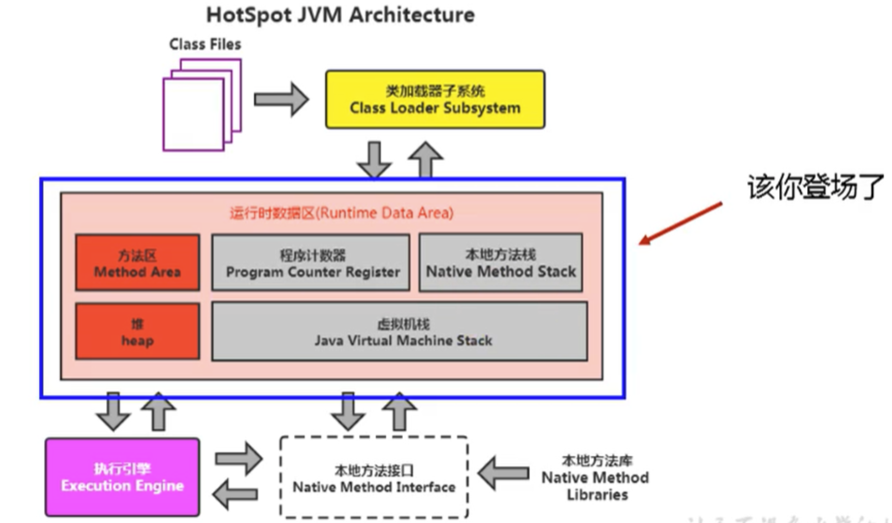
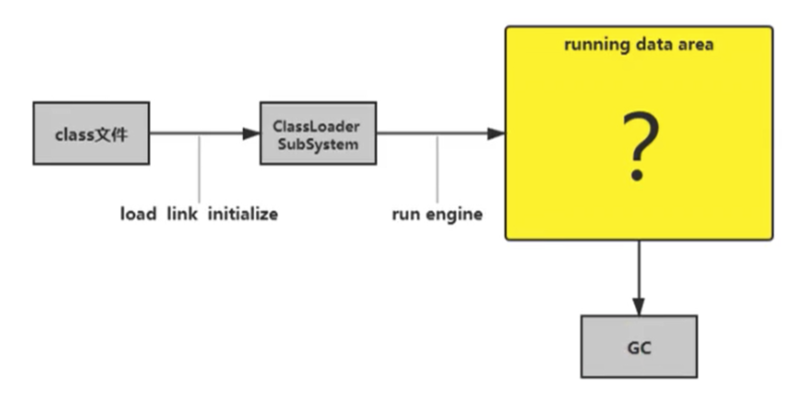
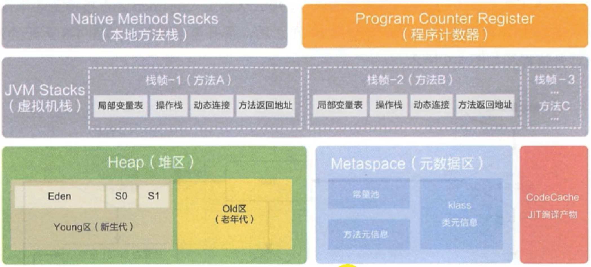

##           				运行时数据区概述及线程

### 一、前言

本节主要讲的是运行时数据区，也就是下图这部分，它是在类加载完成后的阶段

当我们通过前面的：类的  加载 -> 验证 -> 准备 -> 解析 -> 初始化  这几个阶段完成后，就会用到执行引擎对我们的类进行使用，同事执行引擎将会使用到我们运行时数据区

也就是大厨做饭，我们把大厨后面的东西（切好的菜，刀，调料），比作是运行时数据区。而厨师可以类比于执行引擎，将通过准备的东西进行制作成精美的菜品。

内存是非常重要的系统资源，是硬盘和CPU的中间仓库及桥梁，承载着操作系统和应用程序的实时运行JVM内存布局规定了Java在运行过程内存申请，分配，管理的策略，保证了JVM的高效稳定运行。不同的JVM对于内存的划分方式和管理机制存在着部分差异。结合JVM虚拟机规范，来探讨一下经典的JVM内存布局。

> 我们通过磁盘或者网络IO得到的数据，都需要先加载到内存中，然后CPU从内存中获取数据进行读取，也就是说内存充当了CPU和磁盘之间的桥梁

运行时数据区的完整图

Java虚拟机定义了若干种程序运行期会使用到的运行时数据区，其中有一些会随着虚拟机启动而创建，随着虚拟机推出而销毁。另外一些则是与线程一一对应，这些与线程对应的数据区域会随着线程开始和结束而创建和销毁。

灰色的单独线程私有的，红色的为多个线程共享的。即：

- 每个线程：独立包括程序计数器，栈，本地方法栈。
- 线程间共享：堆、堆外内存（永久代或元空间，代码缓存）

### 二、线程

线程是一个程序里的运行单元。JVM允许一个应用有多个线程并行的执行。在Hostpot JVM里，每个线程都与操作系统的本地线程直接映射。

- 当一个Java线程准备好执行以后，此时一个操作系统的本地线程也同事创建。Java线程执行终止后，本地线程也会回收。

操作系统负责所有线程的安排调度到任何一个可用的CPU上。一旦本地线程初始化成功，它就会调用Java线程中的run()方法。

### 三、JVM系统线程

如果你使用console或者是任何一个调试工具，都能看到在后台有许多线程在运行。这些后台线程不包括调用public static void main (String[]) 的main线程以及所有这个main线程自己创建的线程。这些主要的后台系统线程在Hotspot JVM里主要是以下几个：

- **虚拟机线程：**这种线程的操作是需要JVM达到安全点才会出现。这些操作必须在不同的线程中发生的原因是他们都需要JVM达到安全点，这样堆才不会变化。这种线程的执行类型包括"stop-the-world"的垃圾收集，线程收集，线程挂起以及偏向锁撤销。
- **周期任务线程：**这种线程对在JVM里不同种类的垃圾收集行为提供了支持。
- **GC线程：**这种线程对在JVM里不同种类的垃圾收集车型为提供了支持。
- **编译线程：**这种线程在运行时将字节码编译成本地代码。
- **信号调度线程：**这种线程接收信号并发送给JVM，他在内部通过调用适当的方法进行处理。

