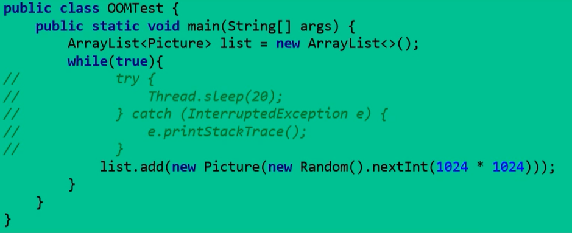
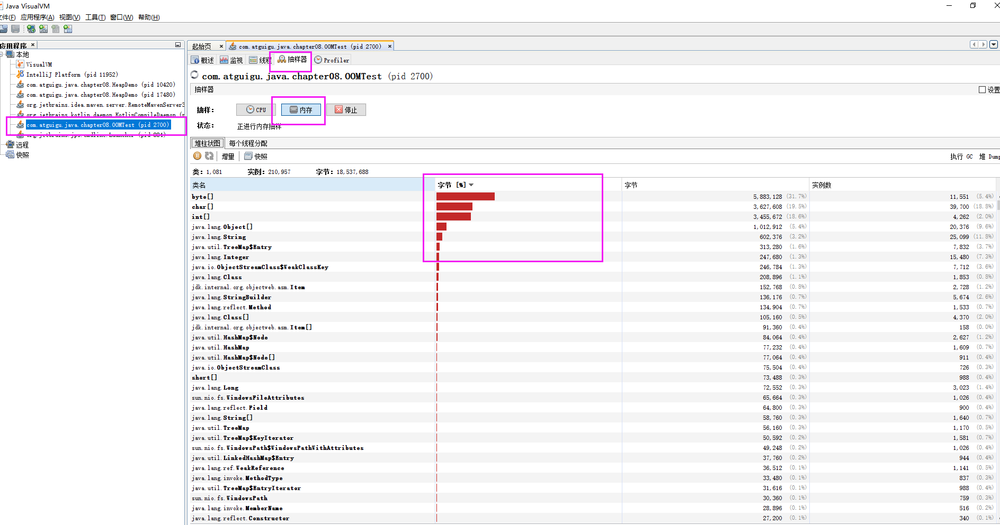
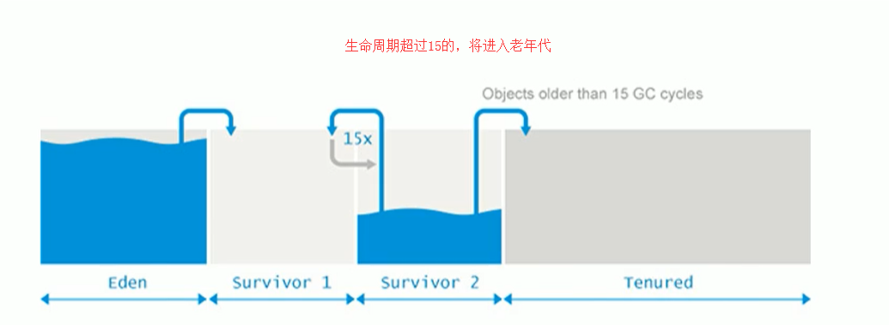

## 											堆

### 一、堆的核心概念

堆针对一个JVM进程来说是唯一的，也就是一个进程只有一个JVM，但是进程包含多个进程，他们是共享一个堆空间的。


一个JVM实例只存在一个堆内存，堆也是Java内存管理的核心区域。

Java堆区在JVM启动的时候即被创建，其空间大小也就被确定了。是JVM管理的最大一块内存空间。

- 堆内存的大小是可以调节的。

《Java虚拟机规范》规定，堆可以处于物理上不连续的内存空间，但在逻辑上它应该被视为连续的。

所有的线程共享Java堆，在这里还可以划分线程私有的缓冲区（Thread Local Allocation Buffer，TLAB）。

> -Xms10m: 最小堆内存
>
> -Xms10m: 最大堆内存

下图就是使用：java VisualVM查看堆空间的内容，通过jdk bin提供的插件


《Java虚拟机规范》中对Java堆的描述是：所有的对象实例以及数组都应当在运行时分配在堆上。（The heap is the run-time data area from which memory for all class instances and arrays is allocated）

我要说的是：“几乎所有的对象实例都在这里分配内存。从实际使用角度看的。

- 因为还有一些对象是在栈上分配的。

数组和对象可能永远不会存储在栈上，因为栈帧中保存引用，这个引用指向对象或者数组在堆中的位置。

在方法结束后，堆中的对象不会马上被移除，仅仅在垃圾收集的时候才会被移除。

- 也就是出发了GC的时候，才会进行回收。
- 如果堆中对象马上被回收，那么用户线程就会收到影响，因为有stop the word。

堆，是GC（Garbage Collection，垃圾收集器）执行垃圾回收的重点区域。


#### 1.1 堆内存细分

Java7及之前堆内存在逻辑上分为三部分：新生区 + 养老区 + 永久区

- Young Generation Space 新生区 Young/New 又被划分为Eden区和Survivor区
- Tenure generation space 养老区 Old/Tenure
- Permanent Space 永久区 Perm

Java 8及之后堆内存逻辑上分为三部分：新生区 + 养老区 + 元空间

- Young Generation Space 新生区 Young/New 又被划分为Eden区和Survivor区
- Tenure generation space 养老区 Old/Tenure
- Meta Space 元空间 Meta

约定：新生区 -> 新生代 -> 年轻代 、 养老区 -> 老年区 -> 老年代、 永久区 -> 永久代


堆空间内部结构，JDK 1.8 之前从永久代 替换成 元空间


### 二、设置堆内存大小与OOM

Java堆区用于存储Java对象实例，那么堆的大小在JVM启动时就已经设定好了，大家可以通过选项 "-Xmx" 和 "-Xms"来进行设置。

- "-Xms" 用于表示堆区的起始内存，等价于 -xx:InitialHeapSize。
- "-Xmx" 用于表示堆区的最大内存，等价于 -xx:MaxHeapSize。

一旦堆区中的内存大小超过"-xmx"所制定的最大内存时，将会抛出outofMemoryError异常。

通常会将-Xms 和 -Xmx两个参数配置相同的值，其目的是**为了能够在Java垃圾回收机制清理完堆区后不需要重新分隔计算堆区的大小，从而提高性能。**

默认情况下：

- 初始内存大小：物理电脑内存大小/64
- 最大内存大小：物理电脑内存大小/4

```java
/**
 * -Xms 用来设置堆空间（年轻代+老年代）的初始内存大小
 *  -X：是jvm运行参数
 *  ms：memory start
 * -Xmx：用来设置堆空间（年轻代+老年代）的最大内存大小
 *
 */
public class HeapSpaceInitial {
    public static void main(String[] args) {
        // 返回Java虚拟机中的堆内存总量
        long initialMemory = Runtime.getRuntime().totalMemory() / 1024 / 1024;
        // 返回Java虚拟机试图使用的最大堆内存
        long maxMemory = Runtime.getRuntime().maxMemory() / 1024 / 1024;
        System.out.println("-Xms:" + initialMemory + "M");
        System.out.println("-Xmx:" + maxMemory + "M");
    }
}
```

```java
[0.002s][warning][gc] -XX:+PrintGC is deprecated. Will use -Xlog:gc instead.
[0.007s][info   ][gc] Using G1
-Xms: 256M
-Xmx: 4096M
```

如何查看堆内存的内存分配情况

```
jps -> jstat -gc 进程id
```


```java
-XX:+PrintGCDetails
```


#### 2.1  OutOfMemory举例




```java
/**
 * OOM测试
 *
 */
public class OOMTest {
    public static void main(String[] args) {
        List<Integer> list = new ArrayList<>();
        while(true) {
            list.add(999999999);
        }
    }
}
```

然后设置启动参数

```java
-Xms10m -Xmx:10m
```

运行后，就出现OOM了，那么我们可以通过 VisualVM这个工具查看具体是什么参数造成的OOM



### 三、年轻代和老年代

存储在JVM中的Java对象可以被划分为两类：

- 一类是生命周期较短的瞬时对象，这类对象的创建和消亡都非常迅速
- 生命周期短的，即时回收即可
- 领完一类对象的生命周期却非常长，在某些极端的情况下还能够与JVM的生命周期保持一致。

Java堆区进一步细分的话，还可以划分为年轻代（YoungGen）和老年代（oldGen）

其中年轻代有又可以划分为Eden空间，Survivor0空间和Survivor1空间（有时也叫from区，to区）


下面这参数开发中一般不会调：


- Eden：From：to -> 8:1:1
- 新生代：老年代 - > 1 : 2

配置新生代与老年代在堆结构的占比。

- 默认-XX:NewRatio = 2,表示新生代占1，老年代占2，新生代占整个堆的1/3
- 可以修改-XX:NewRatio=4,表示新生代占1，老年代占4，新生代占整个堆的1/5

> 当发现整个项目中，生命周期长的对象偏多，那么就可以通过调整 老年代的大小，来进行调优

在HotSpot中，Eden空间和另外两个survivor空间缺省所占的比例是8：1：1当然开发人员可以通过选项 "-xx:SurvivorRatio"调整整个空间比例。比如-xx:SurvivorRatio=8

几乎所有的Java对象都是在Eden区被new出来的。绝大部分的Java对象的销毁都在新生代进行了。（有些大的对象在Eden区无法存储时候，将直接进入老年代）

> IBM 公司的专门研究表明，新生代中80%的对象都是“朝生夕死”的。
>
> 可以使用选型"-Xmn"设置新生代最大内存大小
>
> 这个参数一般使用默认值就可以了。



### 四、图解对象分配过程

#### 4.1 概念

为新对象分配内存是一件非常严谨和复杂的任务，JM的设计者们不仅需要考虑内存如何分配，在哪里分配等问题，并且由于内存分配算法与内存回收算法密切相关，所以还需要考虑GC执行完内存回收后是否会在内存空间中生产内存碎片。

- new 的对象先放伊甸园区。此区有大小限制。
- 当伊甸园的空间填满时，程序有需要创建对象，JVM的垃圾回收器将对伊甸园区进行回收（MinorGC），将伊甸园区中的不再被其他对象所引用的对象进行销毁。再加载新的对象放到伊甸园区。
- 然后将伊甸园中的剩余对象移动到幸存者0区。
- 如果再次触发垃圾回收，此时上次幸存下来的放到幸存者0区，如果没有回收，就会放到幸存者1区。
- 如果再次经历垃圾回收，此时会重新放回幸存者0区，接着再去幸存者1区。
- 啥时候能去养老区呢？可以设置次数。默认是15次。
- 在养老区，相对悠闲。当养老区内存不足时，再次触发GC：Major GC ，进行养老区的内存清理
- 若养老区执行Major GC之后，发现依然无法进行对象的保存，就会产生OOM异常。

可以设置参数：-Xx:MaxTenuringThreshold=N进行设置

#### 4.2 图解过程

我们创建的对象，一般都是存放在Eden区的，当我们Eden区满了后，就会触发GC操作，一般被称为YGC/Minor GC 操作


当我们进行一次垃圾收集后，红色的将会被回收，而绿色的还会被占用着，存放在S0(Survivor From)区。同时我们给每个对象设置了一个年龄计数器，一次回收后就是1。

同时Eden区继续存放对象，当Eden区再次存满的时候，又会触发一个MinorGC操作，此时GC将会把 Eden和Survivor From中的对象 进行一次收集，把存活的对象放到 Survivor To区，同时让年龄 + 1


我们继续不断的进行对象生成 和 垃圾回收，当Survivor中的对象的年龄达到15的时候，将会触发一次 Promotion晋升的操作，也就是将年轻代中的对象 晋升到 老年代中


####  4.3 思考：幸存区区满了后？

特别注意，在Eden区满了的时候，才会触发MinorGC，而幸存者区满了后，不会触发MinorGC操作

如果Survivor区满了后，将会触发一些特殊的规则，也就是可能直接晋升老年代

> 举例：以当兵为例，正常人的晋升可能是 ： 新兵 -> 班长 -> 排长 -> 连长
>
> 但是也有可能有些人因为做了非常大的贡献，直接从 新兵 -> 排长

#### 4.4  对象分配的特殊情况


####  4.5 代码演示对象分配过程

```java
public class HeapInstanceTest {
    byte [] buffer = new byte[new Random().nextInt(1024 * 200)];
    public static void main(String[] args) throws InterruptedException {
        ArrayList<HeapInstanceTest> list = new ArrayList<>();
        while (true) {
            list.add(new HeapInstanceTest());
            Thread.sleep(10);
        }
    }
}
```

然后设置JVM参数

> ```java
> -Xms600m -Xmx600m
> ```

然后cmd输入下面命令，打开VisualVM图形化界面

```java
jvisualvm
```

然后通过执行上面代码，通过VisualGC进行动态化查看


最终，在老年代和新生代都满了，就出现OOM

```java
Exception in thread "main" java.lang.OutOfMemoryError: Java heap space
	at com.atguigu.java.chapter08.HeapInstanceTest.<init>(HeapInstanceTest.java:13)
	at com.atguigu.java.chapter08.HeapInstanceTest.main(HeapInstanceTest.java:17)
```

#### 4.6 常用的调优工具

- JDK命令行
- Eclipse：Memory Analyzer Tool
- Jconsole
- Visual VM（实时监控 推荐~）
- Jprofiler（推荐~）
- Java Flight Recorder（实时监控）
- GCViewer
- GCEasy

####  4.7 总结

- 针对幸存者s0，s1区的总结：复制之后有交换，谁空谁是to
- 关于垃圾回收：频繁在新生区收集，很少在老年代收集，几乎不再永久代和元空间进行收集
- 新生代采用复制算法的目的：是为了减少内碎片

> 我们都知道，JVM的调优的一个环节，也就是垃圾收集，我们需要尽量的避免垃圾回收，因为在垃圾回收的过程中，容易出现STW的问题
>
> 而 Major GC 和 Full GC出现STW的时间，是Minor GC的10倍以上

JVM在进行GC时，并非每次都对上面三个内存区域一起回收的，大部分时候回收的都是指新生代。针对Hotspot VM的实现，它里面的GC按照回收区域又分为两大种类型：一种是部分收集（Partial GC），一种是整堆收集（FullGC）

部分收集：不是完整收集整个Java堆的垃圾收集。其中又分为：

- 新生代收集（MinorGC/YoungGC）：只是新生代的垃圾收集
- 老年代收集（MajorGC/o1dGC）：只是老年代的圾收集。
  - 目前，只有CMSGC会有单独收集老年代的行为。
  - 注意，很多时候Major GC会和Fu11GC混淆使用，需要具体分辨是老年代回收还是整堆回收。
- 混合收集（MixedGC）：收集整个新生代以及部分老年代的垃圾收集。
  - 目前，只有G1 GC会有这种行为

整堆收集（FullGC）：收集整个java堆和方法区的垃圾收集。


