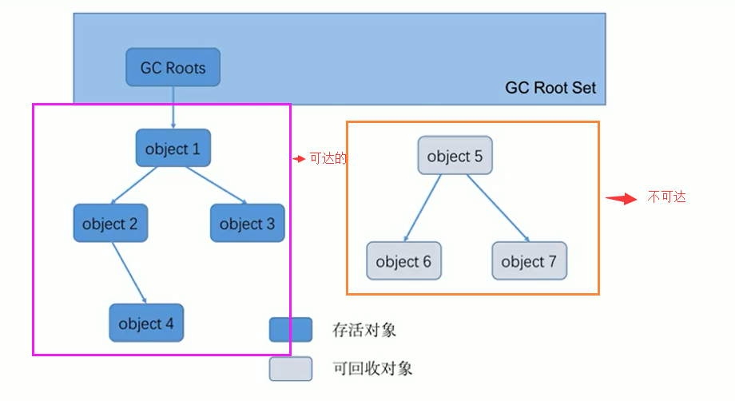
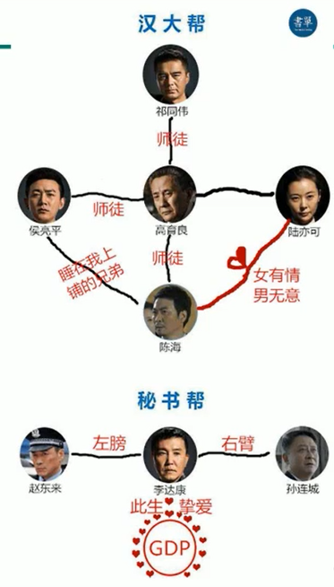
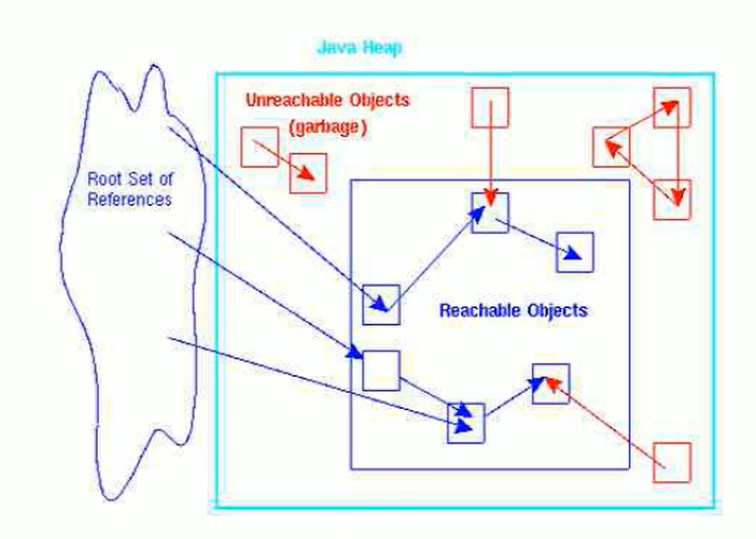

## 							垃圾回收相关算法

### 一、标记阶段：引用计数算法

在堆里存放着几乎所有的Java对象实例，在GC执行垃圾回收之前，首先需要区分出内存中那些是存活对象，哪些是已经死亡的对象。只有被标记为已经死亡的对象，GC才会在执行垃圾回收时，释放掉其所占用的内存空间，因此这个过程我们可以成为垃圾标记阶段。

那么在JVM中究竟是如何标记一个死亡对象呢？简单来说，当一个对象已经不再被任何的存活对象继续引用时，就可以宣判为已经死亡。

判断对象存活一般有两种方式：**引用计数算法 **和 **可达性分析算法**

引用计数算法（Reference Counting）比较简单，对每个对象保存一个整型的引用计数器属性。用于记录对象被引用的情况。

对于一个对象A，只要有任何一个对象引用了A，则A的引用技术区就加1；当引用时效时，引用计数器就减1.只要对象A的引用计数器的值为0，即表示对象A不可能在被使用，可进行回收。

**优点**：实现简单，垃圾对昂便于识别；判定效率高，回收没有延迟性。

**缺点**：他需要单独的字段存储计数器，这样的做法增加了存储空间的开销。

> 每次赋值都需要更新计数器，伴随着加法和减法操作，这增加了时间开销。 引用计数器有一个严重的问题，即无法处理循环引用的情况。这是一条致命缺陷，导致在Java的垃圾回收器中没有使用这类算法。

#### 1.1 循环引用

当p的指针断开的时候，内部的引用形成一个循环，这就四循环引用，从而造成内存泄漏


#### 1.2 举例

我们使用一个案例来测试Java中是否采用的是引用计数算法

```java
/**
 * 引用计数算法测试
 *
 */
public class RefCountGC {
    // 这个成员属性的唯一作用就是占用一点内存
    private byte[] bigSize = new byte[5*1024*1024];
    // 引用
    Object reference = null;

    public static void main(String[] args) {
        RefCountGC obj1 = new RefCountGC();
        RefCountGC obj2 = new RefCountGC();
        obj1.reference = obj2;
        obj2.reference = obj1;
        obj1 = null;
        obj2 = null;
        // 显示的执行垃圾收集行为，判断obj1 和 obj2是否被回收？
        System.gc();
    }
}
```

运行结果

```java
[GC (System.gc()) [PSYoungGen: 15490K->808K(76288K)] 15490K->816K(251392K), 0.0061980 secs] [Times: user=0.00 sys=0.00, real=0.36 secs] 
[Full GC (System.gc()) [PSYoungGen: 808K->0K(76288K)] [ParOldGen: 8K->672K(175104K)] 816K->672K(251392K), [Metaspace: 3479K->3479K(1056768K)], 0.0045983 secs] [Times: user=0.00 sys=0.00, real=0.00 secs] 
Heap
 PSYoungGen      total 76288K, used 655K [0x000000076b500000, 0x0000000770a00000, 0x00000007c0000000)
  eden space 65536K, 1% used [0x000000076b500000,0x000000076b5a3ee8,0x000000076f500000)
  from space 10752K, 0% used [0x000000076f500000,0x000000076f500000,0x000000076ff80000)
  to   space 10752K, 0% used [0x000000076ff80000,0x000000076ff80000,0x0000000770a00000)
 ParOldGen       total 175104K, used 672K [0x00000006c1e00000, 0x00000006cc900000, 0x000000076b500000)
  object space 175104K, 0% used [0x00000006c1e00000,0x00000006c1ea8070,0x00000006cc900000)
 Metaspace       used 3486K, capacity 4496K, committed 4864K, reserved 1056768K
  class space    used 385K, capacity 388K, committed 512K, reserved 1048576K
```

我们能够看到，上述进行了GC收集的行为，将上述的新生代中的两个对象都进行回收了

```java
PSYoungGen: 15490K->808K(76288K)] 15490K->816K(251392K)
```

如果使用引用计数算法，那么这两个对象将会无法回收。而现在两个对象被回收了，说明Java使用的不是引用计数算法来进行标记的。


####  1.3 小结

引用计数算法，是很多语言的资源回收选择，例如因人工智能而更加火热的Python，它更是同时支持引用计数和垃圾收集机制。

具体哪种最优是要看场景的，业界有大规模实践中仅保留引用计数机制，以提高吞吐量的尝试。

Java并没有选择引用计数，是因为其存在一个基本的难题，也就是很难处理循环引用关系。Python如何解决循环引用？

> 手动解除：很好理解，就是在合适的时机，解除引用关系。 使用弱引用weakref，weakref是Python提供的标准库，旨在解决循环引用。

### 二、标记阶段：可达性分析算法

#### 2.1 概念

可达性分析算法：也可称为  根搜索短发，追踪性垃圾收集。

相对于应用计数算法而言，可达性分析算法不经同样具备实现简单和执行高效等特点，更重要的是该算法可以有效地解决在引用计数算法中循环引用的问题，防止内存泄漏的发生。

相较于引用计数算法，这里的可达性分析就是Java、C#选择的。这种类型的垃圾收集同城也叫做追踪性垃圾收集（Tracing Garbage Collection）

#### 2.2 思路

所谓"GCRoots"根集合就是一组必须活跃的引用。

基本思路：

- 可达性分析算法是以根对象集合（GCRoots）为起始点，按照从上至下的方式搜索被根对象集合所连接的目标对象是否可达。
- 使用可达性分析算法后，内存中的存活对象都会被根对象集合直接或间接连接着，搜索所走过的路径称为引用链（Reference Chain）
- 如果目标对象没有任何引用链相连，则是不可达的，就意味着该对象已经死亡，可以标记为垃圾对象。
- 在可达性分析算法中，只有能够被根对象集合直接或者间接连接的对象才是存活对象。



官场上的裙带关系，可达性分析在人类关系网中



#### 2.3 GC Roots可以是那些？

- 虚拟机栈中引用的对象
  - 比如：各个线程被调用的方法中使用到的参数，局部变量等。

- 本地方法栈内JNI（通常说的本地方法）引用的对象方法区中类静态属性引用的对象。
  - 比如：Java类的引用类型静态变量

- 方法区中常量引用的对象
  - 比如：字符串常量池（string Table）里面的引用

- 所有被同步锁synchronized持有的对象

- Java虚拟机内部的引用。
  - 基本数据类型对应的Class对象，一些常驻的异常对象（如：NullPointerException，OutOfMomoryError），系统类加载器。

- 反映java虚拟机内部情况的JMXBean，JVMTI中注册的回调，本地代码缓存等。



#### 2.4 总结

总结一句话就是，除了堆空间外的一些结构，比如  虚拟机栈、本地方法栈、方法区、字符串常量池  等地方堆空间进行引用的，都可以作为GC Roots进行可达性分析。

除了这些固定的GC Roots集合以外，根据用户所选用的垃圾收集器以及当前回收的内存区域不同，还可以有其他对象"临时性"地加入，共同构成完成GC Roots集合。比如：分代收集和局部回收（PartialGC）。

如果只针对Java堆中的某一块区域进行垃圾回收（比如：典型的只针对新生代），必须考虑到内存区域是虚拟机自己的实现细节，更不是孤立封闭的，这个区域的对象完全有可能被其他区域的对象所引用，这时候就需要一并将关联的区域对象也加入GCRoots集合中区考虑，才能保证可达性分析的准确性。

####  2.5 小技巧

由于Root采用栈方式存放变量和指针，所以如果一个指针，它保存了堆内存里面的对象，但是自己又不存放在堆内存里面，那它就是一个Root。

#### 2.6 注意

如果要使用可达性分析算法来判断内存是否可回收，那么分析工作必须在一个能保障一致性的快照中进行。这点不满足的话分析结果的准确性就无法保证。

这点也是导致GC进行时必须“stop The World”的一个重要原因。

即使是号称（几乎）不会发生停顿的CMS收集器中，枚举根节点时也是必须要停顿的。


