### Kafka 详细教程

### 一、Kafka概述

#### 1.1 定义

**Kafka传统定义**： Kafka是一个分布式的基于**发布/订阅模式**的消息队列（Message Queue），主要应用于大数据实时处理领域。

**发布/订阅**：消息的发布者不会将消息直接发布给特定的订阅者，而是将发布的消息分为不同的类别，订阅者只接收感兴趣的消息。

**Kafka最新定义**：Kafka是一个开源的分布式事件流平台（Event Streaming Platform），被数千家公司用于高性能的数据管道、流分析、数据集成和关键任务应用。


#### 1.2 消息队列

目前企业中比较常见的消息队列产品主要有Kafka、ActiveMQ、RabbitMQ、RocketMQ等。

在大数据场景主要采用Kafka作为消息队列。在JavaEE开发中主要采用ActiveMQ、RabbitMQ、RocketMQ。

##### 1.2.1 传统消息队列的应用场景

传统的消息队列的主要应用场景包括**：缓存/消峰、解耦**和**异步通信**。

**缓冲/消峰**： 有助于控制和优化数据流经过系统的速度，解决生产消息和消费消息的处理速度不一致的情况。


**解耦**：允许你独立的扩展或修改两边的处理过程，只要确保它们遵守同样的接口约束。


**异步通信**：允许用户把一个消息放入队列，但并不立即处理它，然后再需要的时候再去处理它们。

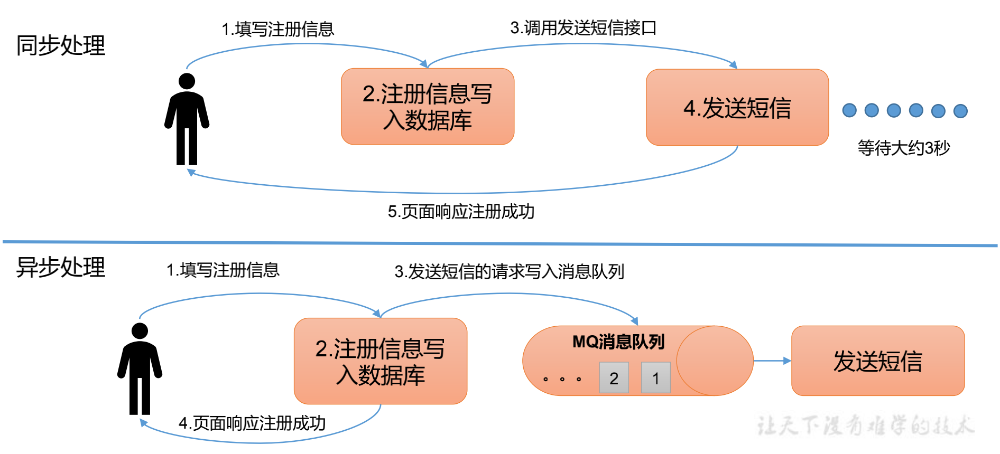

##### 1.2.2 消息队列的两种模式

**1、点对点模式**

- 消费者主动拉去数据，消息收到后清除消息


**2、发布/订阅模式**

- 可以有多个topic主题(浏览，点赞，收藏，评论等)
- 消费者消费数据之后，不删除数据
- 每个消费者互相独立，都可以消费到数据


#### 1.3 Kafka基础架构

1、为方便扩展，并提高吞吐量，一个topic分为多个partition

2、配合分区的设计，提出消费者组的概念，组内每个消费者并行消费

3、为提高可用性，为每个partition增加若干副本，类似NameNode HA

4、ZK中记录谁是leader，Kafka2.8.0 以后也可以配置不采用ZK

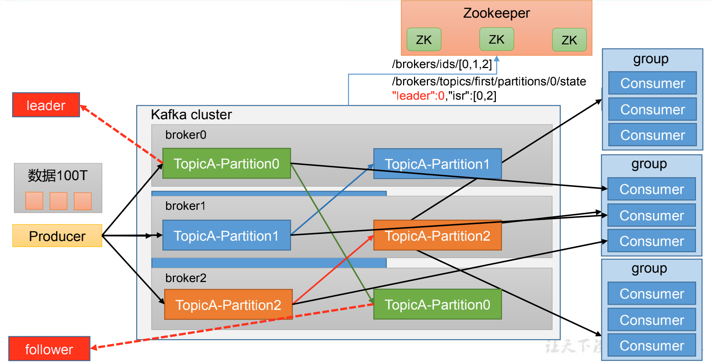


- **Producer**：消息生产者，就是向Kafka broker 发消息的客户端。
- **Consumer**：消息消费者，向Kafka broker 取消息的客户端。

- **Consumer Group（CG）**：消费者组，由多个consumer组成。消费者组内每个消费者负责消费不同分区的数据，一个分区只能由一个组内消费者消费；消费者组之间互不影响。素有的消费者都属于某个消费者组，即消费者组是逻辑上的一个订阅者。

- **Broker**：一台Kafka服务器就是一个broker。一个集群由多个broker组成。一个broker可以容纳多个topic。
- **Topic**： 可以理解为一个队列，生产者和消费者面向的斗士一个topic。
- **Partition**： 为了实现扩展性，一个非常大的topic可以分布到多个broker（即服务器）上，一个topic可以分为多个partition，每个partition是一个有序的队列。
- **Replica**：副本。一个topic的每个分区都有若干个副本，一个Leader和若干个Follower。
- **Leader**：每个分区多个副本的 "主"，生产者发送数据的对象，以及消费者消费数据的对象都是Leader。
- **Follower**：每个分区多个副本中的 "从"，实时从 Leader 中同步数据，保持和 Leader 数据的同步。Leader 发生故障时，某个Follower会成为新的 Leader。

### 二、Kafka快速入门

#### 2.1 安装部署

##### 2.1.1 集群规划

| Hadoop102 | Hadoop103 | Hadoop104 |
| --------- | --------- | --------- |
| zk        | zk        | zk        |
| kafka     | kafka     | kafka     |

##### 2.1.2 集群部署

1、官方下载地址：http://kafka.apache.org/downloads.html

2、解压安装包

```tex
[yooome@192 local % sudo tar -zxvf kafka_2.13-3.1.0.tgz 
```

3、修改解压后的文件名称

```basic
[yooome@192 local % sudo mv kafka_2.13-3.1.0 kafka
```

4、进入到/usr/local/kafka目录，修改配置文件

```basic
yooome@192 kafka % cd config 
yooome@192 config % vim server.properties 
```

输入一下内容：

```bash
#broker 的全局唯一编号，不能重复，只能是数字。
broker.id=0
#处理网络请求的线程数量
num.network.threads=3
#用来处理磁盘 IO 的线程数量
num.io.threads=8
#发送套接字的缓冲区大小
socket.send.buffer.bytes=102400
#接收套接字的缓冲区大小
socket.receive.buffer.bytes=102400
#请求套接字的缓冲区大小
socket.request.max.bytes=104857600
#kafka 运行日志(数据)存放的路径，路径不需要提前创建，kafka 自动帮你创建，可以
配置多个磁盘路径，路径与路径之间可以用"，"分隔
log.dirs=/opt/module/kafka/datas
#topic 在当前 broker 上的分区个数
num.partitions=1
#用来恢复和清理 data 下数据的线程数量
num.recovery.threads.per.data.dir=1
# 每个 topic 创建时的副本数，默认时 1 个副本
offsets.topic.replication.factor=1
#segment 文件保留的最长时间，超时将被删除
log.retention.hours=168
#每个 segment 文件的大小，默认最大 1G
log.segment.bytes=1073741824
# 检查过期数据的时间，默认 5 分钟检查一次是否数据过期
log.retention.check.interval.ms=300000
#配置连接 Zookeeper 集群地址（在 zk 根目录下创建/kafka，方便管理）
zookeeper.connect=hadoop102:2181,hadoop103:2181,hadoop104:2181/kafka
```

5、分发安装包

```ba
```

6、分别在hadoop103和hadoop104 上修改配置文件/opt/module/kafka/config/server.properties中的 broker.id=1、broker.id=2

**注**：broker.id 不得重复，整个集群中唯一

```bash
[atguigu@hadoop103 module]$ vim kafka/config/server.properties
修改:
# The id of the broker. This must be set to a unique integer for each broker.
broker.id=1
[atguigu@hadoop104 module]$ vim kafka/config/server.properties
修改:
# The id of the broker. This must be set to a unique integer for each broker.
broker.id=2
```

7、配置环境变量

（1）在/etc/profile.d/my_env.sh 文件中增加 kafka 环境变量配置

```bash
[atguigu@hadoop102 module]$ sudo vim /etc/profile.d/my_env.sh
增加如下内容：
#KAFKA_HOME
export KAFKA_HOME=/opt/module/kafka
export PATH=$PATH:$KAFKA_HOME/bin
```

（2）刷新一下环境变量。

```bash
[atguigu@hadoop102 module]$ source /etc/profile
```

（3）分发环境变量文件到其他节点，并 source。

```bash
[atguigu@hadoop102 module]$ sudo /home/atguigu/bin/xsync /etc/profile.d/my_env.sh
[atguigu@hadoop103 module]$ source /etc/profile
[atguigu@hadoop104 module]$ source /etc/profile
```

8、启动集群

（1）先启动 Zookeeper 集群，然后启动 Kafka。

```bash
[atguigu@hadoop102 kafka]$ zk.sh start
```

（2）依次在 hadoop102、hadoop103、hadoop104 节点上启动 Kafka。

```bash
[atguigu@hadoop102 kafka]$ bin/kafka-server-start.sh -daemon
config/server.properties
[atguigu@hadoop103 kafka]$ bin/kafka-server-start.sh -daemon
config/server.properties
[atguigu@hadoop104 kafka]$ bin/kafka-server-start.sh -daemon
config/server.properties
```

**注意：配置文件的路径要能够到 server.properties。**

9、关闭集群

```bash
[atguigu@hadoop102 kafka]$ bin/kafka-server-stop.sh 
[atguigu@hadoop103 kafka]$ bin/kafka-server-stop.sh 
[atguigu@hadoop104 kafka]$ bin/kafka-server-stop.sh
```

##### 2.1.3 集群启停脚本

1）在/home/atguigu/bin 目录下创建文件 kf.sh 脚本文件

```bash
[atguigu@hadoop102 bin]$ vim kf.sh
```

脚本如下：

```bash
#! /bin/bash
case $1 in
"start"){
	for i in hadoop102 hadoop103 hadoop104
	do
		echo " --------启动 $i Kafka-------"
		ssh $i "/opt/module/kafka/bin/kafka-server-start.sh -
	daemon /opt/module/kafka/config/server.properties"
	done
};;
"stop"){
	for i in hadoop102 hadoop103 hadoop104
	do
		echo " --------停止 $i Kafka-------"
		ssh $i "/opt/module/kafka/bin/kafka-server-stop.sh "
	done
};;
esac
```

2）添加执行权限

```bash
[atguigu@hadoop102 bin]$ chmod +x kf.sh
```

3）启动集群命令

```bash
[atguigu@hadoop102 ~]$ kf.sh start
```

4）停止集群命令

```bash
[atguigu@hadoop102 ~]$ kf.sh stop
```

**注意**：停止 Kafka 集群时，一定要等 Kafka 所有节点进程全部停止后再停止 Zookeeper集群。因为 Zookeeper 集群当中记录着 Kafka 集群相关信息，Zookeeper 集群一旦先停止，Kafka 集群就没有办法再获取停止进程的信息，只能手动杀死 Kafka 进程了。

待续。。。。。。

#### 2.2 Kafka命令行操作

##### 2.2.1 Kafka基础架构


##### 2.2.2 主题命令行操作

1、查看操作主题命令参数

```basic
yooome@192 kafka % ./bin/kafka-topics.sh 
```

| 参数                                              | 描述                                   |
| :------------------------------------------------ | :------------------------------------- |
| --bootstrap-server <String: server toconnect to>  | 连接的 Kafka Broker 主机名称和端口号。 |
| --topic <String: topic>                           | 操作的 topic 名称。                    |
| --create                                          | 创建主题                               |
| --delete                                          | 删除主题                               |
| --alter                                           | 修改主题                               |
| --list                                            | 查看所有主题                           |
| --describe                                        | 查看主题详细描述                       |
| --partitions <Integer: # of partitions>           | 设置分区数。                           |
| --replication-factor<Integer: replication factor> | 设置分区副本。                         |
| --config <String: name=value>                     | 更新系统默认的配置。                   |

2、查看当前服务器中的所有topic

```bash
yooome@192 kafka % ./bin/kafka-topics.sh --bootstrap-server localhost:9092 --list
```

3、创建 `first topic`

```bash
yooome@192 kafka % ./bin/kafka-topics.sh --bootstrap-server localhost:9092 --create --partitions 1 --replication-factor 1 --topic first
```

- 选项说明：
  1. --topic 定义 topic 名
  2. --replication-factor 定义副本数
  3. --partitions 定义分区数

4、查看 `first` 主题的详情

```bash
yooome@192 kafka % ./bin/kafka-topics.sh --bootstrap-server localhost:9092 --topic first --describe
```

5、修改分区数（注意：分区数只能增加，不能减少）

```shell
yooome@192 kafka % ./bin/kafka-topics.sh --bootstrap-server localhost:9092 --alter --topic first --partitions 3
```

6、查看结果：

```shell
yooome@192 kafka % ./bin/kafka-topics.sh --bootstrap-server localhost:9092 --topic first --describe 
Topic: first	TopicId: _Pjhmn1NTr6ufGufcnsw5A	PartitionCount: 3	ReplicationFactor: 1	Configs: segment.bytes=1073741824
	Topic: first	Partition: 0	Leader: 0	Replicas: 0	Isr: 0
	Topic: first	Partition: 1	Leader: 0	Replicas: 0	Isr: 0
	Topic: first	Partition: 2	Leader: 0	Replicas: 0	Isr: 0
```

7、删除 `topic `

```shell
yooome@192 kafka % ./bin/kafka-topics.sh --bootstrap-server localhost:9092 --delete --topic first 
```

##### 2.2.3 生产者命令行操作

1、查看操作者命令参数

```shell
yooome@192 kafka % ./bin/kafka-console-producer.sh 
```

| 参数                                             | 描述                                   |
| ------------------------------------------------ | -------------------------------------- |
| --bootstrap-server <String: server toconnect to> | 连接的 Kafka Broker 主机名称和端口号。 |
| --topic <String: topic>                          | 操作的 topic 名称。                    |

2、发送消息

```shell
yooome@192 kafka % ./bin/kafka-console-producer.sh --bootstrap-server localhost:9092 --topic first
>hello world
>yooome yooome
```

##### 2.3.4 消费者命令行操作

1、查看操作消费者命令参数

| 参数                                             | 描述                                   |
| ------------------------------------------------ | -------------------------------------- |
| --bootstrap-server <String: server toconnect to> | 连接的 Kafka Broker 主机名称和端口号。 |
| --topic <String: topic>                          | 操作的 topic 名称。                    |
| --from-beginning                                 | 从头开始消费。                         |
| --group <String: consumer group id>              | 指定消费者组名称。                     |

2、消费消息

- 消费`first` 主题中的数据

```shell
yooome@192 kafka % ./bin/kafka-console-consumer.sh --bootstrap-server localhost:9092 --topic first
```

- 把主题中所有的数据都读取出来（包括历史数据）。

```shell
yooome@192 kafka % ./bin/kafka-console-consumer.sh --bootstrap-server localhost:9092 --from-beginning --topic first
```

### 三、Kafka生产者

#### 3.1 生产者消息发送流程

##### 3.1.1 发送原理

在消息发送的过程中，涉及到了两个线程 --- main 线程和Sender线程。在main线程中创建了一个双端队列 RecordAccumulator。main线程将消息发送给ResordAccumlator，Sender线程不断从 RecordAccumulator 中拉去消息发送到 Kafka Broker


##### 3.1.2 生产者重要参数列表

| 参数名称                              | 描述                                                         |
| ------------------------------------- | ------------------------------------------------------------ |
| bootstrap.servers                     | 生产者连接集群所需的 broker 地 址 清 单 。 例 如hadoop102:9092,hadoop103:9092,hadoop104:9092，可以设置 1 个或者多个，中间用逗号隔开。注意这里并非需要所有的 broker 地址，因为生产者从给定的 broker里查找到其他 broker 信息。 |
| key.serializer 和 value.serializer    | 指定发送消息的 key 和 value 的序列化类型。一定要写全类名。   |
| buffer.memory                         | RecordAccumulator 缓冲区总大小，默认 32m。                   |
| batch.size                            | 缓冲区一批数据最大值，默认 16k。适当增加该值，可以提高吞吐量，但是如果该值设置太大，会导致数据传输延迟增加。 |
| linger.ms                             | 如果数据迟迟未达到 batch.size，sender 等待 linger.time之后就会发送数据。单位 ms，默认值是 0ms，表示没有延迟。生产环境建议该值大小为 5-100ms 之间。 |
| acks                                  | 0：生产者发送过来的数据，不需要等数据落盘应答。1：生产者发送过来的数据，Leader 收到数据后应答。-1（all）：生产者发送过来的数据，Leader+和 isr 队列里面的所有节点收齐数据后应答。默认值是-1，-1 和all 是等价的。 |
| max.in.flight.requests.per.connection | 允许最多没有返回 ack 的次数，默认为 5，开启幂等性要保证该值是 1-5 的数字。 |
| retries                               | 当消息发送出现错误的时候，系统会重发消息。retries表示重试次数。默认是 int 最大值，2147483647。如果设置了重试，还想保证消息的有序性，需要设置MAX_IN_FLIGHT_REQUESTS_PER_CONNECTION=1否则在重试此失败消息的时候，其他的消息可能发送成功了。 |
| retry.backoff.ms                      | 两次重试之间的时间间隔，默认是 100ms。                       |
| enable.idempotence                    | 是否开启幂等性，默认 true，开启幂等性。                      |
| compression.type                      | 生产者发送的所有数据的压缩方式。默认是 none，也就是不压缩。支持压缩类型：none、gzip、snappy、lz4 和 zstd。 |

#### 3.2 异步发送API

##### 3.2.1 普通异步发送

1、需求：创建Kafka生产者，采用异步的方式发送到Kafka Broker。

- **异步发送流程**


2、代码编程

- 创建工程kafka
- 导入依赖

```xml
<dependencies>
  <dependency>
    <groupId>org.apache.kafka</groupId>
    <artifactId>kafka-clients</artifactId>
    <version>3.0.0</version>
  </dependency>
</dependencies>
```

- 创建包名：com.yooome.kafka.producer

```java
package com.yooome.kafka.producer;

import org.apache.kafka.clients.producer.KafkaProducer;
import org.apache.kafka.clients.producer.ProducerConfig;
import org.apache.kafka.clients.producer.ProducerRecord;

import java.util.Properties;

public class CustomProducer {
    public static void main(String[] args) {
        // 1. 创建kafka生产者配置对象
        Properties properties = new Properties();
        // 2. 给 kafka 配置对象添加配置信息：bootstrap.servers
        properties.put(ProducerConfig.BOOTSTRAP_SERVERS_CONFIG, "localhost:9092");
        // key,value 序列化（必须）：key.serializer，value.serializer
        properties.put(ProducerConfig.KEY_SERIALIZER_CLASS_CONFIG, "org.apache.kafka.common.serialization.StringSerializer");
        properties.put(ProducerConfig.VALUE_SERIALIZER_CLASS_CONFIG, "org.apache.kafka.common.serialization.StringSerializer");
        // 3. 创建 kafka 生产者对象
        KafkaProducer<String, String> kafkaProducer = new KafkaProducer<String, String>(properties);
        // 4. 调用 send 方法,发送消息
        for (int i = 0; i < 5; i++) {
            kafkaProducer.send(new ProducerRecord<>("first", "yooome" + i));
        }
        // 5. 关闭资源
        kafkaProducer.close();
    }
}
```

- 测试
  1. 在 hadoop102 上开启 Kafka 消费者。

```shell
yooome@192 kafka % ./bin/kafka-console-consumer.sh --bootstrap-server localhost:9092 --topic first
```

​		2. 在 IDEA 中执行代码，观察 hadoop102 控制台中是否接收到消息。

```shell
yooome@192 kafka % ./bin/kafka-console-consumer.sh --bootstrap-server localhost:9092 --topic first
yooome0
yooome1
yooome2
yooome3
yooome4
```

##### 3.2.2 带回调函数的异步发送

回调函数会在producer收到ack时调用，为异步调用，该方法有两个参数，分别是元数据信息(RecordMetadata)和异常信息(Exception)，如果Exception为null，说明消息发送成功，如果Exception不为null，说明消息发送失败。

**带回调函数的异步发送**


【注意:】消息发送失败会自动重试，不需要我们在回调函数中手动重试。

```java
package com.yooome.kafka.producer;

import org.apache.kafka.clients.producer.*;
import org.apache.kafka.common.serialization.StringSerializer;

import java.util.Properties;

public class CustomProducerCallback {
    public static void main(String[] args) throws InterruptedException {
        // 1. 创建Kafka生产者的配置对象
        Properties properties = new Properties();
        // 2. 给kafka配置对象添加配置信息
        properties.put(ProducerConfig.BOOTSTRAP_SERVERS_CONFIG, "localhost:9092");
        // 3. key 序列化 key.serializer，value.serializer
        properties.put(ProducerConfig.KEY_SERIALIZER_CLASS_CONFIG, StringSerializer.class.getName());
        // 4. value 序列化 value.serializer
        properties.put(ProducerConfig.VALUE_SERIALIZER_CLASS_CONFIG, StringSerializer.class.getName());
        // 5. 创建kafka生产者对象
        KafkaProducer<String,String> kafkaProducer = new KafkaProducer<String, String>(properties);
        for (int i = 0; i < 5; i++) {
            kafkaProducer.send(new ProducerRecord<>("first", "yooome " + i), new Callback() {
                // 该方法在Producer 收到 ack 时调用，为异步调用
                @Override
                public void onCompletion(RecordMetadata recordMetadata, Exception e) {
                    if (e == null) {
                        // 没有异常，输出信息到控制台
                        System.out.println(" 主题：" + recordMetadata.topic() + " -> " + " 分区 " + recordMetadata.partition());
                    }else {
                        e.printStackTrace();
                    }
                }
            });
            // 延迟一会会看到数据发往不同分区
            //Thread.sleep(2);
        }
        // 5. 关闭资源
        kafkaProducer.close();
    }
}

```

- 测试：
  1. 在在 hadoop102 上开启 Kafka 消费者。

```bash
yooome@192 kafka % ./bin/kafka-console-consumer.sh --bootstrap-server localhost:9092 --topic first
```

   		 2. 在 IDEA 中执行代码，观察 hadoop102 控制台中是否接收到消息 

```bash
yooome@192 kafka % ./bin/kafka-console-consumer.sh --bootstrap-server localhost:9092 --topic first
yooome 0
yooome 1
yooome 2
yooome 3
yooome 4
```

3. 在 IDEA 控制台观察回调信息(注意：本up主，只启用了一台kafka，故各位根据自己的集群数而定)


#### 3.3 同步发送API


只需要在异步发送的基础上，在调用一下 get() 方法即可。

```java
package com.yooome.kafka.producer;

import org.apache.kafka.clients.producer.*;
import org.apache.kafka.common.serialization.StringSerializer;

import java.util.Properties;
import java.util.concurrent.ExecutionException;

public class CustomProducerCallback {
    public static void main(String[] args) throws InterruptedException, ExecutionException {
        // 1. 创建Kafka生产者的配置对象
        Properties properties = new Properties();
        // 2. 给kafka配置对象添加配置信息
        properties.put(ProducerConfig.BOOTSTRAP_SERVERS_CONFIG, "localhost:9092");
        // 3. key 序列化 key.serializer，value.serializer
        properties.put(ProducerConfig.KEY_SERIALIZER_CLASS_CONFIG, StringSerializer.class.getName());
        // 4. value 序列化 value.serializer
        properties.put(ProducerConfig.VALUE_SERIALIZER_CLASS_CONFIG, StringSerializer.class.getName());
        // 5. 创建kafka生产者对象
        KafkaProducer<String,String> kafkaProducer = new KafkaProducer<String, String>(properties);
        for (int i = 0; i < 5; i++) {
            //异步发送
            // kafkaProducer.send(new ProducerRecord<>("first","kafka" + i));
            // 6. 同步发送
            kafkaProducer.send(new ProducerRecord<>("first","kafka" + i)).get();
        }
        // 7. 关闭资源
        kafkaProducer.close();
    }
}

```

**测试**：

1. 在在 hadoop102 上开启 Kafka 消费者。

```bash
yooome@192 kafka % ./bin/kafka-console-consumer.sh --bootstrap-server localhost:9092 --topic first
```

   		 2. 在 IDEA 中执行代码，观察 hadoop102 控制台中是否接收到消息 

```bash
yooome@192 kafka % ./bin/kafka-console-consumer.sh --bootstrap-server localhost:9092 --topic first
kafka0
kafka1
kafka2
kafka3
kafka4
```

#### 3.4 生产者分区

##### 3.4.1 分区好处

1. **便于合理使用存储资源**，每个Partition在一个Broker上存储，可以把海量的数据按照分区切割成一块一块数据存储在多台Broker上。合理控制分区的任务，可以实现**负载均衡**的效果。

2. **提高并行度**，生产者可以以分区为单位**发送数据**；消费者可以以分区为单位进行 **消费数据**。

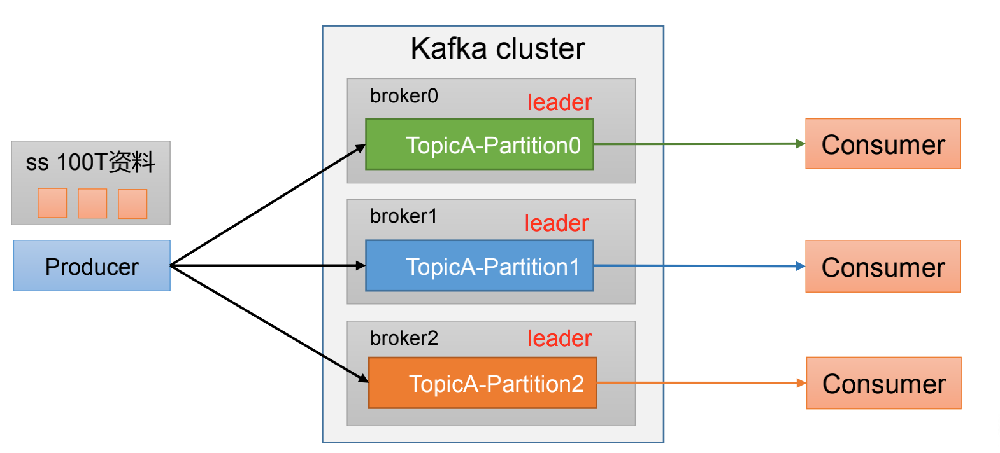

##### 3.4.2 生产者发送消息的分区策略

1. **默认的分区器DefaultPartitioner**

   在IDEA中ctrl + n，全局查找 DefaultPartitioner

```java
public class DefaultPartitioner implements Partitioner {
   ....
}
```

2. **Kafka原则**

ProducerRecord类，在类中可以看到如下构造方法：

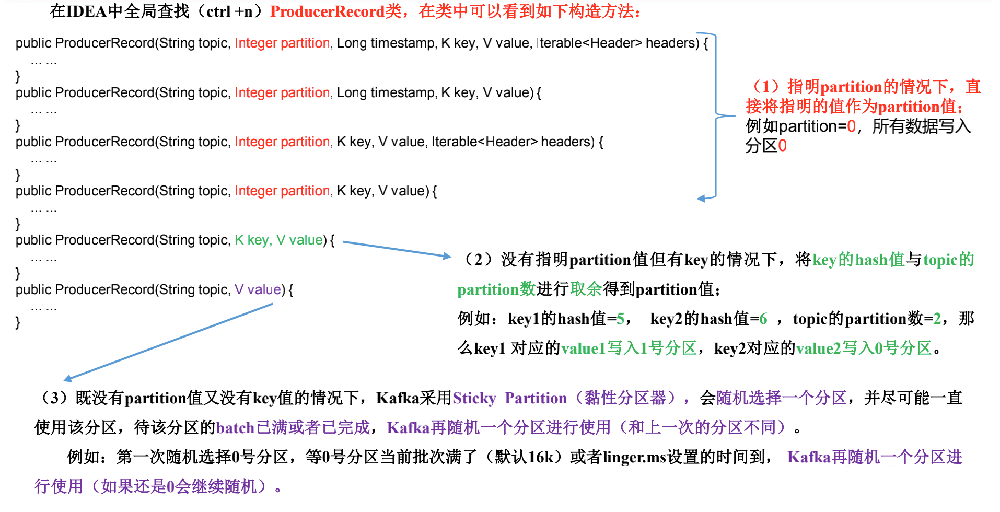

1. 指明partition的情况下，直接将指明的值作为partition值；例如：partition=0，所有数据写入分区0。
2. 没有指明 partition 值但有key的情况下，将key的hash值与topic的partition数进行取余得到partition值；例如：key1的hash值=5，key2的hash值=6，topic的partition数=2，那么key1对应的value1写入 1 号分区，key2对应的 value2 写入 0 号分区。
3. 既没有partition值又没有key值的情况下，Kafka采用 Sticky Partition（粘性分区器），会随机选择一个分区，并尽可能一直使用该分区，待该分区的 batch 已满或者已完成，Kafka在随机一个分区进行使用（和上一次的分区不同）。例如：第一次随机选择0号分区，等0号分区当前批次满了（默认16K）或者；linger.ms设置的时间到，Kafka在随机一个分区进行使用（如果还是0会继续随机）。

【案例一】

将数据发往指定partition的情况下，例如，将所有数据发往分区 0【注意：本up主开启了一台kafka，只能发往分区0，你们注意自己的分区】 中。

```java
package com.yooome.kafka.producer;

import org.apache.kafka.clients.producer.*;
import org.apache.kafka.common.serialization.StringSerializer;

import java.util.Properties;
import java.util.concurrent.ExecutionException;

public class CustomProducerCallbackPartitions {
    public static void main(String[] args) throws InterruptedException, ExecutionException {
        // 1. 创建Kafka生产者的配置对象
        Properties properties = new Properties();
        // 2. 给kafka配置对象添加配置信息
        properties.put(ProducerConfig.BOOTSTRAP_SERVERS_CONFIG, "localhost:9092");
        // 3. key 序列化 key.serializer，value.serializer
        properties.put(ProducerConfig.KEY_SERIALIZER_CLASS_CONFIG, StringSerializer.class.getName());
        // 4. value 序列化 value.serializer
        properties.put(ProducerConfig.VALUE_SERIALIZER_CLASS_CONFIG, StringSerializer.class.getName());
        // 5. 创建kafka生产者对象
        KafkaProducer<String,String> kafkaProducer = new KafkaProducer<String, String>(properties);
        for (int i = 0; i < 5; i++) {
            //异步发送
            // kafkaProducer.send(new ProducerRecord<>("first","kafka" + i));
            // 6. 同步发送
            kafkaProducer.send(new ProducerRecord<>("first", 0, "", "ka ka ka " + i), new Callback() {
                @Override
                public void onCompletion(RecordMetadata recordMetadata, Exception e) {
                    if (e == null){
                        System.out.println(" 主题： " +
                                recordMetadata.topic() + "->" + "分区：" + recordMetadata.partition()
                        );
                    }else {
                        e.printStackTrace();
                    }
                }
            }).get();
        }
        // 7. 关闭资源
        kafkaProducer.close();
    }
}
```

测试：

1. 在 hadoop102 上开启 Kafka 消费者。

```java
yooome@192 kafka % ./bin/kafka-console-consumer.sh --bootstrap-server localhost:9092 --topic first
```

2. 在IDEA中执行代码，观察 hadoop102控制台中是否接收到消息。

```java
yooome@192 kafka % ./bin/kafka-console-consumer.sh --bootstrap-server localhost:9092 --topic first
ka ka ka 0
ka ka ka 1
ka ka ka 2
ka ka ka 3
ka ka ka 4
```

3. 在 IDEA 控制台观察回调信息。

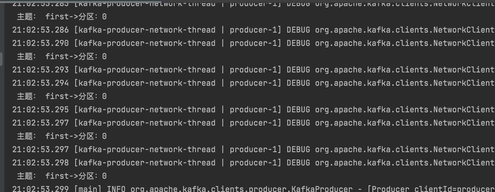

【案例二】

没有指明 partition 值但有 key 的情况下，将 key 的 hash 值与 topic 的 partition 数进行取余得到 partition 值。

**// 依次指定 key 值为 a,b,f ，数据 key 的 hash 值与 3 个分区求余，分别发往 1、2、0**

```java
package com.yooome.kafka.producer;

import org.apache.kafka.clients.producer.*;
import org.apache.kafka.common.serialization.StringSerializer;

import java.util.Properties;
import java.util.concurrent.ExecutionException;

public class CustomProducerCallbackPartitions {
    public static void main(String[] args) throws InterruptedException, ExecutionException {
        // 1. 创建Kafka生产者的配置对象
        Properties properties = new Properties();
        // 2. 给kafka配置对象添加配置信息
        properties.put(ProducerConfig.BOOTSTRAP_SERVERS_CONFIG, "localhost:9092");
        // 3. key 序列化 key.serializer，value.serializer
        properties.put(ProducerConfig.KEY_SERIALIZER_CLASS_CONFIG, StringSerializer.class.getName());
        // 4. value 序列化 value.serializer
        properties.put(ProducerConfig.VALUE_SERIALIZER_CLASS_CONFIG, StringSerializer.class.getName());
        // 5. 创建kafka生产者对象
        KafkaProducer<String,String> kafkaProducer = new KafkaProducer<String, String>(properties);
        for (int i = 0; i < 5; i++) {
            //异步发送
            // kafkaProducer.send(new ProducerRecord<>("first","kafka" + i));
            // 6. 同步发送
            // 依次指定 key 值为 a,b,f ，数据 key 的 hash 值与 3 个分区求余，分别发往 1、2、0
            kafkaProducer.send(new ProducerRecord<>("first",  "f"," fffffff " + i), new Callback() {
                @Override
                public void onCompletion(RecordMetadata recordMetadata, Exception e) {
                    if (e == null){
                        System.out.println(" 主题： " +
                                recordMetadata.topic() + "->" + "分区：" + recordMetadata.partition()
                        );
                    }else {
                        e.printStackTrace();
                    }
                }
            }).get();
        }
        // 7. 关闭资源
        kafkaProducer.close();
    }
}

```

测试：

①key="a"时，在控制台查看结果。

```java
主题：first->分区：1
主题：first->分区：1
主题：first->分区：1
主题：first->分区：1
主题：first->分区：1 
```

②key="b"时，在控制台查看结果。

```java
主题：first->分区：2
主题：first->分区：2
主题：first->分区：2
主题：first->分区：2
主题：first->分区：2 
```

③key="f"时，在控制台查看结果。

```java
主题：first->分区：0
主题：first->分区：0
主题：first->分区：0
主题：first->分区：0
主题：first->分区：0
```

##### 3.4.3 自定义分区器

如果研发人员可以根据企业需求，自己重新实现分区器

1. **需求**

例如我们实现一个分区器实现，发送过来的数据中如果包含 yooome，就发往 0 号分区，不包含 yooome ，就发往 1 号分区。

2. 实现步骤：

   (1) 定义类实现 Partition 接口。

   (2) 重写 partition() 方法。

```java
package com.yooome.kafka.producer;

import org.apache.kafka.clients.producer.Partitioner;
import org.apache.kafka.common.Cluster;

import java.util.Map;

public class MyPartitioner implements Partitioner {
    @Override
    public int partition(String s, Object key, byte[] bytes, Object value, byte[] bytes1, Cluster cluster) {
        // 获取消息
        String msgValue = value.toString();
        // 创建 partition
        int partition;
        if (msgValue.contains("yooome")) {
            partition = 0;
        } else {
            partition = 1;
        }
        return partition;
    }

    @Override
    public void close() {

    }

    @Override
    public void configure(Map<String, ?> map) {

    }
}

```

```java
package com.yooome.kafka.producer;

import org.apache.kafka.clients.producer.*;
import org.apache.kafka.common.serialization.StringSerializer;

import java.util.Properties;
import java.util.concurrent.ExecutionException;

public class CustomProducerCallbackPartitions {
    public static void main(String[] args) throws InterruptedException, ExecutionException {
        // 1. 创建Kafka生产者的配置对象
        Properties properties = new Properties();
        MyPartitioner myPartitioner = new MyPartitioner();
        // 2. 给kafka配置对象添加配置信息
        properties.put(ProducerConfig.BOOTSTRAP_SERVERS_CONFIG, "localhost:9092");
        // 3. key 序列化 key.serializer，value.serializer
        properties.put(ProducerConfig.KEY_SERIALIZER_CLASS_CONFIG, StringSerializer.class.getName());
        // 4. value 序列化 value.serializer
        properties.put(ProducerConfig.VALUE_SERIALIZER_CLASS_CONFIG, StringSerializer.class.getName());
        properties.put(ProducerConfig.PARTITIONER_CLASS_CONFIG, myPartitioner.getClass().getName());
        // 5. 创建kafka生产者对象
        KafkaProducer<String, String> kafkaProducer = new KafkaProducer<String, String>(properties);
        for (int i = 0; i < 5; i++) {
            //异步发送
            // kafkaProducer.send(new ProducerRecord<>("first","kafka" + i));
            // 6. 同步发送
            // 依次指定 key 值为 a,b,f ，数据 key 的 hash 值与 3 个分区求余，分别发往 1、2、0
            kafkaProducer.send(new ProducerRecord<>("first", "yooome fffffff " + i), new Callback() {
                @Override
                public void onCompletion(RecordMetadata recordMetadata, Exception e) {
                    if (e == null) {
                        System.out.println(" 主题： " +
                                recordMetadata.topic() + "->" + "分区：" + recordMetadata.partition()
                        );
                    } else {
                        e.printStackTrace();
                    }
                }
            }).get();
        }
        // 7. 关闭资源
        kafkaProducer.close();
    }
}

```

**测试**：

① 在 hadoop102 上开启 Kafka 消费者。

```java
yooome@192 kafka % ./bin/kafka-console-consumer.sh --bootstrap-server localhost:9092 --topic first
```

```bash
yooome@192 kafka % ./bin/kafka-console-consumer.sh --bootstrap-server localhost:9092 --topic first
yooome fffffff 0
yooome fffffff 1
yooome fffffff 2
yooome fffffff 3
yooome fffffff 4
```

②在 IDEA 控制台观察回调信息。


#### 3.5 生产经验----生产者如何提高吞吐量

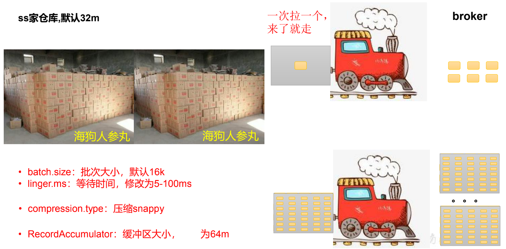

```java
package com.yooome.kafka.producer;

import org.apache.kafka.clients.producer.*;
import org.apache.kafka.common.serialization.StringSerializer;

import java.util.Properties;
import java.util.concurrent.ExecutionException;

public class CustomProducerParameters {
    public static void main(String[] args) throws ExecutionException, InterruptedException {
        // 1. 创建Kafka生产者的配置对象
        Properties properties = new Properties();
        // 2. 给kafka配置对象添加配置信息
        properties.put(ProducerConfig.BOOTSTRAP_SERVERS_CONFIG, "localhost:9092");
        // 3. key 序列化 key.serializer，value.serializer
        properties.put(ProducerConfig.KEY_SERIALIZER_CLASS_CONFIG, StringSerializer.class.getName());
        // 4. value 序列化 value.serializer
        properties.put(ProducerConfig.VALUE_SERIALIZER_CLASS_CONFIG, StringSerializer.class.getName());
        // batch size 批次大小，默认 16k
        properties.put(ProducerConfig.BATCH_SIZE_CONFIG, 16384);
        // linger.ms : 等待时间， 默认0
        properties.put(ProducerConfig.LINGER_MS_CONFIG, 0);
        // 缓冲区大小
        properties.put(ProducerConfig.BUFFER_MEMORY_CONFIG, 33554432);
        //  compression.type：压缩，默认 none，可配置值 gzip、snappy、lz4 和 zstd
        // properties.put(ProducerConfig.COMPRESSION_TYPE_CONFIG,"snappy");

        // 5. 创建kafka生产者对象
        KafkaProducer<String, String> kafkaProducer = new KafkaProducer<String, String>(properties);
        for (int i = 0; i < 5; i++) {
            //异步发送
            // kafkaProducer.send(new ProducerRecord<>("first","kafka" + i));
            // 6. 同步发送
            // 依次指定 key 值为 a,b,f ，数据 key 的 hash 值与 3 个分区求余，分别发往 1、2、0
            kafkaProducer.send(new ProducerRecord<>("first", "ProducerRecord" + i));
        }
        // 7. 关闭资源
        kafkaProducer.close();
    }
}
```

【注意】：compression.type：压缩，默认 none，可配置值 gzip、snappy、lz4 和 zstd

```bash
Mac 电脑对 compression.type 不兼容，出现报错 如下：

org.apache.spark.SparkException: Job aborted due to stage failure: Task 0 in stage 0.0 failed 1 times, most recent failure: Lost task 0.0 in stage 0.0 (TID 0, localhost, executor driver): org.xerial.snappy.SnappyError: [FAILED_TO_LOAD_NATIVE_LIBRARY] no native library is found for os.name=Mac and os.arch=aarch64
```

**测试**：

**查看控制台是否接收到消息**

```java
yooome@192 kafka % ./bin/kafka-console-consumer.sh --bootstrap-server localhost:9092 --topic first
ProducerRecord0
ProducerRecord1
ProducerRecord2
ProducerRecord3
ProducerRecord4
```

#### 3.6 生产经验----数据可靠性

##### 3.6.1 回顾发送流程


##### 3.6.2 ACK应答级别

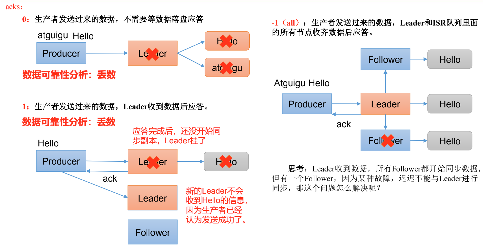


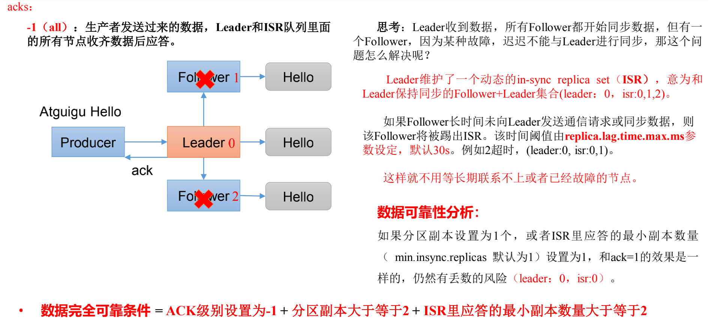

**可靠性总结**：

1. acks=0，生产者发送过来数据就不管了，可靠性差，效率高；
2. acks=1，生产者发送过来数据 Leader 应答，可靠性中等，效率中等；
3. acks=-1，生产者发送过来数据 Leader 和 ISR 队列里面苏欧欧Follwer应答，可靠性，效率低；

在生产环境中，acks=0很少使用；acks=1，一般用于传输普通的日志，允许丢个别数据；acks=-1，一般用于传输和钱相关的数据，对可靠性要求比较高的场景。


**数据重复分析**：

acks：-1（all）：生产者发送过来的数据，Leader和ISR队列里面的所有节点收齐数据后应答。


**代码配置**

```java
package com.yooome.kafka.producer;

import org.apache.kafka.clients.producer.KafkaProducer;
import org.apache.kafka.clients.producer.ProducerConfig;
import org.apache.kafka.clients.producer.ProducerRecord;
import org.apache.kafka.common.serialization.StringSerializer;

import java.util.Properties;

public class CustomProducerAck {
    public static void main(String[] args) {
        // 1. 创建Kafka生产者的配置对象
        Properties properties = new Properties();
        // 2. 给kafka配置对象添加配置信息
        properties.put(ProducerConfig.BOOTSTRAP_SERVERS_CONFIG, "localhost:9092");
        // 3. key 序列化 key.serializer，value.serializer
        properties.put(ProducerConfig.KEY_SERIALIZER_CLASS_CONFIG, StringSerializer.class.getName());
        // 4. value 序列化 value.serializer
        properties.put(ProducerConfig.VALUE_SERIALIZER_CLASS_CONFIG, StringSerializer.class.getName());
        // 设置 acks
        properties.put(ProducerConfig.ACKS_CONFIG, "all");
        // 重试次数
        properties.put(ProducerConfig.RETRIES_CONFIG, 3);
        // 5. 创建kafka生产者对象
        KafkaProducer<String, String> kafkaProducer = new KafkaProducer<String, String>(properties);
        for (int i = 0; i < 5; i++) {
            //异步发送
            // kafkaProducer.send(new ProducerRecord<>("first","kafka" + i));
            // 6. 同步发送
            // 依次指定 key 值为 a,b,f ，数据 key 的 hash 值与 3 个分区求余，分别发往 1、2、0
            kafkaProducer.send(new ProducerRecord<>("first", "acks acks " + i));
        }
        // 7. 关闭资源
        kafkaProducer.close();
    }
}

```

#### 3.7 生产经验------数据去重

##### 3.7.1 数据传递语义

- 至少一次（At Least Once） = ACK 级别设置为-1 + 分区副本大于等于 2 + ISR 里应答的最小副本数量大于等于 2 ；
- 最多一次（At Most Once）= ACK 级别设置为 0 ；
- **总结**：
  1. At Least Once 可以保证数据不丢失，但是不能保证数据不重复；
  2. At Most Once 可以保证数据不重复，但是不能保证数据不丢失。

- 精确一次（Exactly Once）：对于一些非常重要的信息，比如和钱相关的数据，要求数据既不能重复也不丢失。

  Kafka 0.11版本以后，引入了一项重大特性：幂等性和事务。

##### 3.7.2 幂等性

1. **幂等性原理**

**幂等性** 就是指 Producer 不论向 Broker 发送多少次重复数据，Broker 端都只会持久化一条，保证了不重复。

**精确一次（Exactly Once）**= 幂等性 + 至少一次（ack=-1 + 分区副本数 >= 2 + ISR 最小副本数量 >= 2)。

**重复数据的判断标准**：具有<PID, Partition, SeqNumber>相同主键的消息提交时，Broker只会持久化一条。其 中PID是Kafka每次重启都会分配一个新的；Partition 表示分区号；Sequence Number是单调自增的。

所以幂等性只能保证的是**在单分区单会话内不重复**


2. **如何使用幂等性**

   开启参数 enable.idempotence 默认为 true，false 关闭。

##### 3.7.3 生产者事务

1. **Kafka事务原理**：

【注意】说明，开启事务，必须开启幂等性

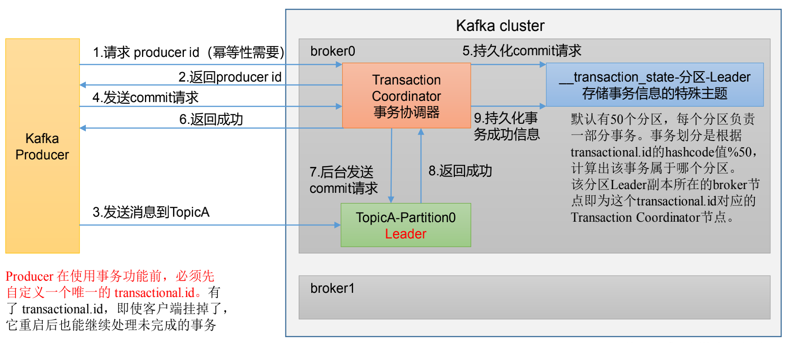

2. **Kafka的事务一共有如下 5 个 API**

```java
// 1. 初始化事务
void initTransactions();
// 2. 开启事务
void beginTransaction() throws ProducerFencedException;
// 3. 在事务内提交已经消费的偏移量(主要用于消费者)
void sendOffsetsToTransaction(Map<TopicPartition,OffsetAndMetadata> offsets, String consumerGroupId) throws ProducerFencedException;
// 4. 提交事务
void commitTransaction() throws ProducerFencedException;
// 5. 放弃事务(类似于混滚事务的操作)
void abortTransaction() throws ProducerFencedException;
```

3. 单个Producer，使用事务保证消息的仅一次发送

```java
package com.yooome.kafka.producer;

import org.apache.kafka.clients.producer.KafkaProducer;
import org.apache.kafka.clients.producer.ProducerConfig;
import org.apache.kafka.clients.producer.ProducerRecord;
import org.apache.kafka.common.serialization.StringSerializer;

import java.util.Properties;

public class CustomProducerTransactions {
    public static void main(String[] args) {
        // 1. 创建Kafka生产者的配置对象
        Properties properties = new Properties();
        // 2. 给kafka配置对象添加配置信息
        properties.put(ProducerConfig.BOOTSTRAP_SERVERS_CONFIG, "localhost:9092");
        // 3. key 序列化 key.serializer，value.serializer
        properties.put(ProducerConfig.KEY_SERIALIZER_CLASS_CONFIG, StringSerializer.class.getName());
        // 4. value 序列化 value.serializer
        properties.put(ProducerConfig.VALUE_SERIALIZER_CLASS_CONFIG, StringSerializer.class.getName());
        // 设置 事务 id(必须)，事务 id 任意起名
        properties.put(ProducerConfig.TRANSACTIONAL_ID_CONFIG,"transaction_id_0");
        // 5. 创建kafka生产者对象
        KafkaProducer<String, String> kafkaProducer = new KafkaProducer<String, String>(properties);
        // 初始化事务
        kafkaProducer.initTransactions();
        // 开启事务
        kafkaProducer.beginTransaction();
        try {
            for (int i = 0; i < 5; i++) {
                //异步发送
                // kafkaProducer.send(new ProducerRecord<>("first","kafka" + i));
                // 6. 同步发送
                // 依次指定 key 值为 a,b,f ，数据 key 的 hash 值与 3 个分区求余，分别发往 1、2、0
                kafkaProducer.send(new ProducerRecord<>("first", "transaction"));
            }
            // 提交事务
            kafkaProducer.commitTransaction();
        }catch (Exception e){
            // 终止事务
            kafkaProducer.abortTransaction();
        }finally {
            // 7. 关闭资源
            kafkaProducer.close();
        }
    }
}

```

#### 3.8 生产经验-----数据有序

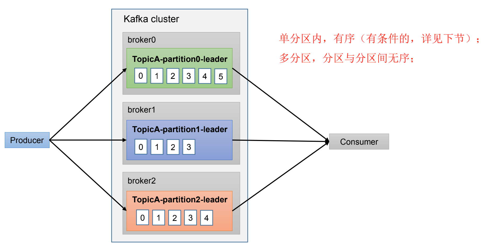

#### 3.9 生产经验-----数据乱序

1、kafka在1.x 版本之前保证数据单分区有序，条件如下：

​	**max.in.flight.requests.per.connection**=1（不需要考虑是否开启幂等性）。

2、kafka在1.x及以后版本保证数据单分区有序，条件如下：

- **未开启幂等性**

  **max.in.flight.requests.per.connection** 需要设置为1。

- **开启幂等性**

  **max.in.flight.requests.per.connection** 需要设置小于等于5。

原因说明：因为在kafka1.x以后，启用幂等后，kafka服务端会缓存producer发来的最近5个request的元数据，

故无论如何，都可以保证最近5个request的数据都是有序的。


### 四、**Kafka Broker**

#### **4.1 Kafka Broker** **工作流程**

##### **4.1.1 Zookeeper** **存储的** **Kafka** **信息**

1. 启动Zookeeper客户端

```basic
yooome@192 zookeeper % ./bin/zkCli.sh 
```

2. 通过ls命令可以查看kafka相关信息

```basic
[zk: localhost:2181(CONNECTING) 0] ls /
```

3. Zookeeper中存储的Kafka信息

```basic
[zk: localhost:2181(CONNECTING) 0] ls /
[admin, brokers, cluster, config, consumers, controller, controller_epoch, feature, isr_change_notification, latest_producer_id_block, log_dir_event_notification, zookeeper]
```

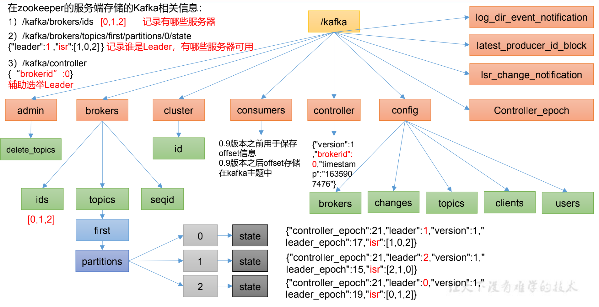

##### 4.1.2 Kafka Broker总体工作流程

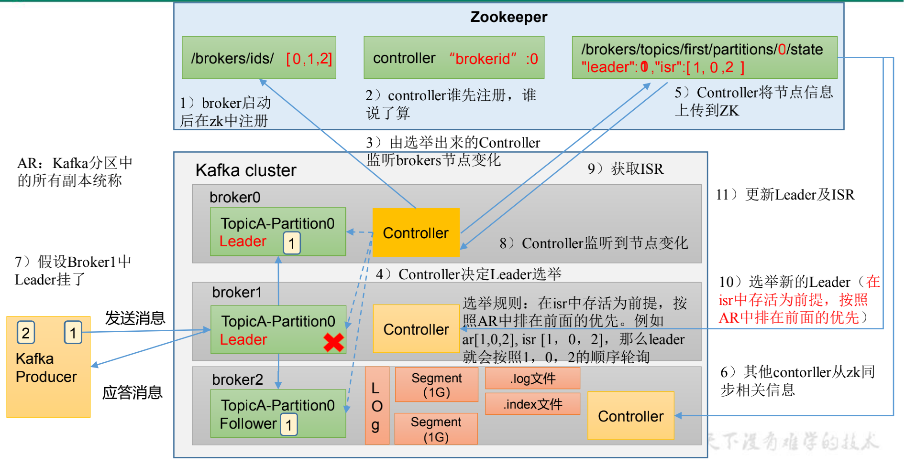


1、模拟Kafka上下线，Zookeeper中数据变化

- ① 查看/kafka/brokers/ids 路径上的节点。

```basci
[zk: localhost:2181(CONNECTED) 2] ls /kafka/brokers/ids
[0, 1, 2]
```

- ② 查看/kafka/controller 路径上的数据。

```bash
[zk: localhost:2181(CONNECTED) 15] get /kafka/controller
{"version":1,"brokerid":0,"timestamp":"1637292471777"}
```

- ③ 查看/kafka/brokers/topics/first/partitions/0/state 路径上的数据。

```bash
[zk: localhost:2181(CONNECTED) 16] get /kafka/brokers/topics/first/partitions/0/state
{"controller_epoch":24,"leader":0,"version":1,"leader_epoch":18,"isr":[0,1,2]}
```

- ④ 停止 hadoop104 上的 kafka。

```bash
[atguigu@hadoop104 kafka]$ bin/kafka-server-stop.sh
```

- ⑤ 再次查看/kafka/brokers/ids 路径上的节点。

```bash
[zk: localhost:2181(CONNECTED) 3] ls /kafka/brokers/ids
[0, 1]
```

- ⑥ 再次查看/kafka/controller 路径上的数据。

```bash
[zk: localhost:2181(CONNECTED) 15] get /kafka/controller
{"version":1,"brokerid":0,"timestamp":"1637292471777"}
```

- ⑦ 再次查看/kafka/brokers/topics/first/partitions/0/state 路径上的数据。

```bash
[zk: localhost:2181(CONNECTED) 16] get 
/kafka/brokers/topics/first/partitions/0/state
{"controller_epoch":24,"leader":0,"version":1,"leader_epoch":18,"isr":[0,1]}
```

- ⑧ 启动 hadoop104 上的 kafka。

```bash
[atguigu@hadoop104 kafka]$ bin/kafka-server-start.sh -
daemon ./config/server.properties
```

- ⑨ 再次观察（1）、（2）、（3）步骤中的内容。

##### 4.1.3 Broker重要参数

| 参数名称                                | 描述                                                         |
| --------------------------------------- | ------------------------------------------------------------ |
| replica.lag.time.max.ms                 | ISR 中，如果 Follower 长时间未向 Leader 发送通<br/>信请求或同步数据，则该 Follower 将被踢出 ISR。<br/>该时间阈值，默认 30s。 |
| auto.leader.rebalance.enable            | 默认是 true。 自动 Leader Partition 平衡。                   |
| leader.imbalance.per.broker.percentage  | 默认是 10%。每个 broker 允许的不平衡的 leader<br/>的比率。如果每个 broker 超过了这个值，控制器<br/>会触发 leader 的平衡。 |
| leader.imbalance.check.interval.seconds | 默认值 300 秒。检查 leader 负载是否平衡的间隔时间。          |
| log.segment.bytes                       | 间。Kafka 中 log 日志是分成一块块存储的，此配置是指 log 日志划分 成块的大小，默认值 1G。 |
| log.index.interval.bytes                | 默认 4kb，kafka 里面每当写入了 4kb 大小的日志<br/>（.log），然后就往 index 文件里面记录一个索引。 |
| log.retention.hours                     | Kafka 中数据保存的时间，默认 7 天。                          |
| log.retention.minutes                   | Kafka 中数据保存的时间，分钟级别，默认关闭。                 |
| log.retention.ms                        | Kafka 中数据保存的时间，毫秒级别，默认关闭。                 |
| log.retention.check.interval.ms         | 检查数据是否保存超时的间隔，默认是 5 分钟。                  |
| log.retention.bytes                     | 默认等于-1，表示无穷大。超过设置的所有日志总<br/>大小，删除最早的 segment。 |
| log.cleanup.policy                      | 默认是 delete，表示所有数据启用删除策略；<br/>如果设置值为 compact，表示所有数据启用压缩策<br/>略。 |
| num.io.threads                          | 默认是 8。负责写磁盘的线程数。整个参数值要占<br/>总核数的 50%。 |
| num.replica.fetchers                    | 副本拉取线程数，这个参数占总核数的 50%的 1/3                 |
| num.network.threads                     | 默认是 3。数据传输线程数，这个参数占总核数的<br/>50%的 2/3 。 |
| log.flush.interval.messages             | 强制页缓存刷写到磁盘的条数，默认是 long 的最<br/>大值，9223372036854775807。一般不建议修改，<br/>交给系统自己管理。 |
| log.flush.interval.ms                   | 每隔多久，刷数据到磁盘，默认是 null。一般不建<br/>议修改，交给系统自己管理。 |

#### 4.2 生产经验-----节点服役和退役

##### 4.2.1 服役新节点

**1、新节点准备**

- ① 关闭hadoop104，并右键执行克隆操作。
- ② 开启hadoop105，并修改IP地址。

```shell
[root@hadoop104 ~]# vim /etc/sysconfig/network-scripts/ifcfg-ens33
DEVICE=ens33
TYPE=Ethernet
ONBOOT=yes
BOOTPROTO=static
NAME="ens33"
IPADDR=192.168.10.105
PREFIX=24
GATEWAY=192.168.10.2
DNS1=192.168.10.2
```

- ③ 在hadoop105 上修改主机名称为hadoop105。

```shell
[root@hadoop104 ~]# vim /etc/hostname
hadoop105
```

- ④ 重新启动hadoop104、hadoop105

- ⑤ 修改 haodoop105 中 kafka 的 broker.id 为 3。 
- ⑥ 删除 hadoop105 中 kafka 下的 datas 和 logs。

```shell
[atguigu@hadoop105 kafka]$ rm -rf datas/* logs/*
```

- ⑦ 启动 hadoop102、hadoop103、hadoop104 上的 kafka 集群。

```shell
[atguigu@hadoop102 ~]$ zk.sh start
[atguigu@hadoop102 ~]$ kf.sh start
```

- ⑧ 单独启动 hadoop105 中的 kafka。

```shell
[atguigu@hadoop105 kafka]$ bin/kafka-server-start.sh -
daemon ./config/server.properties
```

**2、执行负载均衡操作**

- ① 创建一个要均衡的主题

```shell
[atguigu@hadoop102 kafka]$ vim topics-to-move.json
{
  "topics": [
  {"topic": "first"}
  ],
  "version": 1
}
```

- ② 生成一个负载均衡的计划

```shell
[atguigu@hadoop102 kafka]$ bin/kafka-reassign-partitions.sh --
bootstrap-server hadoop102:9092 --topics-to-move-json-file 
topics-to-move.json --broker-list "0,1,2,3" --generate
Current partition replica assignment
{"version":1,"partitions":[{"topic":"first","partition":0,"replic
as":[0,2,1],"log_dirs":["any","any","any"]},{"topic":"first","par
tition":1,"replicas":[2,1,0],"log_dirs":["any","any","any"]},{"to
pic":"first","partition":2,"replicas":[1,0,2],"log_dirs":["any","
any","any"]}]}
Proposed partition reassignment configuration
{"version":1,"partitions":[{"topic":"first","partition":0,"replic
as":[2,3,0],"log_dirs":["any","any","any"]},{"topic":"first","par
tition":1,"replicas":[3,0,1],"log_dirs":["any","any","any"]},{"to
pic":"first","partition":2,"replicas":[0,1,2],"log_dirs":["any","
any","any"]}]}
```

- ③ 创建副本存储计划（所有副本存储在 broker0、broker1、broker2、broker3中)。

```shell
[atguigu@hadoop102 kafka]$ vim increase-replication-factor.json
```

输入如下内容：

```json
{"version":1,"partitions":[{"topic":"first","partition":0,"replic
as":[2,3,0],"log_dirs":["any","any","any"]},{"topic":"first","par
tition":1,"replicas":[3,0,1],"log_dirs":["any","any","any"]},{"to
pic":"first","partition":2,"replicas":[0,1,2],"log_dirs":["any","
any","any"]}]}
```

- ④ 执行副本存储计划

```shell
[atguigu@hadoop102 kafka]$ bin/kafka-reassign-partitions.sh --
bootstrap-server hadoop102:9092 --reassignment-json-file 
increase-replication-factor.json --execute
```

- ⑤ 验证副本存储计划。

```shell
[atguigu@hadoop102 kafka]$ bin/kafka-reassign-partitions.sh --
bootstrap-server hadoop102:9092 --reassignment-json-file 
increase-replication-factor.json --verify
Status of partition reassignment:
Reassignment of partition first-0 is complete.
Reassignment of partition first-1 is complete.
Reassignment of partition first-2 is complete.
Clearing broker-level throttles on brokers 0,1,2,3
Clearing topic-level throttles on topic first
```

##### 4.2.2 退役旧节点

**1、执行负载均衡操作**

先按照退役一台节点，生成执行计划，然后按照服役时操作流程执行负载均衡。

- ① 创建一个要均衡的主题。

```json
[atguigu@hadoop102 kafka]$ vim topics-to-move.json
{
  "topics": [
  {"topic": "first"}
  ],
  "version": 1
}
```

- ② 创建执行计划。

```json
bootstrap-server hadoop102:9092 --topics-to-move-json-file 
topics-to-move.json --broker-list "0,1,2" --generate
Current partition replica assignment
{"version":1,"partitions":[{"topic":"first","partition":0,"replic
as":[2,0,1],"log_dirs":["any","any","any"]},{"topic":"first","par
tition":1,"replicas":[3,1,2],"log_dirs":["any","any","any"]},{"to
pic":"first","partition":2,"replicas":[0,2,3],"log_dirs":["any","
any","any"]}]}
Proposed partition reassignment configuration
{"version":1,"partitions":[{"topic":"first","partition":0,"replicas":[2,0,1],"log_dirs":["any","any","any"]},{"topic":"first","par
tition":1,"replicas":[0,1,2],"log_dirs":["any","any","any"]},{"to
pic":"first","partition":2,"replicas":[1,2,0],"log_dirs":["any","
any","any"]}]}
```

- ③ 创建副本存储计划（所有副本存储在 broker0、broker1、broker2 中）。

```json
[atguigu@hadoop102 kafka]$ vim increase-replication-factor.json
{"version":1,"partitions":[{"topic":"first","partition":0,"replic
as":[2,0,1],"log_dirs":["any","any","any"]},{"topic":"first","par
tition":1,"replicas":[0,1,2],"log_dirs":["any","any","any"]},{"to
pic":"first","partition":2,"replicas":[1,2,0],"log_dirs":["any","
any","any"]}]}
```

- ④ 执行副本存储计划。

```json
[atguigu@hadoop102 kafka]$ bin/kafka-reassign-partitions.sh --
bootstrap-server hadoop102:9092 --reassignment-json-file 
increase-replication-factor.json --execute
```

- ⑤ 验证副本存储计划。

```shell
[atguigu@hadoop102 kafka]$ bin/kafka-reassign-partitions.sh --
bootstrap-server hadoop102:9092 --reassignment-json-file 
increase-replication-factor.json --verify
Status of partition reassignment:
Reassignment of partition first-0 is complete.
Reassignment of partition first-1 is complete.
Reassignment of partition first-2 is complete.
Clearing broker-level throttles on brokers 0,1,2,3
Clearing topic-level throttles on topic first
```

**2、执行停止命令**

在hadoop105 上执行停止命令即可

```shell
[atguigu@hadoop105 kafka]$ bin/kafka-server-stop.sh
```

#### 4.3 Kafka副本

##### 4.3.1 副本基本信息


