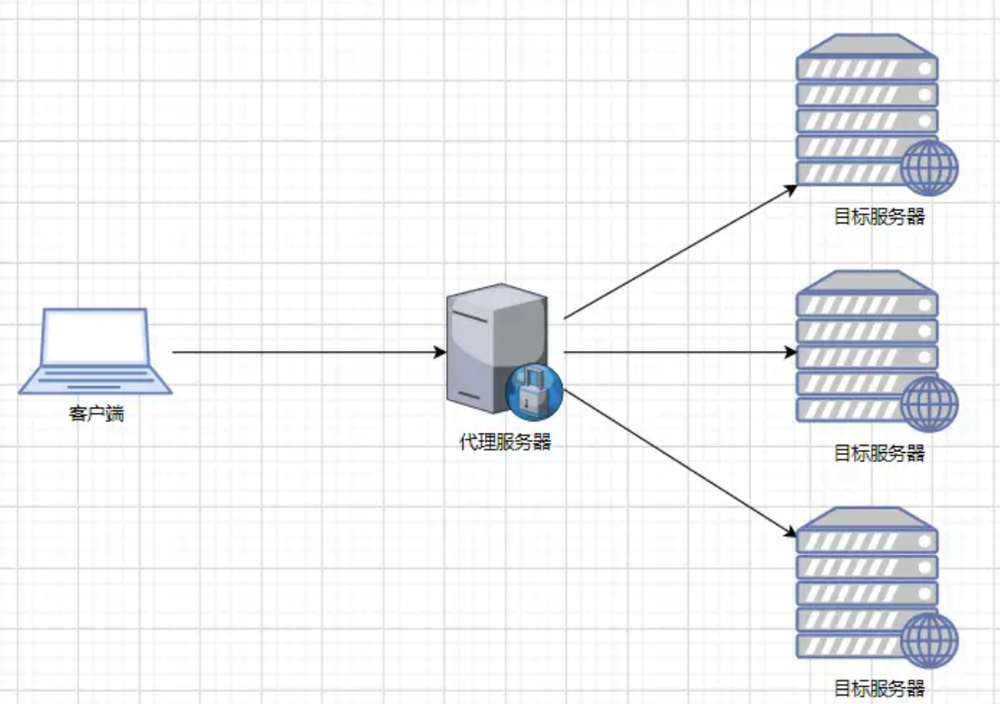
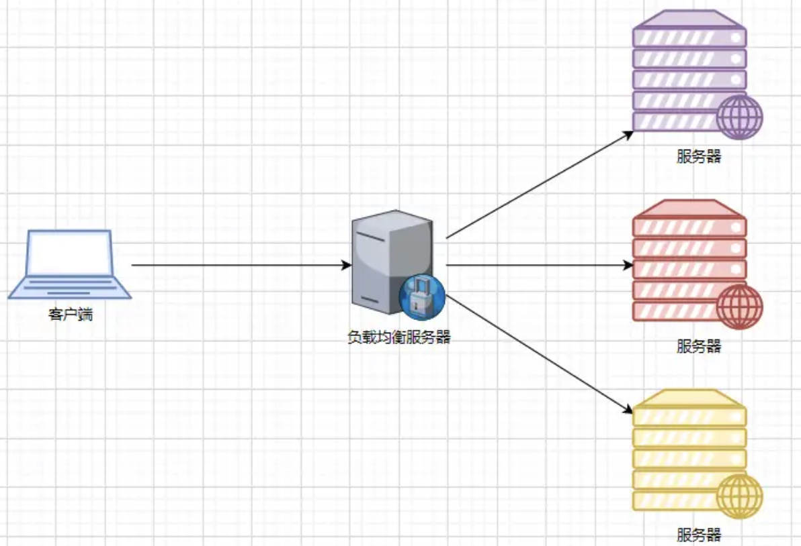

## Nginx 简介

### 一、Nginx概述

#### 1.1 概述

Nginx（“engine x”）是一个高性能的 HTTP /反向代理的服务器及电子邮件（IMAP/POP3)代理服务器。官方测试nginx能够支撑5万并发，并且cpu，内存等资源消耗却非常低，运行非常稳定。最重要的是开源，免费，可商用的。

Nginx还支持热部署，几乎可以做到7 * 24 小时不间断运行，即时运行数个月也不需要重启，还能够在不间断服务的情况下对软件进行升级维护。

#### 1.2 Nginx应用场景

- 虚拟主机：一台服务器虚拟出多个网站。

- 静态资源服务：提供http资源访问服务。

- 反向代理，负载均衡。当网站的访问量达到一定程度后，单台服务器不能满足用户的请求时，需要yo哪个多台服务器集群可以使用nginx做反向代理。并且多台服务器可以平均分担负载，不会因为某台服务器负载高宕机而某台服务器闲置的情况。

#### 1.3 正向代理

**正向代理**：一般的访问流程是客户端直接向目标服务器发送请求并获取内容，使用正向代理后，客户端通过配置或其他方式改为向代理服务器发送请求，并指定目标服务器（原始服务器），然后由代理服务器和原始服务器通信，转交请求并获得的内容，再返回给客户端。正向代理隐藏了真实的客户端，为客户端收发请求，使真实客户端对服务器不可见；

#### 1.4 反向代理

**反向代理：**正好相反。对于客户端来说，反向代理就好像目标服务器。并且客户端不需要进行任何设置。客户端向反向代理发送请求，接着反向代理判断请求走向何处，并将请求转交给客户端，使得这些内容就好像它自己的一样，一次客户端并会并会不感知到反向代理后面的服务，因此不需要客户端做任何设置，只需要把反向代理服务器当成真正的服务器就好了。

#### 1.5 负载均衡

负载均衡建立在现有网络结构之上，它提供一种链家有效透明的方法扩展网络设备和服务器的宽带、增加吞吐量，加强网络数据处理能力，提高网络的灵活性和可用性。

#### 1.6 动静分离

为了加快网站的解析速度，可以把动态页面和静态页面由不同的服务器来解析，加快解析速度，降低原来单个服务器的压力。一般来说，都需要将动态资源和静态资源分开，由于Nginx的高并发和静态资源缓存等特性，经常将静态资源部署在Nginx上。如果请求的是静态资源，直接到静态资源目录获取资源，如果是童泰资源的请求，则利用反向代理的原理，把请求转发给对应后台应用去处理，从而实现动静分离。

二、Nginx安装

