### Redis 高级阶段

#### 一、过期数据的概念由于存储结构

##### 1.1 过期数据

Redis中的数据特征

> Redis是一种内存级数据库，所有的数据均存放在内存中，内存中的数据可以通过TTL指令获取其状态
>
> - XX ：具有时效性的数据
> - -1 ：永久有效的数据
> - -2 ：已经过期的数据 或 被删除的数据 或 未定义的数据

##### 1.2 过期的数据真的被删除了嘛

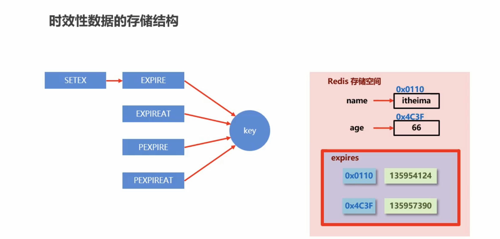

###### 1.2.1 数据删除策略

1. 定时删除：

   >创建一个定时器，当key设置有过期时间，且过期时间到达时，由定时器任务立即执行对键的删除操作。
   >
   >**优点：**节约内存，到时就删除，快速释放掉不必要的内存占用。
   >
   >**缺点：**CPU压力很大，无论CPU此时负载量有多高，均占用CPU，会影响redis服务器响应时间和指令吞吐量。
   >
   >**总结：**用处理器的性能换存储空间。

2. 惰性删除：

   > 数据达到过期时间，不作处理。等到下次访问该数据时。
   >
   > 如果未过期，返回数据；发现已经过期了，删除，返回不存在。
   >
   > **优点：** 节约cpu性能，发现必须删除的时候才删除。
   >
   > **缺点：**内存压力大，出现长期站内存的数据。
   >
   > **总结：**用存储空间换区处理器性能。（拿时间换空间）

3. 定期删除：

   > 周期性轮询redis库中的时效性数据，采用随机抽取的策略，利用过期数据占比的方式控制删除频度。
   >
   > 特点1：CPU性能占用设置有高峰，检测频度可自定义设置。
   >
   > 特点2：内存压力不是很大，长期占用内存的冷数据会被持续清理。    
   >
   > 总结：周期性抽查存储空间（随机抽查，重点抽查）      

###### 1.2.2 数据删除策略的目标

在内存占用与cpu占用之间寻找一种平衡，顾此失彼都会造成整体redis性能的下降，甚至引发服务器宕机或者内存泄漏。

##### 1.3  数据淘汰策略

Redis 使用内存存储数据，在执行每一个命令前，会调用freeMemoryIfNeeded()检测内存是否充足。如果内存不满足新加入数据的最低存储要求，redis要临时删除一些数据为当前指令清理存储空间。清理数据的策略成为**逐出算法**。

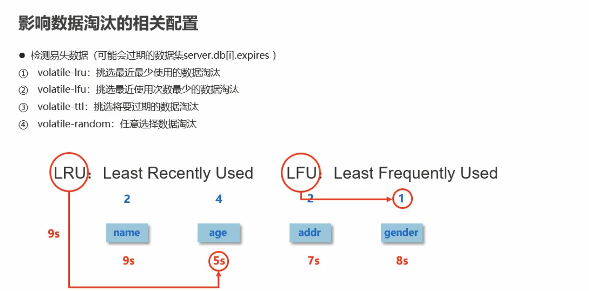


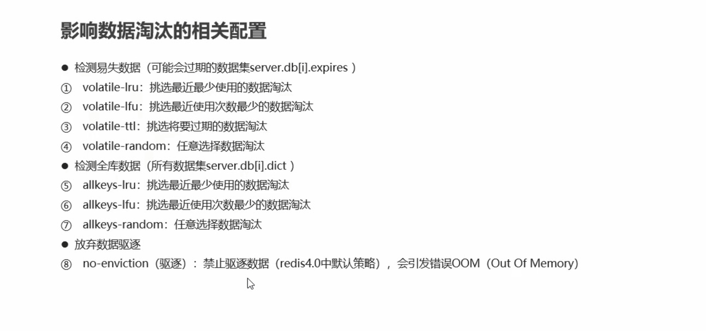

上面的是设置在  **maxmemory-policy **  volatile-lru

#### 二、主从复制

##### 2.1 总述：

主从复制过程大体可以分为3分阶段

- 建立连接阶段（即准备阶段）
- 数据同步阶段
- 命令传播阶段

##### 2.2 主从复制工作流程

##### 2.3 阶段二：数据同步阶段工作流程

- 在 slave 初次连接 master 后，复制 master 中的所有数据到 slave
- 将 slave 的数据库状态更新为 master 当前的数据库状态

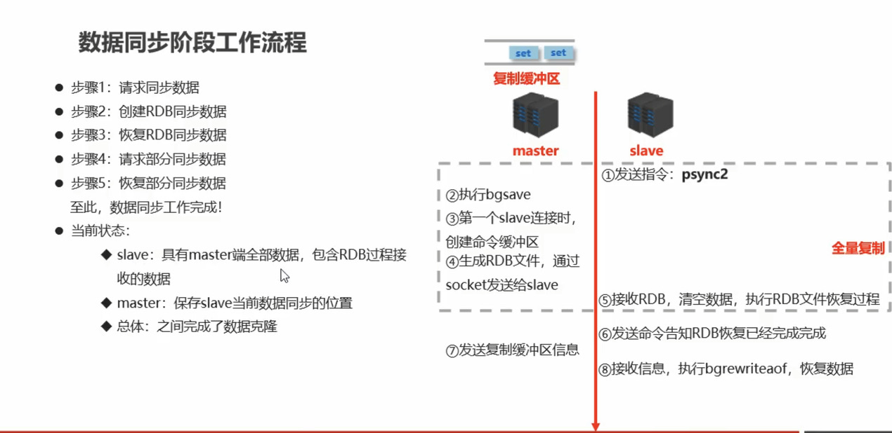

##### 2.4 数据同步阶段master说明

1. 如果master 数据量巨大，数据同步阶段应该避开流量高峰期，避免造成master阻塞，影响业务正常执行。

2. 复制缓冲区大小设置不合理，会导致数据溢出，如果进行全量复制周期太长，进行部分复制的时候发现数据已经存在丢失的情况，必须进行第二次全量复制，导致slave陷入死循环状态。

   ```bash
   设置 redis.conf 文件中的参数
   repl-backlog-size ? Mb
   ```

3. Master 单击北村占用主机内存的比例比应该过大，建议使用50%-70%的内存，留下30%-50%的内存用于执行bgsave 命令和创建复制缓冲区

##### 2.5 数据同步阶段slave说明

1. 为避免slave进行全量复制，部分复制时服务器相应阻塞或数据不同步，建议关闭此期间的对外服务

   > 设置conf 文件中的命令
   >
   > replica-server-stale-data  yes|no

2. 数据同步阶段，master发送给slave信息可以理解master是slave的一个客户端，主动向slave发送命令
3. 对个slave同事对master请求数据同步，master发送的RDB文件增多，会对宽带造成巨大冲击，如果master快带不足，因此数据同步需要根据业务需求，适量错峰。

##### 2.6 命令传播阶段的部分复制

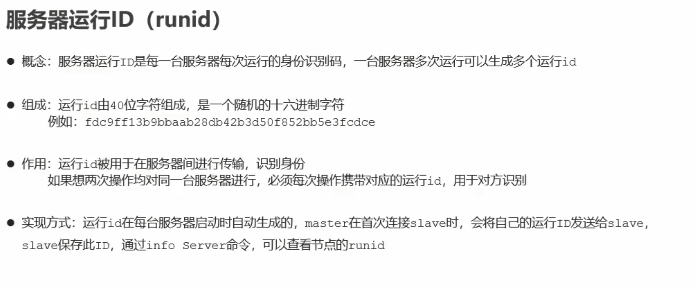

**复制缓冲区：**

**概念：**复制缓冲区，又名复制积压缓冲区，是一个先进先出的队列，用于存储服务器执行过的命令，每次传播命令,master 都会将传播的命令记录下来，并存储在复制缓冲区。

- 复制缓冲区默认数据存储空间大小是1M
- 当入队元素的数量大于队列长度时，最先入队的元素会被弹出，而新元素会被放入队列

**作用：**用于保存master收到的所有指令（仅影响数据变更的指令，例如set，select）

##### 2.7 主从复制服务器复制偏移量（offset）

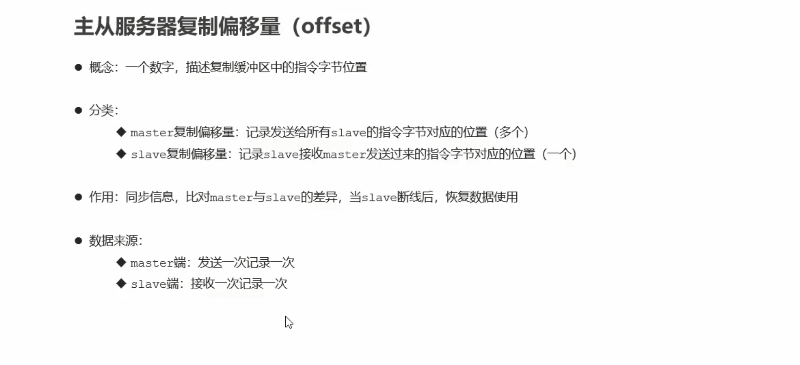

##### 2.8 心跳机制

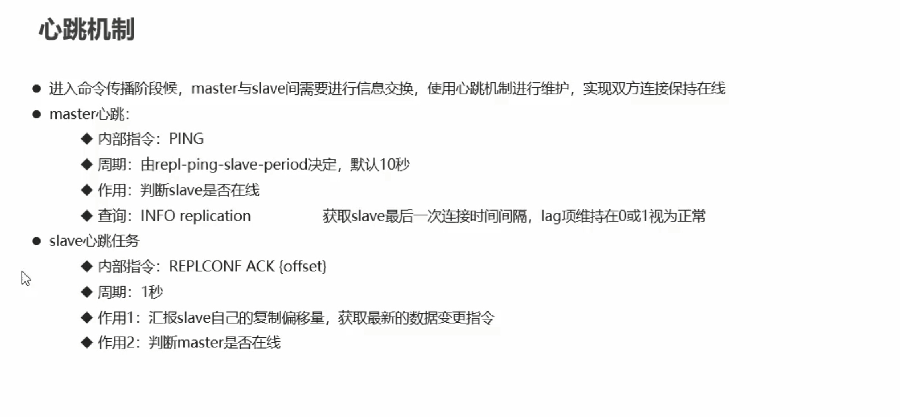

##### 2.9 主从复制中常见的问题

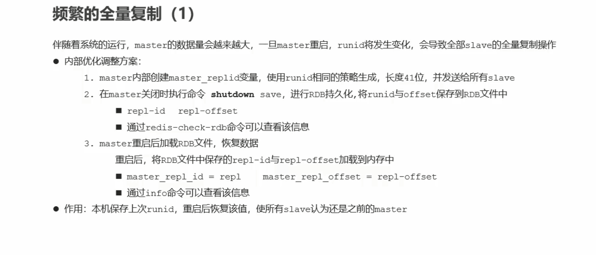

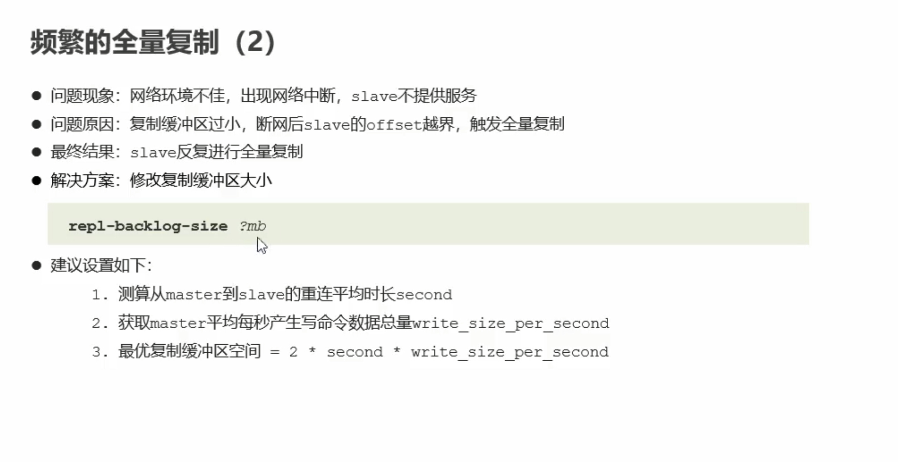

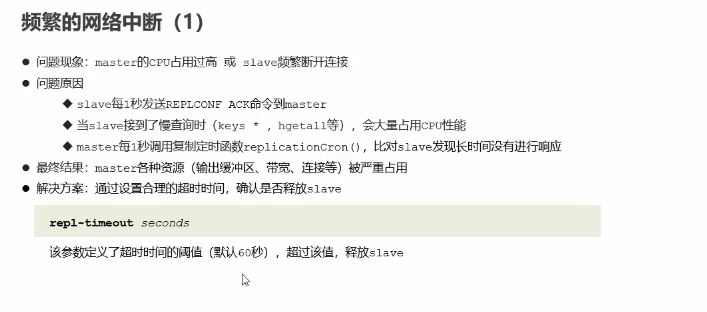

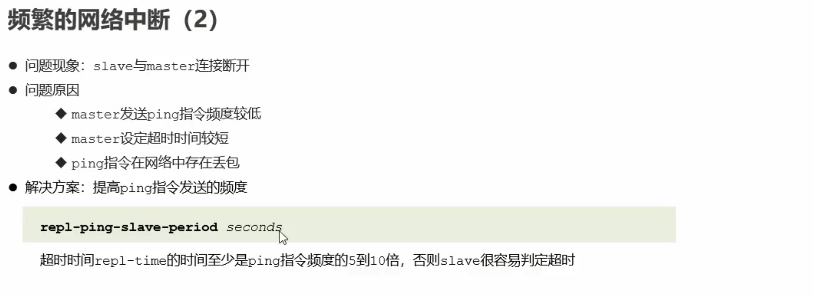

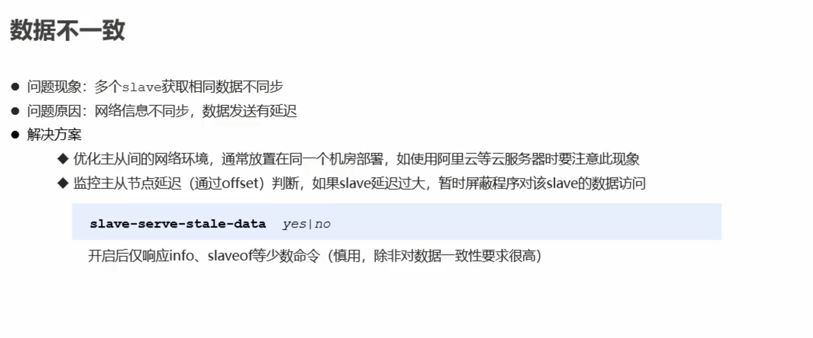

