### SpringCloud中级篇

### 一、Hystrix之全局服务降级DefaultProperties

**目前问题1** 每个业务方法对应一个兜底的方法，代码膨胀

#### 1.1 **解决方法**

1、每个方法配置一个服务降级方法，技术上可以，但是不聪明

2、N除了个别重要的核心业务有专属，其它普通的可以通过@DefaultProperties（defaultFallback=""）统一跳转到统一处理结果页面通用的和独享的各自分开，避免代码膨胀，合理减少了代码量。

```java
package com.yooome.springcloud.controller;

import com.netflix.hystrix.contrib.javanica.annotation.DefaultProperties;
import com.netflix.hystrix.contrib.javanica.annotation.HystrixCommand;
import com.netflix.hystrix.contrib.javanica.annotation.HystrixProperty;
import com.yooome.springcloud.service.PaymentHystrixService;
import org.springframework.beans.factory.annotation.Value;
import org.springframework.web.bind.annotation.GetMapping;
import org.springframework.web.bind.annotation.PathVariable;
import org.springframework.web.bind.annotation.RestController;

import javax.annotation.Resource;

@RestController
@DefaultProperties(defaultFallback = "payment_Global_FallbackMethod")
public class OrderHystirxController {
    @Value("${server.port}")
    private String serverPort;
    @Resource
    private PaymentHystrixService paymentHystrixService;
    @GetMapping("/consumer/payment/hystrix/ok/{id}")
    public String paymentInfo_OK(@PathVariable("id") Integer id)
    {
        String result = paymentHystrixService.paymentInfo_OK(id);
        return result;
    }

    @GetMapping("/consumer/payment/hystrix/timeout/{id}")
//   @HystrixCommand(fallbackMethod = "paymentTimeOutFallbackMethod",commandProperties = {
//            @HystrixProperty(name="execution.isolation.thread.timeoutInMilliseconds",value="1500")
//    })
    @HystrixCommand //用全局的fallback方法
    public String paymentInfo_TimeOut(@PathVariable("id") Integer id) {
        String result = paymentHystrixService.paymentInfo_TimeOut(id);
        return result;
    }
    //善后方法
    public String paymentTimeOutFallbackMethod(@PathVariable("id") Integer id){
        return "我是消费者80,对方支付系统繁忙请10秒钟后再试或者自己运行出错请检查自己,o(╥﹏╥)o";
    }

    // 下面是全局fallback方法
    public String payment_Global_FallbackMethod()
    {
        return "Global异常处理信息，请稍后再试，/(ㄒoㄒ)/~~";
    }
}

```

#### 1.2 Hystrix之通配服务降级FeginFallback

**目前问题2** 统一和自定义的分开，代码混乱

**服务降级，客户端去调用服务端，碰上服务端宕机或关闭**

本次案例服务降级处理是在客户端80实现完成的，与服务端8001没有短息，只需要为Feign客户端定义的接口提那家一个服务降级处理的实现类即可实现解耦。

**未来我们要面对的异常**

- 运行
- 超时
- 宕机

修改cloud-consumer-feign-hystrix-order80

根据cloud-consumer-feign-hystrix-order80已经有的PaymenthystrixService接口。

重新新建一个类(PaymentFallbackService)实现该接口，统一为接口里面的方法进行异常处理

PaymentFallbackService类实现PaymentHystrixService接口

```java
import org.springframework.stereotype.Component;


@Component
public class PaymentFallbackService implements PaymentHystrixService
{
    @Override
    public String paymentInfo_OK(Integer id)
    {
        return "-----PaymentFallbackService fall back-paymentInfo_OK ,o(╥﹏╥)o";
    }

    @Override
    public String paymentInfo_TimeOut(Integer id)
    {
        return "-----PaymentFallbackService fall back-paymentInfo_TimeOut ,o(╥﹏╥)o";
    }
}
```

YML

```yml
server:
  port: 80

eureka:
  client:
    register-with-eureka: false
    service-url:
      defaultZone: http://eureka7001.com:7001/eureka/

#开启
feign:
  hystrix:
    enabled: true

```

PaymentHystrixService接口

```java
import org.springframework.cloud.openfeign.FeignClient;
import org.springframework.stereotype.Component;
import org.springframework.web.bind.annotation.GetMapping;
import org.springframework.web.bind.annotation.PathVariable;

@Component
@FeignClient(value = "CLOUD-PROVIDER-HYSTRIX-PAYMENT" ,//
             fallback = PaymentFallbackService.class)//指定PaymentFallbackService类
public interface PaymentHystrixService
{
    @GetMapping("/payment/hystrix/ok/{id}")
    public String paymentInfo_OK(@PathVariable("id") Integer id);

    @GetMapping("/payment/hystrix/timeout/{id}")
    public String paymentInfo_TimeOut(@PathVariable("id") Integer id);
}
```

**测试**

单个eureka先启动7001

PaymentHystrixApplicaiton8001启动

正常访问测试 - http://localhost/consumer/payment/hystrix/ok/1

故意关闭微服务8001

客户端自己调用提示 - 此时服务端provider已经down了，但是我们做了服务降级处理，让客户端在服务端不可用时也会获得提示信息而不会挂起好似服务器。

#### 1.3 Hystrix之服务熔断理论

断路器，相当于保险丝

**熔断机制概述**

熔断机制是应对雪崩效应的一种微服务链路保护机制。当扇出链路的某个微服务出错不可用或者响应时间不太长，会进行服务的降级，进而熔断该节点微服务的调用，快速返回错误的响应信息。当检测到该节点微服务调用响应正常后，恢复调用链路。

在Spring Cloud框架里，熔断机制通过Hystrix实现。Hystrix会监控微服务间调用的状况，当失败的调用到一定阈值，缺省是5秒内20次调用失败，就会启动熔断机制。熔断机制的注解是@HystrixCommand


### 二、Hystrix之服务熔断案例（上）

[Hutool国产工具类](https://hutool.cn/)

修改cloud-provider-hystrix-payment8001

```java
import cn.hutool.core.util.IdUtil;
import com.netflix.hystrix.contrib.javanica.annotation.HystrixCommand;
import com.netflix.hystrix.contrib.javanica.annotation.HystrixProperty;
import org.springframework.stereotype.Service;
import org.springframework.web.bind.annotation.PathVariable;

import java.util.concurrent.TimeUnit;

@Service
public class PaymentService{    

    ...
    
    //=====服务熔断
    @HystrixCommand(fallbackMethod = "paymentCircuitBreaker_fallback",commandProperties = {
            @HystrixProperty(name = "circuitBreaker.enabled",value = "true"),// 是否开启断路器
            @HystrixProperty(name = "circuitBreaker.requestVolumeThreshold",value = "10"),// 请求次数
            @HystrixProperty(name = "circuitBreaker.sleepWindowInMilliseconds",value = "10000"), // 时间窗口期
            @HystrixProperty(name = "circuitBreaker.errorThresholdPercentage",value = "60"),// 失败率达到多少后跳闸
    })
    public String paymentCircuitBreaker(@PathVariable("id") Integer id) {
        if(id < 0) {
            throw new RuntimeException("******id 不能负数");
        }
        String serialNumber = IdUtil.simpleUUID();

        return Thread.currentThread().getName()+"\t"+"调用成功，流水号: " + serialNumber;
    }
    public String paymentCircuitBreaker_fallback(@PathVariable("id") Integer id) {
        return "id 不能负数，请稍后再试，/(ㄒoㄒ)/~~   id: " +id;
    }

}
```

> The precise way that the circuit opening and closing occurs is as follows:
>
> Assuming the volume across a circuit meets a certain threshold : HystrixCommandProperties.circuitBreakerRequestVolumeThreshold()
> And assuming that the error percentage, as defined above exceeds the error percentage defined in : HystrixCommandProperties.circuitBreakerErrorThresholdPercentage()
> Then the circuit-breaker transitions from CLOSED to OPEN.
> While it is open, it short-circuits all requests made against that circuit-breaker.
> After some amount of time (HystrixCommandProperties.circuitBreakerSleepWindowInMilliseconds()), the next request is let through. If it fails, the command stays OPEN for the sleep window. If it succeeds, it transitions to CLOSED and the logic in 1) takes over again.
> [link](https://github.com/Netflix/Hystrix/issues/674)

HystrixCommandProperties配置类

```java
package com.netflix.hystrix;

...

public abstract class HystrixCommandProperties {
    private static final Logger logger = LoggerFactory.getLogger(HystrixCommandProperties.class);

    /* defaults */
    /* package */ static final Integer default_metricsRollingStatisticalWindow = 10000;// default => statisticalWindow: 10000 = 10 seconds (and default of 10 buckets so each bucket is 1 second)
    private static final Integer default_metricsRollingStatisticalWindowBuckets = 10;// default => statisticalWindowBuckets: 10 = 10 buckets in a 10 second window so each bucket is 1 second
    private static final Integer default_circuitBreakerRequestVolumeThreshold = 20;// default => statisticalWindowVolumeThreshold: 20 requests in 10 seconds must occur before statistics matter
    private static final Integer default_circuitBreakerSleepWindowInMilliseconds = 5000;// default => sleepWindow: 5000 = 5 seconds that we will sleep before trying again after tripping the circuit
    private static final Integer default_circuitBreakerErrorThresholdPercentage = 50;// default => errorThresholdPercentage = 50 = if 50%+ of requests in 10 seconds are failures or latent then we will trip the circuit
    private static final Boolean default_circuitBreakerForceOpen = false;// default => forceCircuitOpen = false (we want to allow traffic)
    /* package */ static final Boolean default_circuitBreakerForceClosed = false;// default => ignoreErrors = false 
    private static final Integer default_executionTimeoutInMilliseconds = 1000; // default => executionTimeoutInMilliseconds: 1000 = 1 second
    private static final Boolean default_executionTimeoutEnabled = true;

    ...
}
```

#### 2.1 Hystrix之服务熔断案例（下）

```java
@RestController
@Slf4j
public class PaymentController
{
    @Resource
    private PaymentService paymentService;

    ...
    
    //====服务熔断
    @GetMapping("/payment/circuit/{id}")
    public String paymentCircuitBreaker(@PathVariable("id") Integer id)
    {
        String result = paymentService.paymentCircuitBreaker(id);
        log.info("****result: "+result);
        return result;
    }
}

```

**测试**

自测 cloud-provider-hystrix-payment8001

正确 - http://localhost:8001/payment/circuit/1

错误 - http://localhost:8001/payment/circuit/-1

多次错误，在来次正确，但错误得显示

重点测试 - 多次错误，然后慢慢正确，发现刚开始不满足条件，就算是正确的访问地址也不能进行

#### 2.2 Hystrix之服务熔断总结

**大神结论**

[Martin Fowler的相关论文](https://martinfowler.com/bliki/CircuitBreaker.html)


##### 2.2.1 **熔断类型**

- 熔断打开：请求不再进行调用当前服务，内部设置时钟一般为MTTR（平均故障处理时间），当打开时长达到所设时钟则进入半熔断状态。
- 熔断关闭：熔断关闭不会对服务进行熔断。
- 熔断搬开：部分请求根据规则调用当前服务，如果请求成功且符合规则则认为当前服务恢复正常，关闭熔断。

**官网断路器流程图**


##### 2.2.2 **官网步骤**

> The precise way that the circuit opening and closing occurs is as follows:
>
> Assuming the volume across a circuit meets a certain threshold : HystrixCommandProperties.circuitBreakerRequestVolumeThreshold()
> And assuming that the error percentage, as defined above exceeds the error percentage defined in : HystrixCommandProperties.circuitBreakerErrorThresholdPercentage()
> Then the circuit-breaker transitions from CLOSED to OPEN.
> While it is open, it short-circuits all requests made against that circuit-breaker.
> After some amount of time (HystrixCommandProperties.circuitBreakerSleepWindowInMilliseconds()), the next request is let through. If it fails, the command stays OPEN for the sleep window. If it succeeds, it transitions to CLOSED and the logic in 1) takes over again.
> [link](https://github.com/Netflix/Hystrix/issues/674)

##### 2.2.3 **断路器在什么情况下开始起作用**

```java
//=====服务熔断
@HystrixCommand(fallbackMethod = "paymentCircuitBreaker_fallback",commandProperties = {
    @HystrixProperty(name = "circuitBreaker.enabled",value = "true"),// 是否开启断路器
    @HystrixProperty(name = "circuitBreaker.requestVolumeThreshold",value = "10"),// 请求次数
    @HystrixProperty(name = "circuitBreaker.sleepWindowInMilliseconds",value = "10000"), // 时间窗口期
    @HystrixProperty(name = "circuitBreaker.errorThresholdPercentage",value = "60"),// 失败率达到多少后跳闸
})
public String paymentCircuitBreaker(@PathVariable("id") Integer id) {
    ...
}
```

涉及到断路器的三个重要参数：

1. **快照时间窗：**断路器确定是否打开需要统计一些请求和错误数据，而统计的时间范围就是快照时间窗，默认为最近的10秒。
2. **请求总数阈值：**在快照时间窗内，必须满足请求总数阈值才有资格熔断。默认为20，意味着在10秒内，如果该hystrix命令的调用次数不足20次，即使所有的请求都超时或者其他原因失败，断路器都不会打开。
3. **错误百分比阈值：**请求总数在快照时间窗内超过了阈值，比如发生了30次调用，如果在这30次调用中，有15次发生了超时异常，也就是超过50%的错误百分比，在默认设定50%阈值情况下，这时候就会将断路器打开。

##### 2.2.4 **断路器开启或者关闭的条件**

- 到达以下阈值，断路器将会开启：
  1. 当满足一定的阈值的时候（默认10秒内超过20个请求次数）
  2. 当失败率达到一定的时候（默认10秒内超过50%的请求失败）

- 当开启的时候，所有请求都不会进行转发
- 一段时间之后（默认是5秒），这个时候断路器是半开状态，会让启动一个请求进行转发。如果成功，断路器会关闭，若失败，继续开启。

##### 2.2.5 断路器打开之后

1. 再有请求调用的时候，将不会调用主逻辑，而是直接调用降级fallback。通过断路器，实现了自动地发现错误并将降级逻辑切换为主逻辑，较少响应延迟的效果。
2. 原来的主逻辑要如何恢复呢？

对于这一问题，hystrix也为我们实现了自动恢复功能。

当断路器打开，堆主逻辑进行熔断之后，hystrix会启动一个休眠时间窗，这个时间窗内，降级逻辑是临时的称为主逻辑，当休眠时间窗到期，断路器进入半开状态，释放一次请求到原来的主逻辑上，如果此次请求正常返回，那么断路器将继续比合，主逻辑恢复，如果这次请求依然有问题，断路器继续进入打开状态，休眠时间窗重新计时。

##### 2.2.6 All配置

```java
@HystrixCommand(fallbackMethod = "fallbackMethod", 
                groupKey = "strGroupCommand", 
                commandKey = "strCommand", 
                threadPoolKey = "strThreadPool",
                
                commandProperties = {
                    // 设置隔离策略，THREAD 表示线程池 SEMAPHORE：信号池隔离
                    @HystrixProperty(name = "execution.isolation.strategy", value = "THREAD"),
                    // 当隔离策略选择信号池隔离的时候，用来设置信号池的大小（最大并发数）
                    @HystrixProperty(name = "execution.isolation.semaphore.maxConcurrentRequests", value = "10"),
                    // 配置命令执行的超时时间
                    @HystrixProperty(name = "execution.isolation.thread.timeoutinMilliseconds", value = "10"),
                    // 是否启用超时时间
                    @HystrixProperty(name = "execution.timeout.enabled", value = "true"),
                    // 执行超时的时候是否中断
                    @HystrixProperty(name = "execution.isolation.thread.interruptOnTimeout", value = "true"),
                    
                    // 执行被取消的时候是否中断
                    @HystrixProperty(name = "execution.isolation.thread.interruptOnCancel", value = "true"),
                    // 允许回调方法执行的最大并发数
                    @HystrixProperty(name = "fallback.isolation.semaphore.maxConcurrentRequests", value = "10"),
                    // 服务降级是否启用，是否执行回调函数
                    @HystrixProperty(name = "fallback.enabled", value = "true"),
                    // 是否启用断路器
                    @HystrixProperty(name = "circuitBreaker.enabled", value = "true"),
                    // 该属性用来设置在滚动时间窗中，断路器熔断的最小请求数。例如，默认该值为 20 的时候，如果滚动时间窗（默认10秒）内仅收到了19个请求， 即使这19个请求都失败了，断路器也不会打开。
                    @HystrixProperty(name = "circuitBreaker.requestVolumeThreshold", value = "20"),
                    
                    // 该属性用来设置在滚动时间窗中，表示在滚动时间窗中，在请求数量超过 circuitBreaker.requestVolumeThreshold 的情况下，如果错误请求数的百分比超过50, 就把断路器设置为 "打开" 状态，否则就设置为 "关闭" 状态。
                    @HystrixProperty(name = "circuitBreaker.errorThresholdPercentage", value = "50"),
                    // 该属性用来设置当断路器打开之后的休眠时间窗。 休眠时间窗结束之后，会将断路器置为 "半开" 状态，尝试熔断的请求命令，如果依然失败就将断路器继续设置为 "打开" 状态，如果成功就设置为 "关闭" 状态。
                    @HystrixProperty(name = "circuitBreaker.sleepWindowinMilliseconds", value = "5000"),
                    // 断路器强制打开
                    @HystrixProperty(name = "circuitBreaker.forceOpen", value = "false"),
                    // 断路器强制关闭
                    @HystrixProperty(name = "circuitBreaker.forceClosed", value = "false"),
                    // 滚动时间窗设置，该时间用于断路器判断健康度时需要收集信息的持续时间
                    @HystrixProperty(name = "metrics.rollingStats.timeinMilliseconds", value = "10000"),
                    
                    // 该属性用来设置滚动时间窗统计指标信息时划分"桶"的数量，断路器在收集指标信息的时候会根据设置的时间窗长度拆分成多个 "桶" 来累计各度量值，每个"桶"记录了一段时间内的采集指标。
                    // 比如 10 秒内拆分成 10 个"桶"收集这样，所以 timeinMilliseconds 必须能被 numBuckets 整除。否则会抛异常
                    @HystrixProperty(name = "metrics.rollingStats.numBuckets", value = "10"),
                    // 该属性用来设置对命令执行的延迟是否使用百分位数来跟踪和计算。如果设置为 false, 那么所有的概要统计都将返回 -1。
                    @HystrixProperty(name = "metrics.rollingPercentile.enabled", value = "false"),
                    // 该属性用来设置百分位统计的滚动窗口的持续时间，单位为毫秒。
                    @HystrixProperty(name = "metrics.rollingPercentile.timeInMilliseconds", value = "60000"),
                    // 该属性用来设置百分位统计滚动窗口中使用 “ 桶 ”的数量。
                    @HystrixProperty(name = "metrics.rollingPercentile.numBuckets", value = "60000"),
                    // 该属性用来设置在执行过程中每个 “桶” 中保留的最大执行次数。如果在滚动时间窗内发生超过该设定值的执行次数，
                    // 就从最初的位置开始重写。例如，将该值设置为100, 滚动窗口为10秒，若在10秒内一个 “桶 ”中发生了500次执行，
                    // 那么该 “桶” 中只保留 最后的100次执行的统计。另外，增加该值的大小将会增加内存量的消耗，并增加排序百分位数所需的计算时间。
                    @HystrixProperty(name = "metrics.rollingPercentile.bucketSize", value = "100"),
                    
                    // 该属性用来设置采集影响断路器状态的健康快照（请求的成功、 错误百分比）的间隔等待时间。
                    @HystrixProperty(name = "metrics.healthSnapshot.intervalinMilliseconds", value = "500"),
                    // 是否开启请求缓存
                    @HystrixProperty(name = "requestCache.enabled", value = "true"),
                    // HystrixCommand的执行和事件是否打印日志到 HystrixRequestLog 中
                    @HystrixProperty(name = "requestLog.enabled", value = "true"),

                },
                threadPoolProperties = {
                    // 该参数用来设置执行命令线程池的核心线程数，该值也就是命令执行的最大并发量
                    @HystrixProperty(name = "coreSize", value = "10"),
                    // 该参数用来设置线程池的最大队列大小。当设置为 -1 时，线程池将使用 SynchronousQueue 实现的队列，否则将使用 LinkedBlockingQueue 实现的队列。
                    @HystrixProperty(name = "maxQueueSize", value = "-1"),
                    // 该参数用来为队列设置拒绝阈值。 通过该参数， 即使队列没有达到最大值也能拒绝请求。
                    // 该参数主要是对 LinkedBlockingQueue 队列的补充,因为 LinkedBlockingQueue 队列不能动态修改它的对象大小，而通过该属性就可以调整拒绝请求的队列大小了。
                    @HystrixProperty(name = "queueSizeRejectionThreshold", value = "5"),
                }
               )
public String doSomething() {
	...
}

```

#### 2.3 Hystrix工作流程最后总结

服务限流- 后面高级篇讲解alibaba的Sentinel说明

[官方解释](https://github.com/Netflix/Hystrix/wiki/How-it-Works)


##### 2.3.1 步骤说明

1. 创建HystrixCommand（用在依赖的服务返回单个操作结果的时候）或HystrixObserableCommand（用在依赖的服务返回多个操作结果的时候）对象。

2. 命令执行。

3. 其中HystrixCommand实现了下面前两种执行方式

   **execute()**： 同步执行，从依赖的服务返回一个单一的结果对象或是在发生错误的时候抛出异常。

   **queue()**：异步执行，直接返回一个Future对象，启动包含了服务执行结束时要返回的单一结果对象。

4. 而HystrixObservableCommand实现了后两种执行方式：
   - obseve()：返回Observable对象，它代表了操作的多个统果，它是一个Hot Observable （不论"事件源"是否有订阅者，都会在创建后堆时间进行发布，所以对于Hot Observable的每一个"订阅者"都有可能是从 "事件源" 的总图开始的。并可能只是看到了整个操作的局部过程)。
   - toObservable()：同样会返回Observable对象，也代表了操作的多个结果，但它返回的是一个Cold Observable(没有 "订阅者"的时候并不会发布事件，而是进行等待，知道有 "订阅者" 之后才发布事件，所以对于Cold Observable的订阅者，它可以保证从一开始看到整个操作的全部过程)。

5. 若当前命令的请求缓存功能是被启用的，并且没改名了缓存命中，那么缓存的结果会立即以Observable对象的形式返回。
6. 检查断路器是否以为打开状态。如果断路器是打开的，那么Hystrix不会执行命令，而是转接到fallback处理逻辑(第8步)；如果断路器是关闭的，检查是否有可用资源来执行命令(第5步)。
7. 线程池/请求队列信号量是否占满。如果命令依赖服务的专有线程地和请求队列，或者信号量（不使用线程的时候）已经被占满，那么Hystrix也不会执行命令，而是转接到fallback处理理辑(第8步) 。
8. Hystrix会根据我们编写的方法来决定采取什么样的方式去请求依赖服务。

- HystrixCommand.run()：返回一个单一的结果，或者抛出异常。
- HystrixObservableCommand.construct()：返回一个Observable对象来发射多个结果，或通过onError发送错误通知。

9. Hystix会将“成功”、“失败”、“拒绝”、“超时” 等信息报告给断路器，而断路器会维护一组计数器来统计这些数据。断路器会使用这些统计数据来决定是否要将断路器打开，来对某个依赖服务的请求进行"熔断/短路"。

10. 当命令执行失败的时候，Hystix会进入fallback尝试回退处理，我们通常也称波操作为“服务降级”。而能够引起服务降级处理的情况有下面几种：
    - 第4步∶当前命令处于“熔断/短路”状态，断洛器是打开的时候。
    - 第5步∶当前命令的钱程池、请求队列或者信号量被占满的时候。
    - 第6步∶HystrixObsevableCommand.construct()或HytrixCommand.run()抛出异常的时候。

11. 当Hystrix命令执行成功之后，它会将处理结果直接返回或是以Observable的形式返回。

**tips**：如果我们没有为命令实现降级逻辑或者在降级处理逻辑中抛出了异常，Hystrix依然会运回一个Obsevable对象，但是它不会发射任结果数惯，而是通过onError方法通知命令立即中断请求，并通过onError方法将引起命令失败的异常发送给调用者。

#### 2.4 Hystrix图形化DashBoard搭建

##### 2.4.1 概述

除了隔离依赖服务的调用外，Hystrix还提供了准实时的调用监控(Hystrix Dashboard),Hystrix会持续地记录所有通过Hystrix发起的请求的执行信息，并以统计报表和图形的形式展示给用户，包括每秒执行多少请求多少成功，多少失败等。

Netflix通过Hystrix-metrics-event-stream项目实现了对以上指标的监控。Spring Cloud也提供了Hystrix Dashboard的整合，对监控内容转化成可视化界面。

##### 2.4.2 仪表盘9001

1、新建cloud-consumer-hystrix-dashboard9001

2、POM

```xml
<?xml version="1.0" encoding="UTF-8"?>
<project xmlns="http://maven.apache.org/POM/4.0.0"
         xmlns:xsi="http://www.w3.org/2001/XMLSchema-instance"
         xsi:schemaLocation="http://maven.apache.org/POM/4.0.0 http://maven.apache.org/xsd/maven-4.0.0.xsd">
    <parent>
        <artifactId>yooomecloud</artifactId>
        <groupId>com.yooome.springcloud</groupId>
        <version>1.0-SNAPSHOT</version>
    </parent>
    <modelVersion>4.0.0</modelVersion>

    <artifactId>cloud-consumer-hystrix-dashboard9001</artifactId>
    <dependencies>
        <dependency>
            <groupId>org.springframework.cloud</groupId>
            <artifactId>spring-cloud-starter-netflix-hystrix-dashboard</artifactId>
        </dependency>
        <dependency>
            <groupId>org.springframework.boot</groupId>
            <artifactId>spring-boot-starter-actuator</artifactId>
        </dependency>

        <dependency>
            <groupId>org.springframework.boot</groupId>
            <artifactId>spring-boot-devtools</artifactId>
            <scope>runtime</scope>
            <optional>true</optional>
        </dependency>
        <dependency>
            <groupId>org.projectlombok</groupId>
            <artifactId>lombok</artifactId>
            <optional>true</optional>
        </dependency>
        <dependency>
            <groupId>org.springframework.boot</groupId>
            <artifactId>spring-boot-starter-test</artifactId>
            <scope>test</scope>
        </dependency>
    </dependencies>
    <properties>
        <maven.compiler.source>8</maven.compiler.source>
        <maven.compiler.target>8</maven.compiler.target>
    </properties>

</project>
```

3、YML

```yml
server:
  port: 9001

```

4、HystrixDashboardMain9001+新注解@EnableHystrixDashboard

```java
package com.yooome.springcloud;

import org.springframework.boot.SpringApplication;
import org.springframework.boot.autoconfigure.SpringBootApplication;
import org.springframework.cloud.netflix.hystrix.dashboard.EnableHystrixDashboard;

@SpringBootApplication
@EnableHystrixDashboard
public class HystrixDashboardApplication9001 {
    public static void main(String[] args) {
        SpringApplication.run(HystrixDashboardApplication9001.class, args);
    }
}
```

5、5.所有Provider微服务提供类(8001/8002/8003)都需要监控依赖配置

```java
package com.yooome.springcloud;

import com.netflix.hystrix.contrib.metrics.eventstream.HystrixMetricsStreamServlet;
import org.springframework.boot.SpringApplication;
import org.springframework.boot.autoconfigure.SpringBootApplication;
import org.springframework.boot.web.servlet.ServletRegistrationBean;
import org.springframework.cloud.client.circuitbreaker.EnableCircuitBreaker;
import org.springframework.cloud.netflix.eureka.EnableEurekaClient;
import org.springframework.context.annotation.Bean;

@SpringBootApplication
@EnableEurekaClient
@EnableCircuitBreaker//添加到此处
public class HystricApplication8001 {
    public static void main(String[] args) {
        SpringApplication.run(HystricApplication8001.class, args);
    }
    /**
     *此配置是为了服务监控而配置，与服务容错本身无关，springcloud升级后的坑
     *ServletRegistrationBean因为springboot的默认路径不是"/hystrix.stream"，
     *只要在自己的项目里配置上下面的servlet就可以了
     *否则，Unable to connect to Command Metric Stream 404
     */
    @Bean
    public ServletRegistrationBean getServlet() {
        HystrixMetricsStreamServlet streamServlet = new HystrixMetricsStreamServlet();
        ServletRegistrationBean registrationBean = new ServletRegistrationBean(streamServlet);
        registrationBean.setLoadOnStartup(1);
        registrationBean.addUrlMappings("/hystrix.stream");
        registrationBean.setName("HystrixMetricsStreamServlet");
        return registrationBean;
    }
}
```

##### 2.4.3 监控测试

启动1个eureka

启动8001,9001

##### 2.4.4 观察监控窗口

9001监控8001 - 填写监控地址 - http://localhost:8001/hystrix.stream 到 http://localhost:9001/hystrix页面的输入框。

测试地址

http://localhost:8001/payment/circuit/1

http://localhost:8001/payment/circuit/-1

测试通过

先访问正确地址，再访问错误地址，再正确地址，会发现图示断路器都是慢慢放开的。


**如何看?**

- 7色


- 1圈

实心圆：共有两种含义。它通过颜色的变化代表了实例的健康程度，它的健康度从绿色<黄色<橙色<红色递减。

该实心圆除了颜色的变化之外，它的大小也会根据实例的请求流量发生变化，流量越大该实心圆就越大。所以通过该实心圆的展示，就可以在大量的实例中快速的发现故障实例和高压力实例。

1线
曲线：用来记录2分钟内流量的相对变化，可以通过它来观察到流量的上升和下降趋势。

- 整图说明

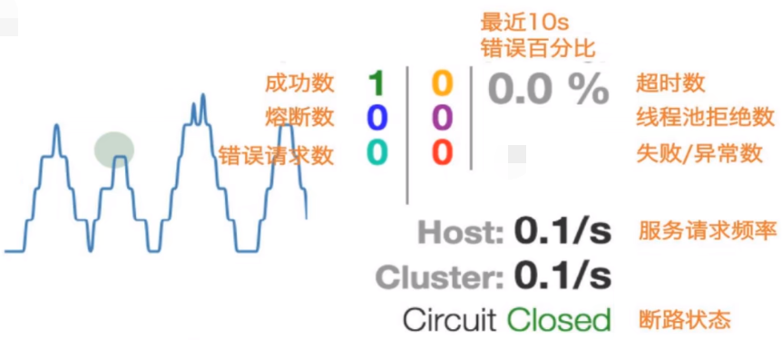


- 整图说明2

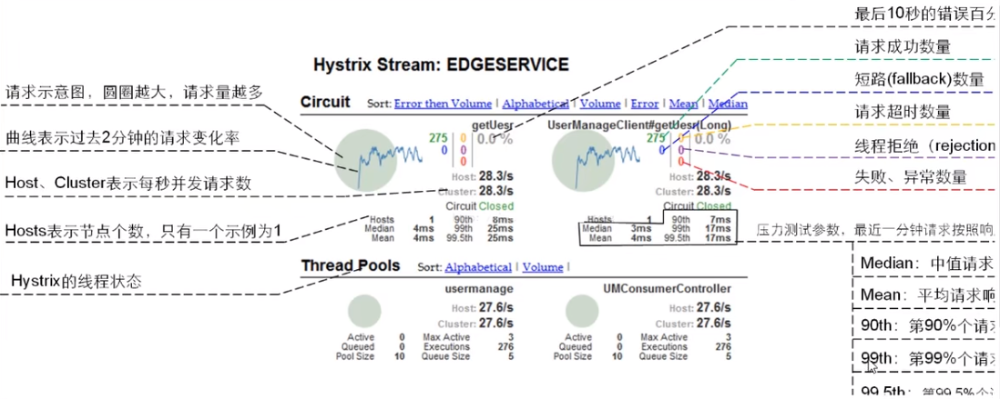

### 三、GateWay和Zuul课程说明

Zuul开发人员窝里斗，实属明日黄花

重点关注Gate Way

#### 3.1 Gateway是什么？

[上一代zuul 1.x官网](https://github.com/Netflix/zuul/wiki)

[Gateway官网](https://cloud.spring.io/spring-cloud-static/spring-cloud-gateway/2.2.1.RELEASE/reference/html/)

##### 3.1.1 概述

Cloud 全家桶中有一个很重要的组件就是网关，在1.x版本中都采用的Zuul网关；

但在2.x版本中，zuul的升级一直跳票，SpringCloud最后自己研发了一个网关代替Zuul，那就是SpringCloud GateWay一句话：gateWay是原zuul1.x版的替代。


Gateway是在spring生态系统上构建的API网关服务，基于Spring5 ，Springboot2和Project Reactor等技术。

Gateway旨在提供一种简单而有效的方式来对API进行路由，以及提供一些强大的过滤器功能，例如：熔断，限流， 重试等。

SpringCloud Gateway是Spring Cloud的一个全新项目。基于Spring5.0 + Springboot2.0 和Project Reactor等技术开发的网关，它旨在为微服务架构提供一种简单有效的统一的API路由管理方式。

SpringCloud Gateway作为Spring Cloud生态系统中的网关，目标是Zuul，在Spring Cloud2.0以上版本中，没有对新版本的Zul 2.0以上的罪行高新能版本进行集成，仍然还是使用的Zuul 1.x非Reactor模式的老版本。而为了提升网关的性能，SpringCloud Gateway是基于WebFlu框架实现的，而WebFlux框架底层则使用了高新能的Reactor模式通信框架Netty。

Spring Cloud Gateway的目标提供统一的路由方式且基于Filter链的方式提供了网关基本的功能，例如：安全，监控/指标，和限流。

##### 3.1.2 作用

- 方向代理
- 鉴权
- 流量控制
- 熔断
- 日志监控
- ...

##### 3.1.3 微服务架构中网关的位置


#### 3.2 Gateway非阻塞异步模型

##### 3.2.1 我们为什么选择Gateway？

1、netflix不太靠谱，zuul2.0 一直跳票，迟迟不发布。

- 一方面因为Zuul1.0 已经进入了维护阶段，而且Gateway是SpringCloud团队研发的，是亲儿子产品，指的信赖。而且很多工鞥呢Zuul都没有用起来也非常的简单便捷。
- Gateway是基于异步非阻塞模型上进行开发的，性能方面不需要担心。虽然Netflix早就发不了最新的Zuul 2.x，但SpringCloud貌似没有整合计划。而且Netflix相关组件都宣布进入维护期；不知前景如何？
- 多方面综合考虑Gateway是很理想的网关选择。

2、SpringCloud Gateway具有如下特性

- 基于Spring Framework 5，Project Reactor 和Spring Boot2.0 进行构建；
- 动态路由：能够匹配任何请求属性；
- 可以对路由执行Predicate(断言)和Filter(过滤器)；
- 集成Hystrix的断路器功能；
- 集成Spring Cloud服务发现功能；
- 易于编写的Oredicate(断言)和Filter(过滤器)；
- 请求限流功能；
- 支持路径重写。

3、SpringCloud Gateway与zuul的区别

- 在SpringCloud Finchley正式版之前，Spring Cloud推荐的网关是Netflix提供的Zuul。
- Zuul 1.x，是一个基于阻塞I/O的API Gateway。
- Zuul 1.x 基于Servlet 2.5 使用阻塞架构它不支持任何长连接（如WebSocket）Zuul的设计模式和Nginx 较像，每次I/O操作都会从工作线程中选择一个执行，请求线程被阻塞到工作线程完成，但是差别是Nginx用C++实现，Zuul用Java实现，而JVM本身会有第一次加载较慢的情况，只用Zuul的性能相对较差。
- Zuul 2.x理念更先进，想基于Netty非阻塞和支持长连接，但SpringCloud目前还没有整合。Zuul .x 的性能较Zuul 1.x有较大提升。在性能方面，根据官方踢动的基准测色，Spring Cloud Gateway 的RPS（每秒请求数）是Zuul的1.6倍。

- Spring Cloud Gateway 建立在Spring Framework 5、Project Reactor 和Spring Boot2之上，使用非阻塞API。
- Spring Cloud Gateway 还支持WebSocket，并且与Spring紧密集成拥有更好的开发体验。

##### 3.2.2 Zuul1.x 模型

SpringCloud中所集成的Zuul版本，采用的是Tomcat容器，使用的是传统的Servlet IO处理模型。

Servlet的生命周期？servlet由servlet container进行生命周期管理。

- container启动时构造servlet对象并调用servlet init() 进行初始化；
- container 运行时接受请求，并为每个请求分配一个线程（一般从线程池中获取空闲线程）然后调用service）;
- container 关闭时调用servlet destory()销毁servlet。


##### 3.2.3 上述模式的缺点

Servlet 是一个简单的网络IO模型，当请求进入Servlet container时，Servlet container就会为其绑定一个线程，在并发不高的场景下这种模型是适用的。但是一旦高并发（如抽风用Jmeter压），线程数量就会上涨，而线程资源代价是昂贵（上下文切换，内存消耗大）严重影响请求的处理时间。在一些简单业务场景下，不希望为每个request分配一个线程，只需要1个或几个线程就能应对极大并发的请求，这种业务场景下servlet模型没有优势。

所以Zuul 1.x是基于servlet之上的一个阻塞式处理模型，即Spring实现了处理所有request请求的一个servlet(DispatcherServlet)并由该servlet阻塞式处理。所以SpringCloud Zuul 无法摆脱servlet模型的弊端。

##### 3.2.4 Gateway模型

WebFlux是什么？[官方文档](https://docs.spring.io/spring/docs/current/spring-framework-reference/web-reactive.html#spring-webflux)

传统的Web框架，比如说：Struts2，SpringMVC等都是基于Servlet API与Servlet容器基础之上运行的。

但是在Servlet3.1 之后有了异步阻塞的支持。而WebFlux是一个典型非阻塞异步的框架，它的核心是基于Reactor的相关API实现的。相对于web框架来说，它可以运行在诸如Netty，Undertow及支持Servlet3.1 的容器上。非阻塞式 + 函数式编程(Spring 5必须让你使用 java8)

Spring WebFlux是Spring 5.0 引入的新的响应式框架，区别于Spring MVC，它不需要依赖Servlet APl，它是完全异步非阻塞的，并且基于Reactor来实现响应式流规范。

> Spring Cloud Gateway requires the Netty runtime provided by Spring Boot and Spring Webflux. It does not work in a traditional Servlet Container or when built as a WAR.
>
> [link](https://cloud.spring.io/spring-cloud-static/spring-cloud-gateway/2.2.1.RELEASE/reference/html/#gateway-starter)

#### 3.3 Gatway工作流程

##### 3.3.1 三大核心概念

- Route（路由）：路由是构建网关的基本模块，它由ID，目标URL，一系列的断言和过滤器组成，如断言为true则匹配该路由；
- Predicate(断言)：参考的是Java8的java.util.function.Predicate，开发人员可以匹配HTTP请求中的所有内容(例如请求头或请求参数)，如果请求与断言相匹配则进行路由；
- Filter（过滤）指的是Spring框架中Gateway Filter的实例，使用过滤器，可以在请求被路由前或者之后对请求进行修改。

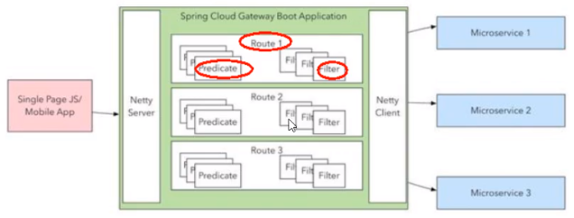

web请求，通过一些匹配条件，定位到真正的服务节点。并在这个转发过程的前后，进行一些精细化控制。

predicate就是我们的匹配条件；而fliter，就可以理解为一个无所不能的拦截器。有了这两个元素，再加上目标uri，就可以实现一个具体的路由了

##### 3.3.2 Gateway工作流程

[官网总结](https://cloud.spring.io/spring-cloud-static/spring-cloud-gateway/2.2.1.RELEASE/reference/html/#gateway-how-it-works)


> Clients make requests to Spring Cloud Gateway. If the Gateway Handler Mapping determines that a request matches a route, it is sent to the Gateway Web Handler. This handler runs the request through a filter chain that is specific to the request. The reason the filters are divided by the dotted line is that filters can run logic both before and after the proxy request is sent. All “pre” filter logic is executed. Then the proxy request is made. After the proxy request is made, the “post” filter logic is run. 
>
> [link](https://cloud.spring.io/spring-cloud-static/spring-cloud-gateway/2.2.1.RELEASE/reference/html/#gateway-how-it-works)

客户端向Spring Cloud Gateway发出请求。然后在Gateway Handler Mapping 中找到与请求相匹配的路由，将其发送到GatewayWeb Handler。

Handler再通过指定的过滤器链来将请求发送到我们实际的服务执行业务逻辑，然后返回。

过滤器之间用虚线分开是因为过滤器可能会在发送代理请求之前(“pre”)或之后(“post"）执行业务逻辑。

Filter在“pre”类型的过滤器可以做参数校验、权限校验、流量监控、日志输出、协议转换等，在“post”类型的过滤器中可以做响应内容、响应头的修改，日志的输出，流量监控等有着非常重要的作用。

**核心逻辑**：路由转发 + 执行过滤器链。

#### 3.4 Gateway9527搭建

1、新建Module  - cloud-gateway-gateway9527

2、POM

```xml
<?xml version="1.0" encoding="UTF-8"?>
<project xmlns="http://maven.apache.org/POM/4.0.0"
         xmlns:xsi="http://www.w3.org/2001/XMLSchema-instance"
         xsi:schemaLocation="http://maven.apache.org/POM/4.0.0 http://maven.apache.org/xsd/maven-4.0.0.xsd">
    <parent>
        <artifactId>yooomecloud</artifactId>
        <groupId>com.yooome.springcloud</groupId>
        <version>1.0-SNAPSHOT</version>
    </parent>
    <modelVersion>4.0.0</modelVersion>

    <artifactId>cloud-gateway-gateway9527</artifactId>
    <dependencies>
        <!--gateway-->
        <dependency>
            <groupId>org.springframework.cloud</groupId>
            <artifactId>spring-cloud-starter-gateway</artifactId>
        </dependency>
       <!--eureka-client-->
        <dependency>
            <groupId>org.springframework.cloud</groupId>
            <artifactId>spring-cloud-starter-netflix-eureka-client</artifactId>
        </dependency>
        <!-- 引入自己定义的api通用包，可以使用Payment支付Entity -->
        <dependency>
            <groupId>com.yooome.springcloud</groupId>
            <artifactId>cloud-api-common</artifactId>
            <version>${project.version}</version>
        </dependency>
        <!--一般基础配置类-->
        <dependency>
            <groupId>org.springframework.boot</groupId>
            <artifactId>spring-boot-devtools</artifactId>
            <scope>runtime</scope>
            <optional>true</optional>
        </dependency>
        <dependency>
            <groupId>org.projectlombok</groupId>
            <artifactId>lombok</artifactId>
            <optional>true</optional>
        </dependency>
        <dependency>
            <groupId>org.springframework.boot</groupId>
            <artifactId>spring-boot-starter-test</artifactId>
            <scope>test</scope>
        </dependency>
    </dependencies>
    <properties>
        <maven.compiler.source>8</maven.compiler.source>
        <maven.compiler.target>8</maven.compiler.target>
    </properties>

</project>
```

3、YML

```yml
server:
  port: 9527

spring:
  application:
    name: cloud-gateway

eureka:
  instance:
    hostname: cloud-gateway-service
  client:
    service-url:
      register-with-eureka: true
      fetch-registry: true
      defaultZone: http://eureka7001.com:7001/eureka

```

4、业务类

无

5、主启动类

```java
package com.yooome.springcloud;

import org.springframework.boot.SpringApplication;
import org.springframework.boot.autoconfigure.SpringBootApplication;
import org.springframework.cloud.netflix.eureka.EnableEurekaClient;

@SpringBootApplication
@EnableEurekaClient
public class GatewayApplication9527 {
    public static void main(String[] args) {
        SpringApplication.run(GatewayApplication9527.class, args);
    }
}

```

6、9527网关如何做路由映射？

cloud-provider-payment8001看看controller访问地址

- get
- lb

我们目前不想暴露8001端口，希望在8001外面套一层9527

7、YML新增网关配置

```yml
server:
  port: 9527

spring:
  application:
    name: cloud-gateway
  cloud:
    gateway:
      routes:
        - id: payment_routh #payment_routh #路由的ID，没有固定规则但要求唯一，建议配合服务名
          uri: http://localhost:8001  #匹配后提供服务的路由地址
          #uri: lb://cloud-payment-service #匹配后提供服务的路由地址
          predicates:
            - Path=/payment/get/**  # 断言，路径相匹配的进行路由

        - id: payment_routh2 #payment_route    #路由的ID，没有固定规则但要求唯一，建议配合服务名
          uri: http://localhost:8001          #匹配后提供服务的路由地址 #uri: lb://cloud-payment-service #匹配后提供服务的路由地址
          #uri: lb://cloud-payment-service #匹配后提供服务的路由地址
          predicates:
            - Path=/payment/lb/**         # 断言，路径相匹配的进行路由

eureka:
  instance:
    hostname: cloud-gateway-service
  client:
    service-url:
      register-with-eureka: true
      fetch-registry: true
      defaultZone: http://eureka7001.com:7001/eureka

```

8.测试

- 启动7001
- 启动8001-cloud-provider-payment8001
- 启动9527网关
- 访问说明

          1. 添加网关前 - http://localhost:8001/payment/get/1
                    2. 添加网关后 - http://localhost:9527/payment/get/1
                    3. 两者访问成功，返回相同结果

#### 3.5 Gateway配置路由的两种方式

在配置文件yml中配置，见上一章节

代码中注入RouterLocator的Bean

官网案例 - [link](https://cloud.spring.io/spring-cloud-static/spring-cloud-gateway/2.2.1.RELEASE/reference/html/#modifying-the-way-remote-addresses-are-resolved)

```java
RemoteAddressResolver resolver = XForwardedRemoteAddressResolver
    .maxTrustedIndex(1);

...

.route("direct-route",
    r -> r.remoteAddr("10.1.1.1", "10.10.1.1/24")
        .uri("https://downstream1")
.route("proxied-route",
    r -> r.remoteAddr(resolver, "10.10.1.1", "10.10.1.1/24")
        .uri("https://downstream2")
)

```

百度国内新闻网址，需要外网 - http://news.baidu.com/guonei

**自己写一个**

业务需求 - 通过9527网关访问到外网的百度新闻网址

**编码**

cloud-gateway-gateway9527业务实现

```java
import org.springframework.cloud.gateway.route.RouteLocator;
import org.springframework.cloud.gateway.route.builder.RouteLocatorBuilder;
import org.springframework.context.annotation.Bean;
import org.springframework.context.annotation.Configuration;


@Configuration
public class GateWayConfig
{
    @Bean
    public RouteLocator customRouteLocator(RouteLocatorBuilder routeLocatorBuilder)
    {
        RouteLocatorBuilder.Builder routes = routeLocatorBuilder.routes();

        routes.route("path_route_atguigu",
                r -> r.path("/guonei")
                        .uri("http://news.baidu.com/guonei")).build();

        return routes.build();
    }
}

```

**测试**

浏览器输入http://localhost:9527/guonei，返回http://news.baidu.com/guonei相同的页面。

#### 3.6 GateWay配置动态路由

默认情况下Gateway会根据注册中心注册的服务列表，以注册中心上微服务名为路径创建**动态路由进行转发，从而实现动态路由的功能**（不写死一个地址）。

**启动**

- eureka7001
- payment8001/8002

POM

```xml
<!--eureka-client-->
<dependency>
    <groupId>org.springframework.cloud</groupId>
    <artifactId>spring-cloud-starter-netflix-eureka-client</artifactId>
</dependency>

```

**YML**

需要注意的是uri的协议为lb，表示启用Gateway的负载均衡功能。

lb://serviceName是spring cloud gateway在微服务中自动为我们创建的负载均衡uri。

```yml
server:
  port: 9527

spring:
  application:
    name: cloud-gateway
#############################新增网关配置###########################
  cloud:
    gateway:
      discovery:
        locator:
          enabled: true #开启从注册中心动态创建路由的功能，利用微服务名进行路由
      routes:
        - id: payment_routh #payment_route    #路由的ID，没有固定规则但要求唯一，建议配合服务名
          #uri: http://localhost:8001          #匹配后提供服务的路由地址
          uri: lb://cloud-payment-service #匹配后提供服务的路由地址
          predicates:
            - Path=/payment/get/**         # 断言，路径相匹配的进行路由

        - id: payment_routh2 #payment_route    #路由的ID，没有固定规则但要求唯一，建议配合服务名
          #uri: http://localhost:8001          #匹配后提供服务的路由地址
          uri: lb://cloud-payment-service #匹配后提供服务的路由地址
          predicates:
            - Path=/payment/lb/**         # 断言，路径相匹配的进行路由
####################################################################

eureka:
  instance:
    hostname: cloud-gateway-service
  client: #服务提供者provider注册进eureka服务列表内
    service-url:
      register-with-eureka: true
      fetch-registry: true
      defaultZone: http://eureka7001.com:7001/eureka

```

**测试**

浏览器输入 - http://localhost:9527/payment/lb

结果

不停刷新页面，8001/8002两个端口切换。

#### 3.7 GateWay常用的Predicate

[官方文档](https://cloud.spring.io/spring-cloud-static/spring-cloud-gateway/2.2.1.RELEASE/reference/html/#gateway-request-predicates-factories)

**Route Predicate Factories这个是什么**

>Spring Cloud Gateway matches routes as part of the Spring WebFlux HandlerMapping infrastructure. Spring Cloud Gateway includes many built-in route predicate factories. All of these predicates match on different attributes of the HTTP request. You can combine multiple route predicate factories with logical and statements. 
>
>[link](https://cloud.spring.io/spring-cloud-static/spring-cloud-gateway/2.2.1.RELEASE/reference/html/#gateway-request-predicates-factories)

Spring Cloud Gateway将路由匹配作为Spring WebFlux HandlerMapping基础架构的一部分。

Spring Cloud Gateway包括许多内置的Route Predicate工厂。所有这些Predicate都与HTTP请求的不同属性匹配。多个RoutePredicate工厂可以进行组合。

Spring Cloud Gateway创建Route 对象时，使用RoutePredicateFactory 创建 Predicate对象，Predicate 对象可以赋值给Route。Spring Cloud Gateway包含许多内置的Route Predicate Factories。
所有这些谓词都匹配HTTP请求的不同属性。多种谓词工厂可以组合，并通过逻辑and。
**常用的Route Predicate Factory**

1. The After Route Predicate Factory
2. The Before Route Predicate Factory
3. The Between Route Predicate Factory
4. The Cookie Route Predicate Factory
5. The Header Route Predicate Factory
6. The Host Route Predicate Factory
7. The Method Route Predicate Factory
8. The Path Route Predicate Factory
9. The Query Route Predicate Factory
10. The RemoteAddr Route Predicate Factory
11. The weight Route Predicate Factory

讨论几个Route Predicate Factory

The After Route Predicate Factory

```yml
spring:
  cloud:
    gateway:
      routes:
      - id: after_route
        uri: https://example.org
        predicates:
        # 这个时间后才能起效
        - After=2017-01-20T17:42:47.789-07:00[America/Denver]

```

可以通过下述方法获得上述格式的时间戳字符串

```java
import java.time.ZonedDateTime;


public class T2
{
    public static void main(String[] args)
    {
        ZonedDateTime zbj = ZonedDateTime.now(); // 默认时区
        System.out.println(zbj);

       //2021-02-22T15:51:37.485+08:00[Asia/Shanghai]
    }
}


```

**The Between Route Predicate Factory**

```yml
spring:
  cloud:
    gateway:
      routes:
      - id: between_route
        uri: https://example.org
        # 两个时间点之间
        predicates:
        - Between=2017-01-20T17:42:47.789-07:00[America/Denver], 2017-01-21T17:42:47.789-07:00[America/Denver]

```

**The Cookie Route Predicate Factory**

```yml
spring:
  cloud:
    gateway:
      routes:
      - id: cookie_route
        uri: https://example.org
        predicates:
        - Cookie=chocolate, ch.p

```

The cookie route predicate factory takes two parameters, the cookie name and a regular expression.

This predicate matches cookies that have the given name and whose values match the regular expression.

测试

```java
# 该命令相当于发get请求，且没带cookie
curl http://localhost:9527/payment/lb

# 带cookie的
curl http://localhost:9527/payment/lb --cookie "chocolate=chip"

```

**The Header Route Predicate Factory**

```yml
spring:
  cloud:
    gateway:
      routes:
      - id: header_route
        uri: https://example.org
        predicates:
        - Header=X-Request-Id, \d+

```

The header route predicate factory takes two parameters, the header name and a regular expression.

This predicate matches with a header that has the given name whose value matches the regular expression.

测试

```java
# 带指定请求头的参数的CURL命令
curl http://localhost:9527/payment/lb -H "X-Request-Id:123"

```

其它的，举一反三。

**小结**

说白了，Predicate就是为了实现一组匹配规则，让请求过来找到对应的Route进行处理。

#### 3.8 GateWay的Filter

[官方文档](https://cloud.spring.io/spring-cloud-static/spring-cloud-gateway/2.2.1.RELEASE/reference/html/#gatewayfilter-factories)

```
Route filters allow the modification of the incoming HTTP request or outgoing HTTP response in some manner. Route filters are scoped to a particular route. Spring Cloud Gateway includes many built-in GatewayFilter Factories.
```

路由过滤器可用于修改进入的HTTP请求和返回的HTTP响应，路由过滤器只能指定路由进行使用。Spring Cloud Gateway内置了多种路由过滤器，他们都由GatewayFilter的工厂类来产生。

Spring Cloud Gateway的Filter:

- 生命周期：
  - pre
  - post

- 种类（具体看官方文档）：
  - GatewayFilter - 有31种
  - GlobalFilter - 有10种

常用的GatewayFilter：AddRequestParameter GatewayFilter

自定义全局GlobalFilter：

**两个主要接口介绍：**

1. GlobalFilter
2. Ordered

**能干什么：**

1. 全局日志记录
2. 统一网关鉴权
3. …
   代码案例：

GateWay9527项目添加MyLogGateWayFilter类：

```java
import lombok.extern.slf4j.Slf4j;
import org.springframework.cloud.gateway.filter.GatewayFilterChain;
import org.springframework.cloud.gateway.filter.GlobalFilter;
import org.springframework.core.Ordered;
import org.springframework.http.HttpStatus;
import org.springframework.stereotype.Component;
import org.springframework.web.server.ServerWebExchange;
import reactor.core.publisher.Mono;

import java.util.Date;

@Component
@Slf4j
public class MyLogGateWayFilter implements GlobalFilter,Ordered
{

    @Override
    public Mono<Void> filter(ServerWebExchange exchange, GatewayFilterChain chain)
    {
        log.info("***********come in MyLogGateWayFilter:  "+new Date());

        String uname = exchange.getRequest().getQueryParams().getFirst("uname");

        if(uname == null)
        {
            log.info("*******用户名为null，非法用户，o(╥﹏╥)o");
            exchange.getResponse().setStatusCode(HttpStatus.NOT_ACCEPTABLE);
            return exchange.getResponse().setComplete();
        }

        return chain.filter(exchange);
    }

    @Override
    public int getOrder()
    {
        return 0;
    }
}
```

测试：

启动：

- EurekaMain7001
- PaymentMain8001
- GateWayMain9527
- PaymentMain8002
  浏览器输入：

http://localhost:9527/payment/lb - 反问异常
http://localhost:9527/payment/lb?uname=abc - 正常访问

### 四、Config分布式配置中心介绍

#### 4.1 分布式系统面临的配置问题

微服务意味着要将单体应用中的业务拆分一个个子服务，每个服务的力度相对较少，因此系统中会出现大量的服务。由于每个服务都需要必要的配置信息才能运行，所以一套集中式的、动态的配置管理设置是必不可少的

SPringCloud提供了ConfigServer来解决这个问题，我们每一个微服务自己带着一个application.yml，上百个配置文件的管理.......

#### 4.2 是什么？

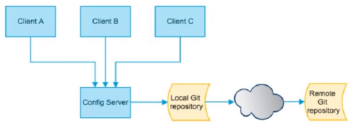

SpringCloud Config微服务架构中的微服务提供集中化的外部配置支持，配置服务器为各个不同微服务应用的所有环境提供了一个中心化的外部配置。

#### 4.3 怎么玩

SpringCloud Config分为服务端和客户端两部分。

- 服务端也成为分布式配置中心，它是一个独立的微服务应用，用来连接配置服务器并为客户低筒获取配置信心，加密/解密信息等访问接口。
- 客户端则是通过指定的配置中心来管理应用资源，以及与业务相关的配置内容，并在启动的时候从配置中心获取和加载配置信息配置，服务器默认采用git来存储配置信息，这样就有主语对环境配置进行版本管理，并且可以通过git客户端工具来方便的管理和访问配置内容。

#### 4.4 能干什么

- 集中管理配置文件
- 不同环境不同配置，动态化的配置更新，分环境部署比如dev/test/prod/beta/release
- 运行期间动态调整配置，不再需要在每个服务部署的机器上编写配置文件，服务会向配置中心统一拉去配置自己的信息。
- 当配置发生变动时，服务不需要重新启动即可感知到配置的变化并应用到新的配置；
- 将配置信息以TEST接口的形式暴露 - post/crul访问刷新即可...

#### 4.5 与Github整合配置

由于SpringCloud Config默认使用Git来存储配置文件（也有其他的方式，比如支持SVN和本地文件），但最推荐的还是Git，而且使用的是http/https访问的形式。

[**官网**](https://cloud.spring.io/spring-cloud-static/spring-cloud-config/2.2.1.RELEASE/reference/html/)

#### 4.6 Config 配置总控制中心搭建

用你自己的账号在GitHub上新建一个名为springcloud-config的新Repository。

由上一步获得刚新建的git地址 - `git@github.com:abc/springcloud-config.git`

本地硬盘目录上新建git仓库并clone。

- 工作目录为D:/SpringCloud2021
- git clone git@github.com:abc/springcloud-config.git

此时工作目录会创建名为springcloud-config的文件夹。

在springcloud-config的文件夹中创建三个配置文件（为本次教学使用的）随后 git add. ，git commit -m "sth" 等一些列上传操作上传到springcloud-config的新Rspository

- config-dev.yml

```yml
config:
  info: "master branch,springcloud-config/config-dev.yml version=7"

```

- Config-prod.yml

```yml
config:
  info: "master branch,springcloud-config/config-dev.yml version=1"

```

- Config-test.yml

```yml
config:
  info: "master branch,springcloud-config/config-dev.yml version=1"

```

新建Module模块cloud-config-center-3344，它即为Cloud配置中心模块CloudConfig  Center

POM

```xml
```

YML

```yml
```

主启动类

```java
```

windows下修改hosts文件，增加映射

```tex
127.0.0.1 config-3344.com
```

测试通过Config微服务是否可以从GitHub上获取配置内容

- 启动ConfigCenterMain3344
- 浏览器防问 - http://config-3344.com:3344/master/config-dev.yml
- 页面返回结果：

```json
config:
  info: "master branch,springcloud-config/config-dev.yml version=7"
```

配置读取规则

- 官方文档

- /{label}/{application}-{profile}.yml（推荐）

- master分支
  - http://config-3344.com:3344/master/config-dev.yml
  - http://config-3344.com:3344/master/config-test.yml
  - http://config-3344.com:3344/master/config-prod.yml

- dev分支
  - http://config-3344.com:3344/dev/config-dev.yml
  - http://config-3344.com:3344/dev/config-test.yml
  - http://config-3344.com:3344/dev/config-prod.yml

- /{application}-{profile}.yml
  - http://config-3344.com:3344/config-dev.yml
  - http://config-3344.com:3344/config-test.yml
  - http://config-3344.com:3344/config-prod.yml
  - http://config-3344.com:3344/config-xxxx.yml(不存在的配置)

- /{application}/{profile}[/{label}]
  - http://config-3344.com:3344/config/dev/master
  - http://config-3344.com:3344/config/test/master
  - http://config-3344.com:3344/config/test/dev

- 重要配置细节总结
  - /{name}-{profiles}.yml
  - /{label}-{name}-{profiles}.yml
  - label：分支(branch)
  - name：服务名
  - profiles：环境(dev/test/prod)

成功实现了用SpringCloud Config通过GitHub获取配置信息

#### 4.7 Config客户端配置与测试

**新建cloud-config-client-3355**

**POM**

```xml
```

**bootstrap.yml**

application.yml 是用户级的资源配置项

bootstrap.yml是系统级的，优先级加高

Spring Cloud会创建一个Bootstrap Context，作为Spring应用的Application Context的父上下文。

初始化的时候，BootstrapContext负责从外部源加载配置属性并解析配置。这两个上下文共享一个从外部获取的Environment。

Bootstrap属性有高优先级，默认情况下，它们不会被本地配置覆盖。Bootstrap context 和Application Context 有不同的约定，所以新增了一个bootstrap.yml文件，保证Bootstrap Context和Application Context配置的分离。

要将Client模块下的application.yml文件改为bootstrap.yml，这是很关键的，因为bootstrap.yml，这是很关键的，因为bootstrap.yml是比application.yml优先级高于application.yml

```yml
server:
  port: 3355

spring:
  application:
    name: config-client
  cloud:
    #Config客户端配置
    config:
      label: master #分支名称
      name: config #配置文件名称
      profile: dev #读取后缀名称   上述3个综合：master分支上config-dev.yml的配置文件被读取http://config-3344.com:3344/master/config-dev.yml
      uri: http://localhost:3344 #配置中心地址k


#服务注册到eureka地址
eureka:
  client:
    service-url:
      defaultZone: http://localhost:7001/eureka


```

**修改config-dev.yml配置并提交到GitHub中，比如加个变量age或者版本号version**

```java
import org.springframework.boot.SpringApplication;
import org.springframework.boot.autoconfigure.SpringBootApplication;
import org.springframework.cloud.netflix.eureka.EnableEurekaClient;


@EnableEurekaClient
@SpringBootApplication
public class ConfigClientMain3355
{
    public static void main(String[] args) {
            SpringApplication.run(ConfigClientMain3355.class, args);
    }
}


```

业务类

```java
import org.springframework.beans.factory.annotation.Value;
import org.springframework.cloud.context.config.annotation.RefreshScope;
import org.springframework.web.bind.annotation.GetMapping;
import org.springframework.web.bind.annotation.RestController;


@RestController
@RefreshScope
public class ConfigClientController
{
    @Value("${config.info}")
    private String configInfo;

    @GetMapping("/configInfo")
    public String getConfigInfo()
    {
        return configInfo;
    }
}
```

**测试**

- 启动Config配置中心3344微服务并自测
  - http://config-3344.com:3344/master/config-prod.yml
  - http://config-3344.com:3344/master/config-dev.yml

- 启动3355作为Client准备访问
  - http://localhost:3355/configlnfo

成功实现了客户端3355访问SpringCloud Config3344通过GitHub获取配置信息可题随时而来

分布式配置的动态刷新问题

- Linux运维修改GitHub上的配置文件内容做调整
- 刷新3344，发现ConfigServer配置中心立刻响应
- 刷新3355，发现ConfigClient客户端没有任何响应
- 3355没有变化除非自己重启或者重新加载
- 难到每次运维修改配置文件，客户端都需要重启??噩梦

#### 4.8 Config动态刷新之手动版

避免每次更新配置都要重启客户端微服务3355

##### 4.8.1 动态刷新步骤

修改3355模块

POM引入actuator监控

```xml
<dependency>
    <groupId>org.springframework.boot</groupId>
    <artifactId>spring-boot-starter-actuator</artifactId>
</dependency>
```

修改YML，添加暴露监控端口配置：

```yml
# 暴露监控端点
management:
  endpoints:
    web:
      exposure:
        include: "*"
```

@RefreshScope业务类Controller修改

```java
import org.springframework.cloud.context.config.annotation.RefreshScope;
...

@RestController
@RefreshScope//<-----
public class ConfigClientController
{
...
}

```

测试

此时修改github配置文件内容 -> 访问3344 -> 访问3355

http://localhost:3355/configInfo

3355改变没有??? **没有**，还需一步

**How**

需要运维人员发送Post请求刷新3355

```java
curl -X POST "http://localhost:3355/actuator/refresh"
```

**再次测试**

http://localhost:3355/configInfo

3355改变没有??? 改了。

成功实现了客户端3355刷新到最新配置内容，避免了服务重启

想想还有什么问题?

- 假如有多个微服务客户端3355/3366/3377
- 每个微服务都要执行—次post请求，手动刷新?
- 可否广播，一次通知，处处生效?
- 我们想大范围的自动刷新，求方法
  

### 五、Bus消息总线是什么

#### 5.1 Bus是什么

Spring Cloud Bus配合Spring Cloud Config使用可以实现配置的动态刷新。


Spring Cloud Bus是用来将分布式系统的节点与轻量级消息系统连接起来的框架，它政和路Java的事件机制和消息中间件的功能。SpringCloudBus目前支持RabbitMQ和Kafka。

#### 5.2 能干什么？

Spring Cloud Bus能管理和传播分布式系统间的消息，就行一个分布式执行器，可用于广播状态更改、事件推送等，也可以当作微服务间的通信通到。

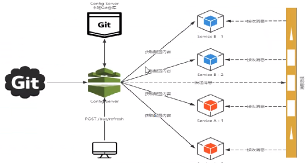

#### 5.3 为何被称为消息总线

**什么是总线**

在微服务架构的系统中，通常会使用轻量级的消息代理来构建一个共用的消息主题，并让系统中所有微服务实例都连接上来。由于该主题中产生的消息会被所有实例监听和消费，所以称它为消息总线。在消息上的各个实例，都可以方便的广播一些需要让其他连接在该主题上的实例都知道的消息。

**基本原理**

ConfigClient实例都监听MQ中同一个topic(默认是SpringCloudBus)。当一个服务刷新数据的时候，它会把这个信息放入到Topic中，这样其他监听同一Topic的服务就能得到通知，然后去更新自身的配置。

#### 5.4 Bus之RabbitMQ环境配置

- 安装Erlang，下载地址：http://erlang.org/download/otp_win64_21.3.exe
- 安装RabbitMQ，下载地址：https://github.com/rabbitmq/rabbitmq-server/releases/download/v3.8.3/rabbitmq-server-3.8.3.exe
- 打开cmd进入RabbitMQ安装目录下的sbin目录，如：D:\devSoft\RabbitMQ Scrverk\rabbitmq_server-3.7.14\sbin
- 输入以下命令启动管理功能

```json
rabbitmq-plugins enable rabbitmq _management
```

这样就可一个添加可视化插件。

- 访问地址查看是否安装成功：http://localhost:15672/
- 输入账号密码并登录：guest  guest

#### 5.5 Bus动态刷新全局广播的设计思想和选型

必须先具备良好的RibbitMQ环境先

演示广播效果，增加复杂度，再以3355位模板在制作一个3366

1、新建cloud-config-client-3366

2、POM

```xml
```

3、YML

```yml
server:
  port: 3366

spring:
  application:
    name: config-client
  cloud:
    #Config客户端配置
    config:
      label: master #分支名称
      name: config #配置文件名称
      profile: dev #读取后缀名称   上述3个综合：master分支上config-dev.yml的配置文件被读取http://config-3344.com:3344/master/config-dev.yml
      uri: http://localhost:3344 #配置中心地址

#rabbitmq相关配置 15672是Web管理界面的端口；5672是MQ访问的端口
  rabbitmq:
    host: localhost
    port: 5672
    username: guest
    password: guest

#服务注册到eureka地址
eureka:
  client:
    service-url:
      defaultZone: http://localhost:7001/eureka

# 暴露监控端点
management:
  endpoints:
    web:
      exposure:
        include: "*"

```

4、主启动

```java
import org.springframework.boot.SpringApplication;
import org.springframework.boot.autoconfigure.SpringBootApplication;
import org.springframework.cloud.netflix.eureka.EnableEurekaClient;

@EnableEurekaClient
@SpringBootApplication
public class ConfigClientApplication3366
{
    public static void main(String[] args)
    {
        SpringApplication.run(ConfigClientApplication3366.class,args);
    }
}


```

5、controller

```java
import org.springframework.beans.factory.annotation.Value;
import org.springframework.cloud.context.config.annotation.RefreshScope;
import org.springframework.web.bind.annotation.GetMapping;
import org.springframework.web.bind.annotation.RestController;

/**
 */
@RestController
@RefreshScope
public class ConfigClientController
{
    @Value("${server.port}")
    private String serverPort;

    @Value("${config.info}")
    private String configInfo;

    @GetMapping("/configInfo")
    public String configInfo()
    {
        return "serverPort: "+serverPort+"\t\n\n configInfo: "+configInfo;
    }

}
```

**设计思想**

1、利用消息总线触发一个客户端/bus/refresh，而刷新所有客户端的配置


2、利用消息总线触发一个服务端ConfigServer的/bus/refresh端点，而刷新所有客户端的配置

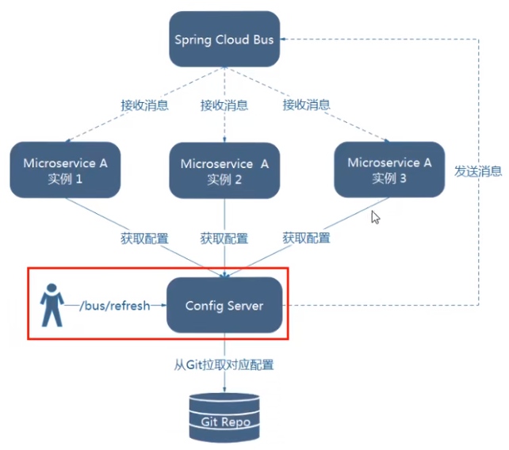


图二的架构显然更加适合，图—不适合的原因如下：

- 打破了微服务的职责单一性，因为微服务本身是业务模块，它本不应该承担配置刷新的职责。

- 破坏了微服务各节点的对等性。

- 有一定的局限性。例如，微服务在迁移时，它的网络地址常常会发生变化，此时如果想要做到自动刷新，那就会增加更多的修改。
  

#### 5.6 Bus动态刷新全局广播配置实现

给cloud-config-center-3344配置中心服务端添加消息总线支持

POM

```xml
<!--添加消息总线RabbitNQ支持-->
<dependency>
	<groupId>org.springframework.cloud</groupId>
	<artifactId>spring-cloud-starter-bus-amap</artifactId>
</dependency>
<dependency>
	<groupId>org-springframework.boot</groupId>
	<artifactId>spring-boot-starter-actuator</artifactId>
</dependency>

```

YML

```yml
server:
  port: 3344

spring:
  application:
    name:  cloud-config-center #注册进Eureka服务器的微服务名
  cloud:
    config:
      server:
        git:
          uri: git@github.com:zzyybs/springcloud-config.git #GitHub上面的git仓库名字
        ####搜索目录
          search-paths:
            - springcloud-config
      ####读取分支
      label: master
#rabbitmq相关配置<--------------------------
rabbitmq:
    host: localhost
    port: 5672
    username: guest
    password: guest

#服务注册到eureka地址
eureka:
  client:
    service-url:
      defaultZone: http://localhost:7001/eureka

##rabbitmq相关配置,暴露bus刷新配置的端点<--------------------------
management:
  endpoints: #暴露bus刷新配置的端点
    web:
      exposure:
        include: 'bus-refresh'

```

**给cloud-config-client-3355客户端添加消息总线支持**

POM

```xml
<!--添加消息总线RabbitNQ支持-->
<dependency>
	<groupId>org.springframework.cloud</groupId>
	<artifactId>spring-cloud-starter-bus-amap</artifactId>
</dependency>
<dependency>
	<groupId>org-springframework.boot</groupId>
	<artifactId>spring-boot-starter-actuator</artifactId>
</dependency>

```

YML

```yml
server:
  port: 3355

spring:
  application:
    name: config-client
  cloud:
    #Config客户端配置
    config:
      label: master #分支名称
      name: config #配置文件名称
      profile: dev #读取后缀名称   上述3个综合：master分支上config-dev.yml的配置文件被读取http://config-3344.com:3344/master/config-dev.yml
      uri: http://localhost:3344 #配置中心地址k

#rabbitmq相关配置 15672是Web管理界面的端口；5672是MQ访问的端口<----------------------
  rabbitmq:
    host: localhost
    port: 5672
    username: guest
    password: guest

#服务注册到eureka地址
eureka:
  client:
    service-url:
      defaultZone: http://localhost:7001/eureka

# 暴露监控端点
management:
  endpoints:
    web:
      exposure:
        include: "*"
```

**给cloud-config-client-3366客户端添加消息总线支持**

POM

```xml
<!--添加消息总线RabbitNQ支持-->
<dependency>
	<groupId>org.springframework.cloud</groupId>
	<artifactId>spring-cloud-starter-bus-amap</artifactId>
</dependency>
<dependency>
	<groupId>org-springframework.boot</groupId>
	<artifactId>spring-boot-starter-actuator</artifactId>
</dependency>

```

YML

```yml
server:
  port: 3366

spring:
  application:
    name: config-client
  cloud:
    #Config客户端配置
    config:
      label: master #分支名称
      name: config #配置文件名称
      profile: dev #读取后缀名称   上述3个综合：master分支上config-dev.yml的配置文件被读取http://config-3344.com:3344/master/config-dev.yml
      uri: http://localhost:3344 #配置中心地址

#rabbitmq相关配置 15672是Web管理界面的端口；5672是MQ访问的端口<-----------------------
  rabbitmq:
    host: localhost
    port: 5672
    username: guest
    password: guest

#服务注册到eureka地址
eureka:
  client:
    service-url:
      defaultZone: http://localhost:7001/eureka

# 暴露监控端点
management:
  endpoints:
    web:
      exposure:
        include: "*"

```

**测试**

- 启动
  - EurekaMain7001
  - ConfigcenterMain3344
  - ConfigclientMain3355
  - ConfigclicntMain3366

- 运维工程师

  - 修改Github上配置文件内容，增加版本号

  - 发送POST请求

    - curl -X POST "http://localhost:3344/actuator/bus-refresh"

    - —次发送，处处生效

- 配置中心
  - http://config-3344.com:3344/config-dev.yml

- 客户端

  - http://localhost:3355/configlnfo

  - http://localhost:3366/configInfo

  - 获取配置信息，发现都已经刷新了

**—次修改，广播通知，处处生效**

#### 5.7 Bus动态刷新定点通知

不想全部通知，只想定点通知

- 只通知3355
- 不通知3366

简单一句话 - **指定具体某一个实例生效而不是全部**

- 公式：http://localhost:3344/actuator/bus-refresh/{destination}
- /bus/refresh请求不再发送到具体的服务实例上，而是发给config server通过destination参数类指定需要更新配置的服务或实例

案例：

- 我们这里以刷新运行在3355端口上的config-client（配置文件中设定的应用名称）为例，只通知3355，不通知3366
- `curl -X POST "http://localhost:3344/actuator/bus-refresh/config-client:3355`

通知总结：


### 六、Stream为什么被引入

常见MQ(消息中间件)：

- ActiveMQ
- RabbitMQ
- RocketMQ
- Kafka

有没有一种新的技术诞生，让我们不再关注具体MQ的细节，我们只需要用一种适配绑定的方式，自动的给我们在各种MQ内切换。（类似于Hibernate）

Cloud Stream是什么？屏蔽底层消息中间件的差异，降低切换成本，统一消息的编程模型。

#### 6.1 Stream是什么及Binder介绍

[官方文档1](https://spring.io/projects/spring-cloud-stream#overview)

[官方文档2](https://cloud.spring.io/spring-tloud-static/spring-cloud-stream/3.0.1.RELEASE/reference/html/Spring)

[Cloud Stream中文指导手册](https://m.wang1314.com/doc/webapp/topic/20971999.html)

#### 6.2 什么是Spring Cloud Stream

官方定义Spring Cloud Stream 是一个构建消息驱动微服务的框架。

应用程序通过inputs或者outputs来与Spring Cloud Stream中binder对象交互。

通过我们配置来binding(绑定)，而Spring Cloud Stream的binder对象负责与消息中间件交互。所以，我们只需要搞清楚如何与Spring Cloud Stream交互就可以方便使用消息驱动的方式。

通过使用Spring Integration来连接消息代理中间件以实现消息事件驱动。

Spring Cloud Stream为一些供应商的消息中间件产品提供了个性化的自动化配置实现，引用了发布-订阅、消费组、分区的三个核心概念。

目前仅支持RabbitMQ、 Kafka。

#### 6.3 Stream 的设计思想

**标准MQ**

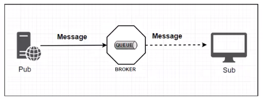

- 生产者/消费者中间靠消息媒介传递消息内容
- 消息必须走特定的通道 - 消息通道 Message Channel
- 消息通道里的消息如何被消费呢，谁负责收发处理 - 消息通道 MessageChannel的子接口 SubscribableChannel，由MessageHandler消息处理器所订阅。

**为什么用Cloud Stream**

比方说我们用到了RabbitMQ和Kafka，由于这两个消息中间件的架构上的不同，像RabbitMQ 有exchange，kafka有Topic和Partitions分区


这些中间件的差异性导致我们实际项目开发给我们造成了一定的困扰，我们如果用了两个消息队列的其中一种，后面的业务需求，我想往另外一种消息队列进行迁移，这时候无疑就是一个灾难性的，一大堆东西都要重新推倒重新做，因为它跟我们的系统耦合了，这时候Spring Cloud Stream给我们提供了—种解耦合的方式。

**Stream凭什么可以统一底层差异？**

在没有绑定器这个概念的情况下，我们的SpringBoot应用要直接与消息中间件进行信息交互的时候，由于各消息中间件构建的初衷不同，它们的实现细节上会有较大的差异性通过定义绑定器作为中间层，完美地实现了应用程序与消息中间件细节之间的隔离。通过向应用程序暴露统一的Channel通道，使得应用程序不需要再考虑各种不同的消息中间件实现。

**通过定义绑定器Binder作为中间层，实现了应用程序与消息中间件细节之间的隔离。**

**Binder**：

- INPUT对应于消费者
- OUTPUT对应于生产者


**Stream中的消息通信方式遵循了发布-订阅模式**

Topic主题进行广播

- 在RabbitMQ就是Exchange
- 在Kakfa中就是Topic

#### 6.4 Stream编码常用注解简介

**Spring Cloud Stream标准流程套路**


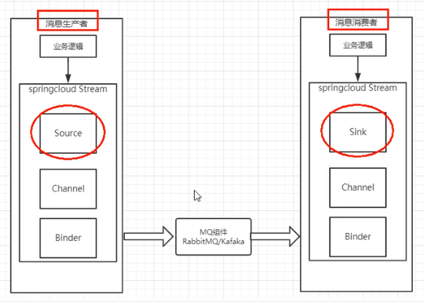

- Binder - 很方便的连接中间件，屏蔽差异。

- Channel - 通道，是队列Queue的一种抽象，在消息通讯系统中就是实现存储和转发的媒介，通过Channel对队列进行配置。

- Source和Sink - 简单的可理解为参照对象是Spring Cloud Stream自身，从Stream发布消息就是输出，接受消息就是输入。
  

**编码API和常用注解**

| **组成**        | **说明**                                                     |
| --------------- | ------------------------------------------------------------ |
| Middleware      | 中间件，目前只支持RabbitMQ和Kafka                            |
| Binder          | Binder是应用与消息中间件之间的封装，目前实行了Kafka和RabbitMQ的Binder，通过Binder可以很方便的连接中间件，可以动态的改变消息类型(对应于Kafka的topic,RabbitMQ的exchange)，这些都可以通过配置文件来实现 |
| @Input          | 注解标识输入通道，通过该输乎通道接收到的消息进入应用程序     |
| @Output         | 注解标识输出通道，发布的消息将通过该通道离开应用程序         |
| @StreamListener | 监听队列，用于消费者的队列的消息接收                         |
| @EnableBinding  | 指信道channel和exchange绑定在一起                            |

**案例说明**

准备RabbitMQ环境（79_Bus之RabbitMQ环境配置有提及）

工程中新建三个子模块

- cloud-stream-rabbitmq-provider8801，作为生产者进行发消息模块
- cloud-stream-rabbitmq-consumer8802，作为消息接收模块
- cloud-stream-rabbitmq-consumer8803，作为消息接收模块
  

#### 6.4 Stream消息驱动之生产者

新建Module：cloud-stream-rabbitmq-provider8801

POM

```xml
```

YML

```yml
server:
  port: 8801

spring:
  application:
    name: cloud-stream-provider
  cloud:
      stream:
        binders: # 在此处配置要绑定的rabbitmq的服务信息；
          defaultRabbit: # 表示定义的名称，用于于binding整合
            type: rabbit # 消息组件类型
            environment: # 设置rabbitmq的相关的环境配置
              spring:
                rabbitmq:
                  host: localhost
                  port: 5672
                  username: guest
                  password: guest
        bindings: # 服务的整合处理
          output: # 这个名字是一个通道的名称
            destination: studyExchange # 表示要使用的Exchange名称定义
            content-type: application/json # 设置消息类型，本次为json，文本则设置“text/plain”
            binder: defaultRabbit # 设置要绑定的消息服务的具体设置

eureka:
  client: # 客户端进行Eureka注册的配置
    service-url:
      defaultZone: http://localhost:7001/eureka
  instance:
    lease-renewal-interval-in-seconds: 2 # 设置心跳的时间间隔（默认是30秒）
    lease-expiration-duration-in-seconds: 5 # 如果现在超过了5秒的间隔（默认是90秒）
    instance-id: send-8801.com  # 在信息列表时显示主机名称
    prefer-ip-address: true     # 访问的路径变为IP地址


```

主启动类StreamMQApplication8801

```java
import org.springframework.boot.SpringApplication;
import org.springframework.boot.autoconfigure.SpringBootApplication;

@SpringBootApplication
public class StreamMQMain8801 {
    public static void main(String[] args) {
        SpringApplication.run(StreamMQMain8801.class,args);
    }
}

```

业务类

1、消息发送接口

```java
public interface IMessageProvider {
    public String send();
}
```

2、发送消息接口实现类

```java
import com.lun.springcloud.service.IMessageProvider;
import org.springframework.cloud.stream.annotation.EnableBinding;
import org.springframework.cloud.stream.messaging.Source;
import org.springframework.integration.support.MessageBuilder;
import org.springframework.messaging.MessageChannel;

import javax.annotation.Resource;
import java.util.UUID;


@EnableBinding(Source.class) //定义消息的推送管道
public class MessageProviderImpl implements IMessageProvider
{
    @Resource
    private MessageChannel output; // 消息发送管道

    @Override
    public String send()
    {
        String serial = UUID.randomUUID().toString();
        output.send(MessageBuilder.withPayload(serial).build());
        System.out.println("*****serial: "+serial);
        return null;
    }
}

```

3、Controller

```java
import com.lun.springcloud.service.IMessageProvider;
import org.springframework.web.bind.annotation.GetMapping;
import org.springframework.web.bind.annotation.RestController;

import javax.annotation.Resource;

@RestController
public class SendMessageController
{
    @Resource
    private IMessageProvider messageProvider;

    @GetMapping(value = "/sendMessage")
    public String sendMessage() {
        return messageProvider.send();
    }

}

```

**测试**

- 启动 7001eureka
- 启动 RabpitMq（79_Bus之RabbitMQ环境配置）
  - rabbitmq-plugins enable rabbitmq_management
  - http://localhost:15672/
    

- 启动 8801
- 访问 - http://localhost:8801/sendMessage
  - 后台将打印serial: UUID字符串

#### 6.5 Stream消息驱动之消费者

新建Module：cloud-stream-rabbitmq-consumer8802

POM

```xml
```

YML

```yml
server:
  port: 8802

spring:
  application:
    name: cloud-stream-consumer
  cloud:
      stream:
        binders: # 在此处配置要绑定的rabbitmq的服务信息；
          defaultRabbit: # 表示定义的名称，用于于binding整合
            type: rabbit # 消息组件类型
            environment: # 设置rabbitmq的相关的环境配置
              spring:
                rabbitmq:
                  host: localhost
                  port: 5672
                  username: guest
                  password: guest
        bindings: # 服务的整合处理
          input: # 这个名字是一个通道的名称
            destination: studyExchange # 表示要使用的Exchange名称定义
            content-type: application/json # 设置消息类型，本次为对象json，如果是文本则设置“text/plain”
            binder: defaultRabbit # 设置要绑定的消息服务的具体设置

eureka:
  client: # 客户端进行Eureka注册的配置
    service-url:
      defaultZone: http://localhost:7001/eureka
  instance:
    lease-renewal-interval-in-seconds: 2 # 设置心跳的时间间隔（默认是30秒）
    lease-expiration-duration-in-seconds: 5 # 如果现在超过了5秒的间隔（默认是90秒）
    instance-id: receive-8802.com  # 在信息列表时显示主机名称
    prefer-ip-address: true     # 访问的路径变为IP地址
```

主启动类StreamMQMain8802

```java
import org.springframework.boot.SpringApplication;
import org.springframework.boot.autoconfigure.SpringBootApplication;

@SpringBootApplication
public class StreamMQMain8802 {
    public static void main(String[] args) {
        SpringApplication.run(StreamMQMain8802.class,args);
    }
}

```

业务类

```java
import org.springframework.beans.factory.annotation.Value;
import org.springframework.cloud.stream.annotation.EnableBinding;
import org.springframework.cloud.stream.annotation.StreamListener;
import org.springframework.cloud.stream.messaging.Sink;
import org.springframework.messaging.Message;
import org.springframework.stereotype.Component;


@Component
@EnableBinding(Sink.class)
public class ReceiveMessageListenerController
{
    @Value("${server.port}")
    private String serverPort;


    @StreamListener(Sink.INPUT)
    public void input(Message<String> message)
    {
        System.out.println("消费者1号,----->接受到的消息: "+message.getPayload()+"\t  port: "+serverPort);
    }
}

```

**测试**

- 启动EurekaMain7001
- 启动StreamMQMain8801
- 启动StreamMQMain8802
- 8801发送8802接收消息

#### 6.6 Stream之消息重复消费

依照8802，克隆出来一份运行8803 - cloud-stream-rabbitmq-consumer8803。

**启动**

- RabbitMQ
- 服务注册 - 8801
- 消息生产 - 8801
- 消息消费 - 8802
- 消息消费 - 8802

**运行后有两个问题**

1. 有重复消费问题
2. 消息持久化问题

**消费**

- http://localhost:8801/sendMessage
- 目前是8802/8803同时都收到了，存在重复消费问题
- 如何解决：分组和持久化属性group（重要）

**生产实际案例**

比如在如下场景中，订单系统我们做集群部署，都会从RabbitMQ中获取订单信息，那如果一个订单同时被两个服务获取到，那么就会造成数据错误，我们得避免这种情况。这时我们就可以**使用Stream中的消息分组来解决**。

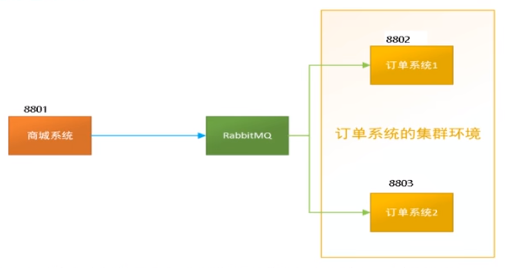

注意在Stream中处于同一个group中的多个消费者是竞争关系，就能够保证消息只会被其中一个应用消费一次。不同组是可以全面消费的(重复消费)。

#### 6.7 Stream之group解决消息重复消费

**原理**

微服务应用放置于同一个group中，就能够保证消息只会被其中一个应用消费一次。

不同的组是可以重复消费的，同一个组内会发生竞争关系，只有其中一个可以消费。

**8802/8803都变成不同组，group两个不同**

group: A_Group、B_Group

8802修改YML

```yml
spring:
  application:
    name: cloud-stream-provider
  cloud:
      stream:
        binders: # 在此处配置要绑定的rabbitmq的服务信息；
          defaultRabbit: # 表示定义的名称，用于于binding整合
            type: rabbit # 消息组件类型
            environment: # 设置rabbitmq的相关的环境配置
              spring:
                rabbitmq:
                  host: localhost
                  port: 5672
                  username: guest
                  password: guest
        bindings: # 服务的整合处理
          output: # 这个名字是一个通道的名称
            destination: studyExchange # 表示要使用的Exchange名称定义
            content-type: application/json # 设置消息类型，本次为json，文本则设置“text/plain”
            binder: defaultRabbit # 设置要绑定的消息服务的具体设置
            group: A_Group #<----------------------------------------关键
```

8803修改YML（与8802的类似位置 group: B_Group）

结论：**还是重复消费**

8802/8803实现了轮询分组，每次只有一个消费者，8801模块的发的消息只能被8802或8803其中一个接收到，这样避免了重复消费。

**8802/8803都变成相同组，group两个相同**group: A_Group

8802修改YML`group: A_Group`

8803修改YML`group: A_Group`

结论：同一个组的多个微服务实例，每次只会有一个拿到

#### 6.7 Stream之消息持久化

通过上述，解决了重复消费问题，再看看持久化。

停止8802/8803并去除掉8802的分组group: A_Group，8803的分组group: A_Group没有去掉。

8801先发送4条消息到RabbitMq。

先启动8802，**无分组属性配置**，后台没有打出来消息。

再启动8803，**有分组属性配置**，后台打出来了MQ上的消息。(消息持久化体现)


### 七、Sleuth是什么

**为什么会出现这个技术？要解决哪些问题？**

在微服务框架中，一个由客户端发起的请求在后端系统中会经过多个不同的的服务节点调用来协同产生最后的请求结果，每一个前段请求都会形成一条复杂的分布式服务调用链路，链路中的任何一环出现高延时或错误都会引起整个请求最后的失败。

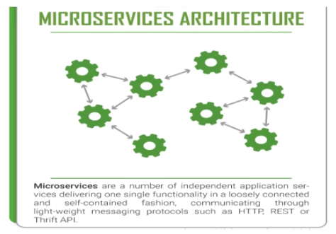


**是什么**

- https://github.com/spring-cloud/spring-cloud-sleuth
- Spring Cloud Sleuth提供了一套完整的服务跟踪的解决方案
- 在分布式系统中提供追踪解决方案并且兼容支持了zipkin

**解决**

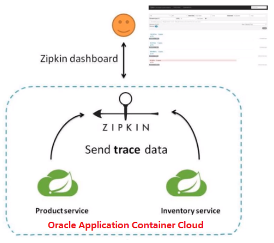

#### 7.1 Sleuth之zipkin搭建安装

**1.zipkin**

**下载**

- SpringCloud从F版起已不需要自己构建Zipkin Server了，只需调用jar包即可
- https://dl.bintray.com/openzipkin/maven/io/zipkin/java/zipkin-server/
- zipkin-server-2.12.9-exec.jar

**运行jar**

```bash
java -jar zipkin-server-2.12.9-exec.jar
```

**运行控制台**

http://localhost:9411/zipkin/

**术语**

完整的调用链路

表示一请求链路，一条链路通过Trace ld唯一标识，Span标识发起的请求信息，各span通过parent id关联起来

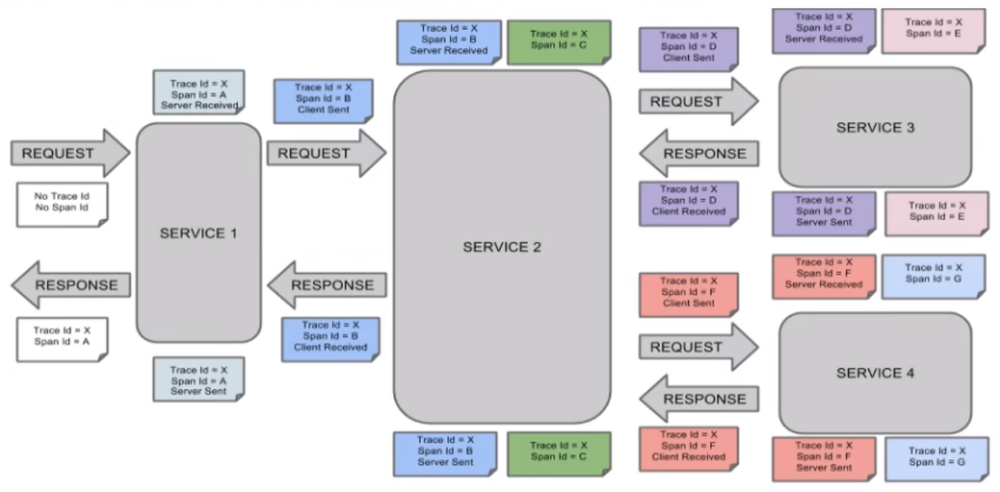

—条链路通过Trace ld唯一标识，Span标识发起的请求信息，各span通过parent id关联起来。


整个链路的依赖关系如下：


名词解释

- Trace：类似于树结构的Span集合，表示一条调用链路，存在唯一标识
- span：表示调用链路来源，通俗的理解span就是一次请求信息

#### 7.2 Sleuth链路监控展现

2.服务提供者

cloud-provider-payment8001

POM

```xml
<!--包含了sleuth+zipkin-->
<dependency>
    <groupId>org.springframework.cloud</groupId>
    <artifactId>spring-cloud-starter-zipkin</artifactId>
</dependency>
```

YML

```yml

spring:
  application:
    name: cloud-payment-service

  zipkin: #<-------------------------------------关键 
      base-url: http://localhost:9411
  sleuth: #<-------------------------------------关键
    sampler:
    #采样率值介于 0 到 1 之间，1 则表示全部采集
    probability: 1
    
  datasource:
    type: com.alibaba.druid.pool.DruidDataSource            # 当前数据源操作类型
    driver-class-name: org.gjt.mm.mysql.Driver              # mysql驱动包
    url: jdbc:mysql://localhost:3306/db2019?useUnicode=true&characterEncoding=utf-8&useSSL=false
    username: root
    password: 123456

```

业务类PaymentController

```java
@RestController
@Slf4j
public class PaymentController {
    
    ...
    
 	@GetMapping("/payment/zipkin")
    public String paymentZipkin() {
        return "hi ,i'am paymentzipkin server fall back，welcome to here, O(∩_∩)O哈哈~";
    }    
}

```

3.服务消费者(调用方)

cloue-consumer-order80

POM

```xml
<dependency>
    <groupId>org.springframework.cloud</groupId>
    <artifactId>spring-cloud-starter-zipkin</artifactId>
</dependency>
```

YML

```yml
spring:
    application:
        name: cloud-order-service
    zipkin:
      base-url: http://localhost:9411
    sleuth:
      sampler:
        probability: 1

```

业务类OrderController

```java
    // ====================> zipkin+sleuth
    @GetMapping("/consumer/payment/zipkin")
    public String paymentZipkin()
    {
        String result = restTemplate.getForObject("http://localhost:8001"+"/payment/zipkin/", String.class);
        return result;
    }
}

```

4.依次启动eureka7001/8001/80 - 80调用8001几次测试下

5.打开浏览器访问: http://localhost:9411

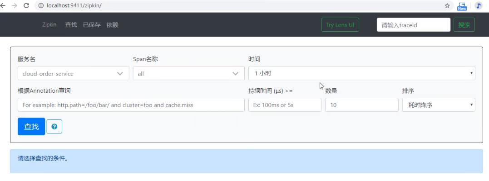