### SpringCloud 高级部分

### 一、Nacos之Linux版本安装

预计需要，1个Nginx + 3 个nacos 注册中心 + 1 个 mysql

> 请确保是在环境中安装使用:
>
> 1. 64 bit OS Linux/Unix/Mac，推荐使用Linux系统。
> 2. 64 bit JDK 1.8+；[下载](http://www.oracle.com/technetwork/java/javase/downloads/jdk8-downloads-2133151.html).[配置](https://docs.oracle.com/cd/E19182-01/820-7851/inst_cli_jdk_javahome_t/)。
> 3. Maven 3.2.x+；[下载](https://maven.apache.org/download.cgi).[配置](https://maven.apache.org/settings.html)。
> 4. 3个或3个以上Nacos节点才能构成集群。
>
> [link](https://nacos.io/zh-cn/docs/cluster-mode-quick-start.html)

- https://github.com/alibaba/nacos/releases/tag/1.1.4
- nacos-server-1.1.4.tar.gz 解压后安装

### 二、Nacos集群配置（上）

集群配置步骤（重点）

#### 2.1 Linux服务区上mysql数据库配置

SQL脚本在哪里 - 目录 nacos/conf/nacos-mysql.sql

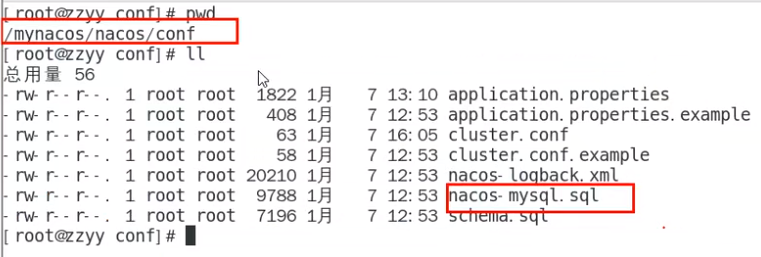

自己Linux机器上的Mysql数据库上运行

#### 2.2 application.properties配置


添加以下内容，设置数据源：

【注意】使用5.xxx 版本的 mysql 添加以下数据源

```properties
spring.datasource.platform=mysql
db.num=1
db.url.0=jdbc:mysql://localhost:3306/nacos_configcharacterEncoding=utf8&connectTimeout=1000&socketTimeout=3000&autoReconnect=true
db.user=root
db.password=1234
```

注意】使用 8.0xx 版本的 mysql 添加以下数据源

```properties
spring.datasource.platform=mysql
### Count of DB:
 db.num=1
### Connect URL of DB:
 db.url.0=jdbc:mysql://127.0.0.1:3306/nacos_config?characterEncoding=utf8&connectTimeout=1000&socketTimeout=3000&autoReconnect=true&useUnicode=true&useSSL=false&serverTimezone=UTC&serverTimezone=GMT%2B8
 db.user.0=root
 db.password.0=root
```

**Mysql8.0** 的数据库后面需要添加时区    `&serverTimezone=GMT%2B8`

#### 2.3 Linux服务器上nacos的集群配置 cluster.conf

梳理出 3 台 nacos 集群的不同服务端口号，设置3个端口：

- 3333
- 4444
- 5555

复制出 cluster.conf 


内容：

```properties
192.168.111.144:3333
192.168.111.144:4444
192.168.111.144:5555
```

【注意】，这个IP不能写 127.0.0.1 ，必须是 Linux 命令 hostname -i 能够识别的 IP


#### 2.4 编辑Nacos的启动脚本 startup.sh ，使它能够接受不同的启动端口

/mynacos/nacos/bin 目录下有startup.sh 

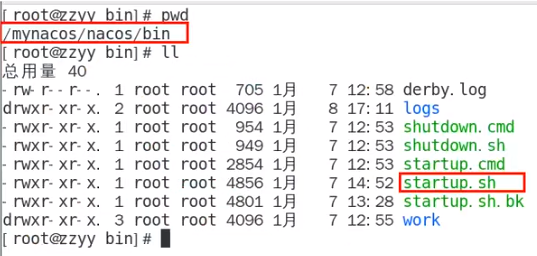

平时单机版的启动，都是./startup.sh即可

但是，集群启动，我们可以类似其他软件的shell命令，传递不同的端口号启动不同的nacos实例。

命令：./startup.sh -p 3333 表示启动端口号为 3333 的nacos服务器实例，和上一步的cluster.conf配置的一致。

修改内容：

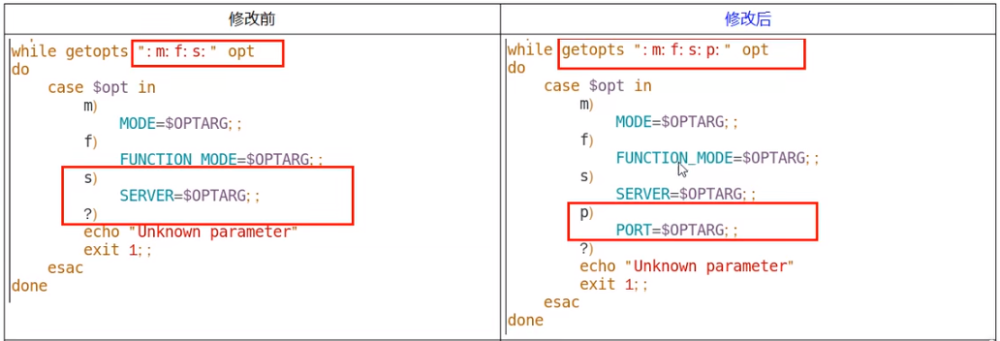


执行方式 - `startup.sh -p 端口号`


### 三、Nacos集群配置（下）

#### 3.1 Nginx 的配置，由它作为负载均衡器

修改nginx的配置文件  - nginx.conf 

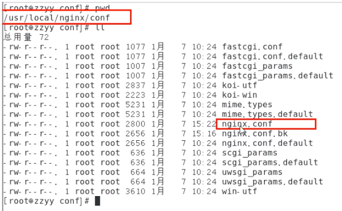

修改内容：

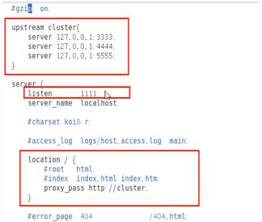


按照指定启动：

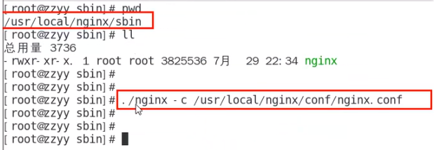

#### 3.2 截止到此处，1个Nginx + 3个nacos注册中心 + 1个 mysql

**测试：**

- 启动 3 个nacos注册中心
  1. startup.sh -p 3333
  2. startup.sh -p 4444
  3. startup.sh -p 5555
  4. 查看nacos进程启动数`ps -ef | grep nacos | grep -v grep | wc -l`

- 启动nginx
  1. `./nginx -c /usr/local/nginx/conf/nginx.conf`
  2. 查看nginx进程`ps - ef| grep nginx`

- 测试通过nginx，访问nacos - http://192.168.111.144:1111/nacos/#/login
- 新建一个配置测试。


- 新建后，可在linux服务器的mysql新插入一条记录

```mysql
select * from config;
```


- 让微服务cloudalibaba-provider-payment9002启动注册进nacos集群 - 修改配置文件

```yml
server:
  port: 9002

spring:
  application:
    name: nacos-payment-provider
  c1oud:
    nacos:
      discovery:
        #配置Nacos地址
        #server-addr: Localhost:8848
        #换成nginx的1111端口，做集群
        server-addr: 192.168.111.144:1111

management:
  endpoints:
    web:
      exposure:
        inc1ude: '*'
```

- 启动微服务 cloudalibaba-provider-payment9002

- 访问 nacos，查看注册结果。

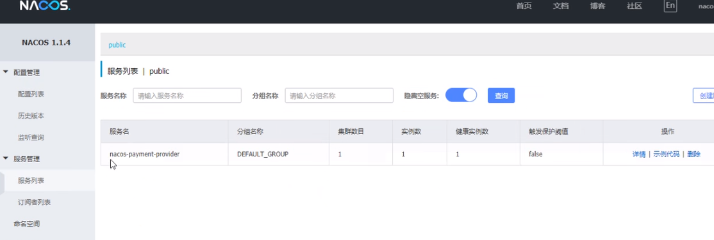

**高可用小总结**

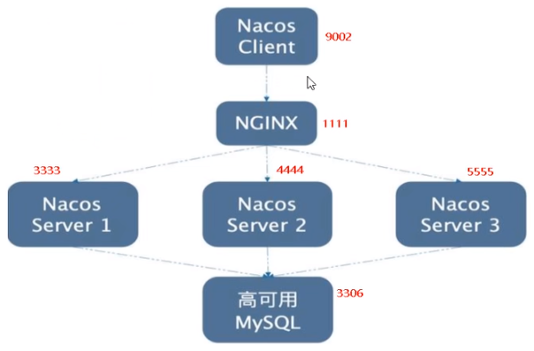

### 四、Sentinel

#### 4.1 sentinel 是什么

[官方Github](https://github.com/alibaba/Sentinel)

[官方文档](https://sentinelguard.io/zh-cn/docs/introduction.html)

服务使用中的各种问题：

- 服务雪崩
- 服务降级
- 服务熔断
- 服务限流

Sentinel分为两个部分：

- 核心库（Java客户端）不依赖任何框架/库，能够运行所有Java运行时的环境， 同时对 Dubbo/Spring Cloud等框架也有较好的支持。
- 控制台（Dashboard）基于SpringBoot 开发，打包后可以直接运行，不需要额外的 Tomat 等应用容器。

安装步骤：

- 下载：
  1. https://github.com/alibaba/Sentinel/releases
  2. 下载到本地sentinel-dashboard-1.7.0.jar

- 运行命令

  1. 前提
     - Java 8 环境
     - 8080端口不能被占用

  2. 命令
     - java -jar sentinel-dashboard-1.7.0.jar

  3. 访问Sentinel管理界面
     - localhost:8080
     - 登录账号密码均为sentinel

#### 4.2 Sentinel初始化监控

1. 启动Nacos8848成功
2. 新建工程 - **cloudalibaba-sentinel-service8401**

3. POM

```xml
<?xml version="1.0" encoding="UTF-8"?>
<project xmlns="http://maven.apache.org/POM/4.0.0"
         xmlns:xsi="http://www.w3.org/2001/XMLSchema-instance"
         xsi:schemaLocation="http://maven.apache.org/POM/4.0.0 http://maven.apache.org/xsd/maven-4.0.0.xsd">
    <parent>
        <artifactId>cloud2020</artifactId>
        <groupId>com.atguigu.springcloud</groupId>
        <version>1.0-SNAPSHOT</version>
    </parent>
    <modelVersion>4.0.0</modelVersion>

    <artifactId>cloudalibaba-sentinel-service8401</artifactId>

    <dependencies>
        <dependency><!-- 引入自己定义的api通用包，可以使用Payment支付Entity -->
            <groupId>com.atguigu.springcloud</groupId>
            <artifactId>cloud-api-commons</artifactId>
            <version>${project.version}</version>
        </dependency>
        <!--SpringCloud ailibaba nacos -->
        <dependency>
            <groupId>com.alibaba.cloud</groupId>
            <artifactId>spring-cloud-starter-alibaba-nacos-discovery</artifactId>
        </dependency>
        <!--SpringCloud ailibaba sentinel-datasource-nacos 后续做持久化用到-->
        <dependency>
            <groupId>com.alibaba.csp</groupId>
            <artifactId>sentinel-datasource-nacos</artifactId>
        </dependency>
        <!--SpringCloud ailibaba sentinel -->
        <dependency>
            <groupId>com.alibaba.cloud</groupId>
            <artifactId>spring-cloud-starter-alibaba-sentinel</artifactId>
        </dependency>
        <!--openfeign-->
        <dependency>
            <groupId>org.springframework.cloud</groupId>
            <artifactId>spring-cloud-starter-openfeign</artifactId>
        </dependency>
        <!-- SpringBoot整合Web组件+actuator -->
        <dependency>
            <groupId>org.springframework.boot</groupId>
            <artifactId>spring-boot-starter-web</artifactId>
        </dependency>
        <dependency>
            <groupId>org.springframework.boot</groupId>
            <artifactId>spring-boot-starter-actuator</artifactId>
        </dependency>
        <!--日常通用jar包配置-->
        <dependency>
            <groupId>org.springframework.boot</groupId>
            <artifactId>spring-boot-devtools</artifactId>
            <scope>runtime</scope>
            <optional>true</optional>
        </dependency>
        <dependency>
            <groupId>cn.hutool</groupId>
            <artifactId>hutool-all</artifactId>
            <version>4.6.3</version>
        </dependency>
        <dependency>
            <groupId>org.projectlombok</groupId>
            <artifactId>lombok</artifactId>
            <optional>true</optional>
        </dependency>
        <dependency>
            <groupId>org.springframework.boot</groupId>
            <artifactId>spring-boot-starter-test</artifactId>
            <scope>test</scope>
        </dependency>

    </dependencies>

</project>
```

4. YML 

```yml
server:
  port: 8401

spring:
  application:
    name: cloudalibaba-sentinel-service
  cloud:
    nacos:
      discovery:
        server-addr: localhost:8848 #Nacos服务注册中心地址
    sentinel:
      transport:
        dashboard: localhost:8080 #配置Sentinel dashboard地址
        port: 8719

management:
  endpoints:
    web:
      exposure:
        include: '*'

feign:
  sentinel:
    enabled: true # 激活Sentinel对Feign的支持
```

5. 主启动

```java
import org.springframework.boot.SpringApplication;
import org.springframework.boot.autoconfigure.SpringBootApplication;
import org.springframework.cloud.client.discovery.EnableDiscoveryClient;

@EnableDiscoveryClient
@SpringBootApplication
public class MainApp8401 {
    public static void main(String[] args) {
        SpringApplication.run(MainApp8401.class, args);
    }
}
```

6. 业务类FlowLimitController

```java
import com.alibaba.csp.sentinel.annotation.SentinelResource;
import com.alibaba.csp.sentinel.slots.block.BlockException;
import lombok.extern.slf4j.Slf4j;
import org.springframework.web.bind.annotation.GetMapping;
import org.springframework.web.bind.annotation.RequestParam;
import org.springframework.web.bind.annotation.RestController;

import java.util.concurrent.TimeUnit;

@RestController
@Slf4j
public class FlowLimitController {
    @GetMapping("/testA")
    public String testA()
    {
        return "------testA";
    }

    @GetMapping("/testB")
    public String testB()
    {
        log.info(Thread.currentThread().getName()+"\t"+"...testB");
        return "------testB";
    }
}
```

7. 启动 Sentinel8080 - `java -jar sentinel-dashboard-1.7.0.jar`
8. 启动微服务8401

#### 4.3 启动 8401 微服务后查看sentinel控制台

1. 刚启动，空空如也，啥都没有


2. Sentinel采用的懒加载说明

- 执行一次访问即可
  - http://localhost:8401/testA
  - http://localhost:8401/testB

- 效果 - sentinel 8080 正在监控微服务8401


#### 4.4 Sentinel流控规则简介

基本介绍


进一步解释说明：

- 资源名：唯一名称，默认请求路径。
- 针对来源：Sentinel可以针对调用者进行限流，填写微服务名，默认default（不区分来源）。
- 阈值类型/单机阈值
  1. QPS（每秒中的请求数量）：当调用该API的QPS达到阈值的时候，进行限流。
  2. 线程数：当调用该API的线程数达到阈值的时候，进行限流。

- 是否集群：不需要集群。
- 流控模式：
  1. 直接：API达到限流条件时，直接限流。
  2. 当关联的资源达到阈值时，就限流自己。
  3. 链路：只记录指定链路上的流量（指定资源从入口资源进来的流浪，如果达到阈值，就进行限流）【API级别的针对来源】。

- 流控效果：
  1. 快速失败：直接失败，抛异常。
  2. Warm up：根据Code Factor(冷加载因子，默认3)的值，从阈值/codeFactor，经过预热时长，才达到阈值的QPS阈值。
  3. 排队等待：匀速排队，请求以匀速的速度通过，阈值类型必须设置为QPS，否则无效。

#### 4.5 Sentinel流控-QPS直接失败

**直接 -> 快速失败（系统默认）**

配置及说明

表示1秒钟内查询1次就是OK，若超过次数1，就直接 -> 快速失败，报默认错误。


**测试**

- 快速多次点击访问http://localhost:8401/testA

**结果**

- 返回页面 Blocked by Sentinel (flow limiting)

**源码**

- com.alibaba.csp.sentinel.slots.block.flow.controller.DefaultController

**思考**

- 直接调用默认报错信息，技术方面OK，但是，是否应该有我们自己的后续处理？类似有个fallback的兜底方法?

#### 4.6 Sentinel流控-线程数直接失败

**线程数**：当调用API的线程数达到阈值的时候，进行限流。


#### 4.7 Sentinel流控-关联

##### 4.7.1 **是什么？**

- 当自己关联的资源达到阈值时，就限流自己
- 当与A关联的资源B达到阈值后，就限流A自己（B 惹事，A挂了）

##### 4.7.2 设置testA

当关联资源/testB的QPS阈值超过1时，就限流/testA的Rest访问地址，当关联资源到阈值后限制配置号的资源名。

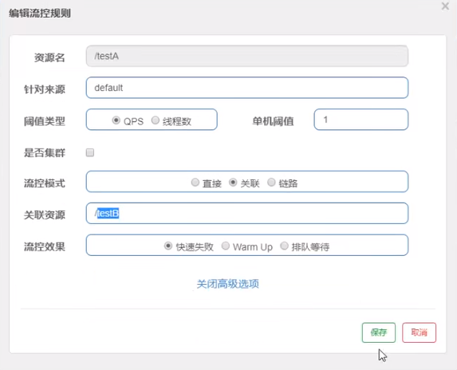

##### 4.7.3 Postman模拟并发密集访问testB


访问testB成功


postman里新建多线程集合组


将访问地址添加进新线程组

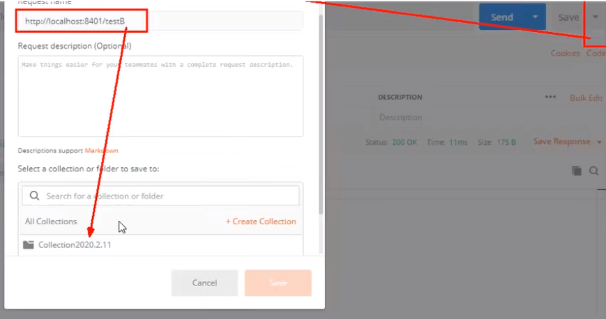

Run - 大批量线程高并发并发访问B

Postman运行后，点击访问http://localhost:8401/testA，发现testA挂了

- 结果Blocked by Sentinel(flow limiting)

HOMEWORK：

自己上机测试

链路：只记录指定链路上的流量（指定资源从入口资源进来的流量，如果达到阈值，就进行限流）【API级别的针对来源】

#### 4.8 Sentinel流控-预热

##### 4.8.1 Warm Up

Warm up（RuleConstant.CONTROL_BEHAVIOR_WARM_UP)方式，即预热/冷启动方式。当西戎长期处于低水位的情况下，当流量突然增加时，直接把系统拉升到高水位可能瞬间把系统压垮。通过“冷启动”，让通过的流浪缓慢增加，在一定时间内逐渐增加到阈值上限，给冷系统一个预热的时间，避免冷系统被压垮。详细文档可以参考 流量控制  - Warm Up文档，具体的例子可以参见  WarmUpFlowDemo.

通常冷启动的过程系统允许通过的QPS曲线如下图所示：


> 默认coldFactor为3，即请求QPS从threshold/3 开始，经预热时长追歼升至设定的QPS阈值。

**源码** - com.alibaba.csp.sentinel.slots.block.flow.controller.WarmUpController

##### 4.7.2 WarmUp配置

案例，阈值为10 + 预热时长设置 5 秒。

系统初始化的阈值为10/3 约等于3 ，即阈值刚开始为3；然后过了 5 秒后阈值才慢慢升高恢复到10.

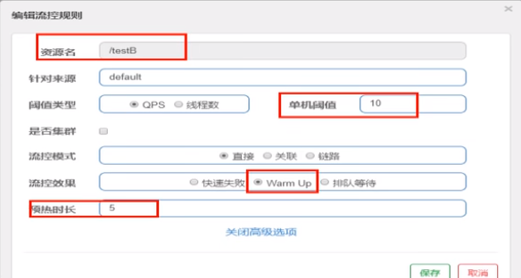

**测试：**

多次快速点击http://localhost:8401/testB - 刚开始不行，后续慢慢OK

**应用场景：**

如：秒杀系统在开启的瞬间，会有很多流量上来，很有可能把系统打死，预热方式就是把为了保护系统，可慢慢的把流量放进来，慢慢的把阈值增长到设置的阈值。


